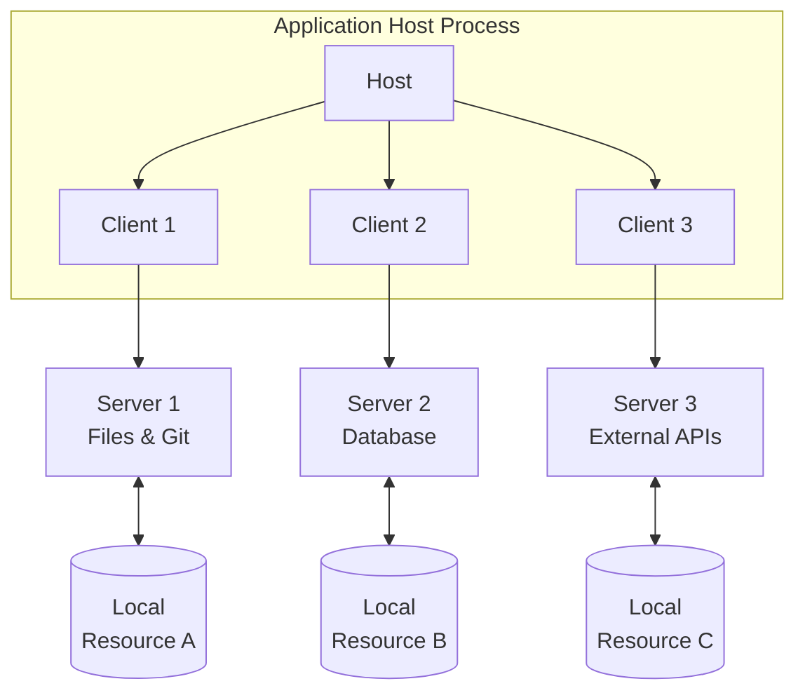
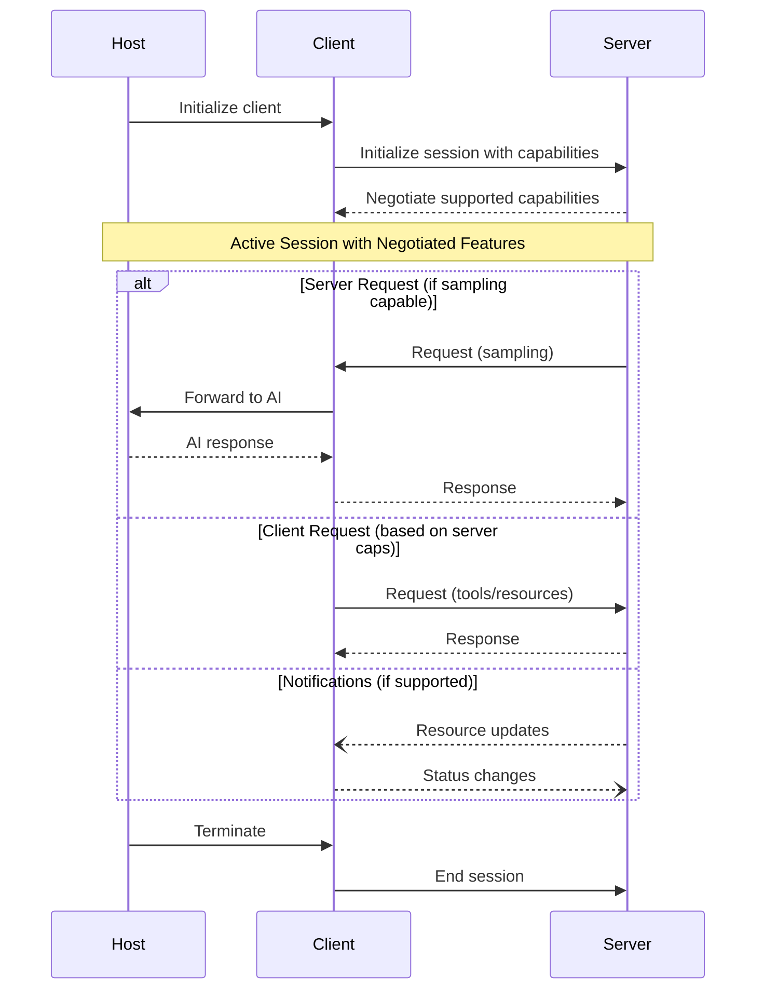

The Model Context Protocol (MCP) follows a client-host-server architecture where each host can run multiple client instances. This architecture enables users to integrate AI capabilities across applications while maintaining clear security boundaries and isolating concerns. Built on JSON-RPC, MCP provides a stateful session protocol focused on context exchange and sampling coordination between clients and servers.

## Core Components

### Host
The host process acts as the container and coordinator:
- Creates and manages multiple client instances
- Controls client connection permissions and lifecycle
- Enforces security policies and consent requirements
- Handles user authorization decisions
- Coordinates AI/LLM integration and sampling
- Manages context aggregation across clients

### Clients
Each client maintains an isolated server connection:
- Establishes one stateful session per server
- Handles protocol negotiation and capability exchange
- Routes protocol messages bidirectionally
- Manages subscriptions and notifications
- Maintains security boundaries between servers

### Servers
Servers provide specialized context and capabilities:
- Expose resources, tools and prompts via MCP primitives
- Operate independently with focused responsibilities
- Request sampling through client interfaces
- Must respect security constraints
- Can be local processes or remote services

## Protocol Capabilities and Flow

The Model Context Protocol uses a capability-based negotiation system where clients and servers explicitly declare their supported features during initialization. Capabilities determine which protocol features and primitives are available during a session.

- Servers declare capabilities like resource subscriptions, tool support, and prompt templates
- Clients declare capabilities like sampling support and notification handling
- Both parties must respect declared capabilities throughout the session
- Additional capabilities can be negotiated through protocol extensions

Each capability unlocks specific protocol features for use during the session. For example:
- Resource subscriptions require the server to declare subscription support
- Tool invocation requires the server to declare tool capabilities
- Sampling requires the client to declare sampling support

This capability negotiation ensures clients and servers have a clear understanding of supported functionality while maintaining protocol extensibility.

### Message Types
MCP defines three core message types based on [JSON-RPC 2.0](https://www.jsonrpc.org/specification):

- **Requests**: Bidirectional messages with method and parameters expecting a response
- **Responses**: Results or errors matching specific request IDs
- **Notifications**: One-way messages requiring no response

Each message type follows the JSON-RPC 2.0 specification for structure and delivery semantics.

## Protocol Features

### Server Features
Servers implement several foundational features that provide context and capabilities to clients:

- **Resources**: Structured data or content exposed via URIs that can be read and optionally subscribed to for updates
- **Prompts**: Pre-defined templates or instructions that guide language model interactions
- **Tools**: Executable functions that allow models to perform actions or retrieve information
- **Utilities**: Helper features for logging, argument completion, and other ancillary functions

The server features focus on exposing data and functionality in a controlled way while maintaining security boundaries.

### Client Features
Clients provide core features for interacting with servers and coordinating with hosts:

- **Sampling**: Ability to request and control language model interactions
- **Root Directory Access**: Controlled exposure of filesystem locations to servers

The client features emphasize safe integration of server capabilities while protecting user privacy and security.
