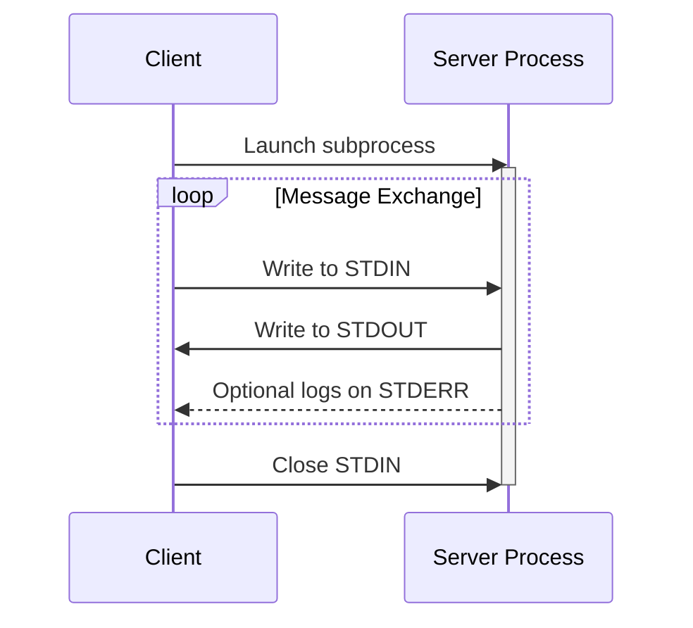
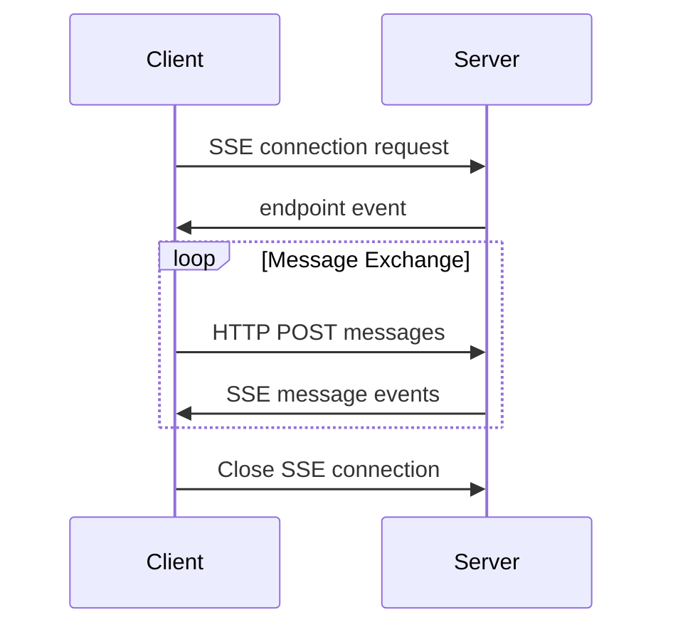


**Protocol Revision**: 2024-11-05 (Final)


MCP supports multiple transport mechanisms for client-server communication. The two standard transport mechanisms are STDIO and HTTP with Server-Sent Events (SSE).  We recommend clients to support at least STDIO.

## STDIO Transport
For STDIO transport, the client is responsible for launching the server as a subprocess. The server receives JSON-RPC messages on its standard input (STDIN) and writes responses to its standard output (STDOUT). Messages are delimited by newlines.

The server MAY use standard error (STDERR) for logging purposes, but clients are not required to capture or process STDERR output.

## HTTP with SSE Transport
For HTTP transport, the server operates as an independent process that can handle multiple client connections. The server provides two endpoints:

1. An SSE endpoint for the server to push messages to clients
2. A regular HTTP endpoint for clients to send messages to the server

When a client connects, the server MUST send an `endpoint` event containing a URI for the client to use for sending messages. All subsequent client messages MUST be sent as HTTP POST requests to this endpoint.

Server messages are sent as SSE `message` events, with the message content encoded as JSON in the event data.

## Custom Transports

While STDIO and HTTP with SSE are the standardized transport protocols defined by MCP, clients and servers MAY implement additional custom transport mechanisms to suit their specific needs. The protocol is transport-agnostic and can be implemented over any communication channel that supports bidirectional message exchange.

Implementers who choose to support custom transports MUST ensure they maintain the core JSON-RPC message format and lifecycle requirements defined by MCP. Custom transports SHOULD document their specific connection establishment and message exchange patterns to aid interoperability.
