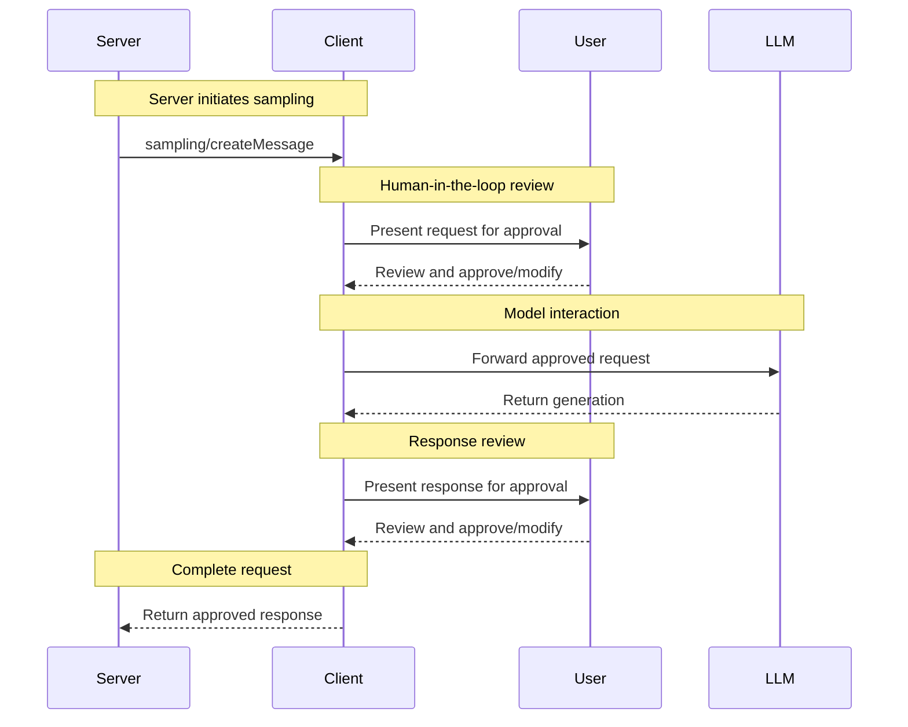


**Protocol Revision**: 2024-11-05


The Model Context Protocol (MCP) provides a standardized way for servers to request generations from language models via clients. This unique reverse flow allows clients to maintain control over model access, selection, and permissions while enabling servers to leverage AI capabilities. Servers can request text or image-based interactions and optionally include context from MCP servers in their prompts.

## User Interaction Model

Sampling in MCP is designed around a human-in-the-loop approval pattern. A recommended implementation exposes sampling requests through an approval UI that allows users to:

1. Review incoming sampling requests
2. Inspect model selections and parameters
3. View and edit prompts before sending
4. Review generated responses before delivery

However, implementations are free to expose sampling through any interface pattern that suits their needs - the protocol itself does not mandate any specific user interaction model.

## Capabilities

Clients that support sampling MUST include a `sampling` capability in their `ClientCapabilities` during initialization:

```json
{
  "capabilities": {
    "sampling": {}
  }
}
```

The empty object indicates basic sampling support with no additional features.

## Protocol Messages

### Creating Messages

To request a language model generation, servers send a `sampling/createMessage` request:

**Request:**
```json
{
  "jsonrpc": "2.0",
  "id": 1,
  "method": "sampling/createMessage",
  "params": {
    "messages": [
      {
        "role": "user",
        "content": {
          "type": "text",
          "text": "What is the capital of France?"
        }
      }
    ],
    "modelPreferences": {
      "hints": [
        {
          "name": "claude-3-sonnet"
        }
      ],
      "intelligencePriority": 0.8,
      "speedPriority": 0.5
    },
    "systemPrompt": "You are a helpful assistant.",
    "maxTokens": 100,
    "temperature": 0.7
  }
}
```

**Response:**
```json
{
  "jsonrpc": "2.0",
  "id": 1,
  "result": {
    "role": "assistant",
    "content": {
      "type": "text",
      "text": "The capital of France is Paris."
    },
    "model": "claude-3-sonnet-20240307",
    "stopReason": "endTurn"
  }
}
```

## Message Flow



## Data Types

### Messages

Sampling messages can contain:

#### Text Content
```json
{
  "type": "text",
  "text": "The message content"
}
```

#### Image Content
```json
{
  "type": "image",
  "data": "base64-encoded-image-data",
  "mimeType": "image/jpeg"
}
```

### Model Preferences

Model selection in MCP requires careful abstraction since servers and clients may use different AI providers with distinct model offerings. A server cannot simply request a specific model by name since the client may not have access to that exact model or may prefer to use a different provider's equivalent model.

To solve this, MCP implements a preference system that combines abstract capability priorities with optional model hints:

#### Capability Priorities

Servers express their needs through three normalized priority values (0-1):

- `costPriority`: How important is minimizing costs? Higher values prefer cheaper models
- `speedPriority`: How important is low latency? Higher values prefer faster models
- `intelligencePriority`: How important are advanced capabilities? Higher values prefer more capable models

#### Model Hints

While priorities help select models based on characteristics, `hints` allow servers to suggest specific models or model families:

- Hints are treated as substrings that can match model names flexibly
- Multiple hints are evaluated in order of preference
- Clients MAY map hints to equivalent models from different providers
- Hints are advisory - clients make final model selection

For example:
```json
{
  "hints": [
    {"name": "claude-3-sonnet"},  // Prefer Sonnet-class models
    {"name": "claude"}            // Fall back to any Claude model
  ],
  "costPriority": 0.3,           // Cost is less important
  "speedPriority": 0.8,          // Speed is very important
  "intelligencePriority": 0.5     // Moderate capability needs
}
```

The client processes these preferences to select an appropriate model from its available options. For instance, if the client doesn't have access to Claude models but has Gemini, it might map the sonnet hint to `gemini-1.5-pro` based on similar capabilities.

## Error Handling

Clients SHOULD return standard JSON-RPC errors for common failure cases:

- User rejection: `-32001`
- Model unavailable: `-32002`
- Invalid parameters: `-32602`
- Context length exceeded: `-32003`

Example error:
```json
{
  "jsonrpc": "2.0",
  "id": 1,
  "error": {
    "code": -32001,
    "message": "User rejected sampling request",
    "data": {
      "reason": "Content policy violation"
    }
  }
}
```

## Security Considerations

1. Clients MUST implement user approval controls
2. Both parties SHOULD validate message content
3. Servers SHOULD respect model preference hints
4. Clients SHOULD implement rate limiting
5. Both parties MUST handle sensitive data appropriately

## See Also





