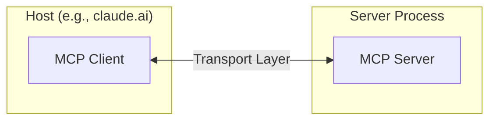
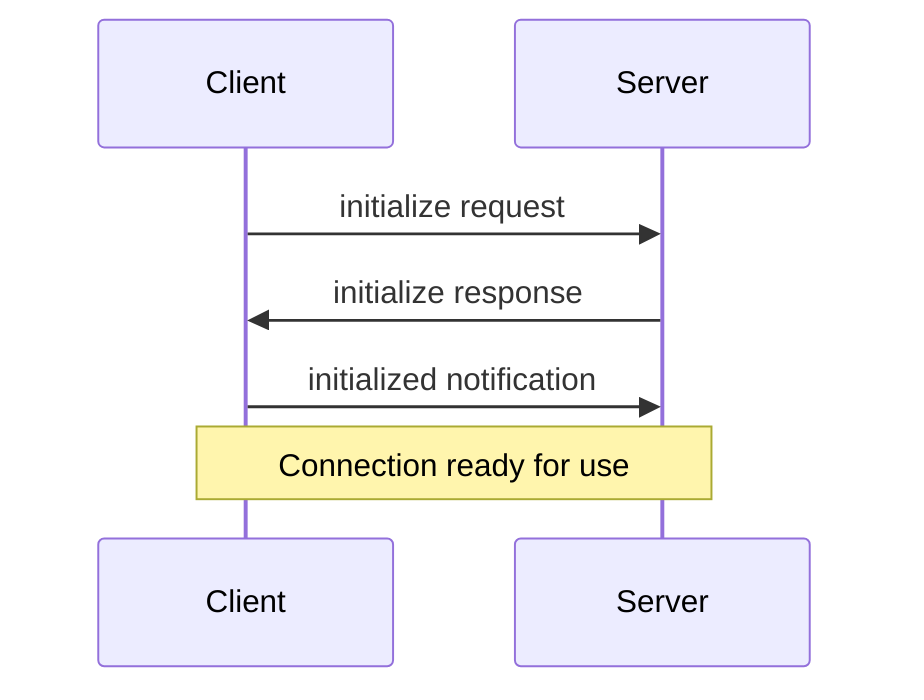

The Model Context Protocol (MCP) is built on a flexible, extensible architecture that enables seamless communication between LLM applications and external services. This document covers the core architectural components and concepts.

## Overview

MCP follows a client-server architecture where:

- **Clients** are LLM applications (like claude.ai or IDEs) that initiate connections
- **Servers** provide context, tools, and prompts to clients
- **Hosts** are processes that run MCP clients



## Core components

### Protocol layer

The protocol layer handles message framing, request/response linking, and high-level communication patterns. Key classes include:

```typescript
class Protocol<SendRequestT, SendNotificationT, SendResultT> {
    // Handle incoming requests
    setRequestHandler<T>(schema: T, handler: (request: T) => Result): void
    
    // Handle incoming notifications
    setNotificationHandler<T>(schema: T, handler: (notification: T) => void): void
    
    // Send requests and await responses
    request<T>(request: Request, schema: T): Promise<T>
    
    // Send one-way notifications
    notification(notification: Notification): Promise<void>
}
```

### Transport layer

The transport layer handles the actual communication between clients and servers. MCP supports multiple transport mechanisms:

1. **Stdio transport**
   - Uses standard input/output for communication
   - Ideal for local processes
   ```typescript
   class StdioTransport implements Transport {
       constructor(stdin: Readable, stdout: Writable)
       send(message: JSONRPCMessage): Promise<void>
   }
   ```

2. **WebSocket transport**
   - Enables real-time bidirectional communication
   - Supports remote connections
   ```typescript
   class WebSocketTransport implements Transport {
       constructor(url: URL)
       send(message: JSONRPCMessage): Promise<void>
   }
   ```

3. **SSE transport**
   - Uses Server-Sent Events for server-to-client messages
   - HTTP POST for client-to-server messages
   ```typescript
   class SSETransport implements Transport {
       constructor(url: URL)
       send(message: JSONRPCMessage): Promise<void>
   }
   ```

### Message types

MCP uses JSON-RPC 2.0 as its message format with three main types:

1. **Requests**
   ```typescript
   interface Request {
       method: string
       params?: {
           _meta?: {
               progressToken?: string | number
           }
       }
   }
   ```

2. **Notifications**
   ```typescript
   interface Notification {
       method: string
       params?: {
           _meta?: Record<string, unknown>
       }
   }
   ```

3. **Results**
   ```typescript
   interface Result {
       _meta?: Record<string, unknown>
       [key: string]: unknown
   }
   ```

## Connection lifecycle

### 1. Initialization



1. Client sends `initialize` request with capabilities
2. Server responds with supported features
3. Client sends `initialized` notification
4. Normal message exchange begins

### 2. Message exchange

After initialization, the following patterns are supported:

- **Request-Response**: Client sends request, server responds
- **Notifications**: Either party sends one-way messages
- **Progress Updates**: Long-running operations can report progress
- **Resource Updates**: Servers notify about changed resources

### 3. Termination

Either party can terminate the connection:
- Clean shutdown via `close()`
- Transport disconnection
- Error conditions

## Error handling

MCP defines standard error codes and handling:

```typescript
enum ErrorCode {
    ConnectionClosed = -1,
    ParseError = -32700,
    InvalidRequest = -32600,
    MethodNotFound = -32601,
    InvalidParams = -32602,
    InternalError = -32603
}
```

Errors are propagated through:
- Error responses to requests
- Error events on transports
- Protocol-level error handlers

## Implementation example

Here's a basic example of implementing an MCP server:

```typescript
import { Server } from "@modelcontextprotocol/sdk/server";
import { StdioServerTransport } from "@modelcontextprotocol/sdk/server/stdio";

const server = new Server({
    name: "example-server",
    version: "1.0.0"
});

// Handle requests
server.setRequestHandler(ListResourcesRequestSchema, async () => {
    return {
        resources: [
            {
                uri: "example://resource",
                name: "Example Resource"
            }
        ]
    };
});

// Connect transport
const transport = new StdioServerTransport();
await server.connect(transport);
```

## Best practices

### Transport selection

1. **Local communication**
   - Use stdio transport for local processes
   - Efficient for same-machine communication
   - Simple process management

2. **Remote communication**
   - WebSocket for full-duplex communication
   - SSE for scenarios requiring HTTP compatibility
   - Consider security implications

### Message handling

1. **Request processing**
   - Validate inputs thoroughly
   - Use type-safe schemas
   - Handle errors gracefully
   - Implement timeouts

2. **Progress reporting**
   - Use progress tokens for long operations
   - Report progress incrementally
   - Include total progress when known

3. **Error management**
   - Use appropriate error codes
   - Include helpful error messages
   - Clean up resources on errors

## Security considerations

1. **Transport security**
   - Use TLS for remote connections
   - Validate connection origins
   - Implement authentication when needed

2. **Message validation**
   - Validate all incoming messages
   - Sanitize inputs
   - Check message size limits
   - Verify JSON-RPC format

3. **Resource protection**
   - Implement access controls
   - Validate resource paths
   - Monitor resource usage
   - Rate limit requests

4. **Error handling**
   - Don't leak sensitive information
   - Log security-relevant errors
   - Implement proper cleanup
   - Handle DoS scenarios

## Debugging and monitoring

1. **Logging**
   - Log protocol events
   - Track message flow
   - Monitor performance
   - Record errors

2. **Diagnostics**
   - Implement health checks
   - Monitor connection state
   - Track resource usage
   - Profile performance

3. **Testing**
   - Test different transports
   - Verify error handling
   - Check edge cases
   - Load test servers