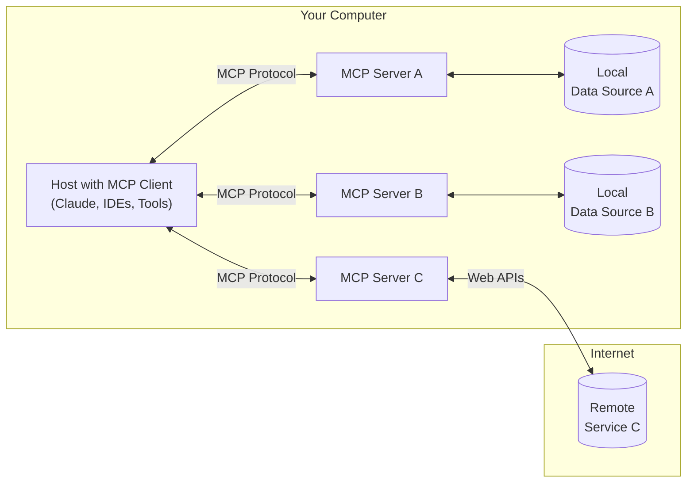

<Note>C# SDK released! Check out [what else is new.](/development/updates)</Note>

MCP is an open protocol that standardizes how applications provide context to LLMs. Think of MCP like a USB-C port for AI applications. Just as USB-C provides a standardized way to connect your devices to various peripherals and accessories, MCP provides a standardized way to connect AI models to different data sources and tools.

## Why MCP?

MCP helps you build agents and complex workflows on top of LLMs. LLMs frequently need to integrate with data and tools, and MCP provides:
- A growing list of pre-built integrations that your LLM can directly plug into
- The flexibility to switch between LLM providers and vendors
- Best practices for securing your data within your infrastructure

### General architecture

At its core, MCP follows a client-server architecture where a host application can connect to multiple servers:

- **MCP Hosts**: Programs like Claude Desktop, IDEs, or AI tools that want to access data through MCP
- **MCP Clients**: Protocol clients that maintain 1:1 connections with servers
- **MCP Servers**: Lightweight programs that each expose specific capabilities through the standardized Model Context Protocol
- **Local Data Sources**: Your computer's files, databases, and services that MCP servers can securely access
- **Remote Services**: External systems available over the internet (e.g., through APIs) that MCP servers can connect to

## Get started

Choose the path that best fits your needs:

#### Quick Starts
<CardGroup cols={2}>
  <Card
    title="For Server Developers"
    icon="bolt"
    href="/quickstart/server"
  >
    Get started building your own server to use in Claude for Desktop and other clients
  </Card>
  <Card
    title="For Client Developers"
    icon="bolt"
    href="/quickstart/client"
  >
    Get started building your own client that can integrate with all MCP servers
  </Card>
  <Card
    title="For Claude Desktop Users"
    icon="bolt"
    href="/quickstart/user"
  >
    Get started using pre-built servers in Claude for Desktop
  </Card>
</CardGroup>

#### Examples
<CardGroup cols={2}>
  <Card
    title="Example Servers"
    icon="grid"
    href="/examples"
  >
    Check out our gallery of official MCP servers and implementations
  </Card>
  <Card
    title="Example Clients"
    icon="cubes"
    href="/clients"
  >
    View the list of clients that support MCP integrations
  </Card>
</CardGroup>

## Tutorials

<CardGroup cols={2}>
  <Card
    title="Building MCP with LLMs"
    icon="comments"
    href="/tutorials/building-mcp-with-llms"
  >
    Learn how to use LLMs like Claude to speed up your MCP development
  </Card>
  <Card
  title="Debugging Guide"
  icon="bug"
  href="/docs/tools/debugging">
    Learn how to effectively debug MCP servers and integrations
  </Card>
  <Card
    title="MCP Inspector"
    icon="magnifying-glass"
    href="/docs/tools/inspector"
  >
    Test and inspect your MCP servers with our interactive debugging tool
  </Card>
  <Card
    title="MCP Workshop (Video, 2hr)"
    icon="person-chalkboard"
    href="https://www.youtube.com/watch?v=kQmXtrmQ5Zg"
  >
    <iframe src="https://www.youtube.com/embed/kQmXtrmQ5Zg"> </iframe>
  </Card>
</CardGroup>

## Explore MCP

Dive deeper into MCP's core concepts and capabilities:

<CardGroup cols={2}>
  <Card
    title="Core architecture"
    icon="sitemap"
    href="/docs/concepts/architecture"
  >
    Understand how MCP connects clients, servers, and LLMs
  </Card>
  <Card
    title="Resources"
    icon="database"
    href="/docs/concepts/resources"
  >
    Expose data and content from your servers to LLMs
  </Card>
  <Card
    title="Prompts"
    icon="message"
    href="/docs/concepts/prompts"
  >
    Create reusable prompt templates and workflows
  </Card>
  <Card
    title="Tools"
    icon="wrench"
    href="/docs/concepts/tools"
  >
    Enable LLMs to perform actions through your server
  </Card>
  <Card
    title="Sampling"
    icon="robot"
    href="/docs/concepts/sampling"
  >
    Let your servers request completions from LLMs
  </Card>
  <Card
    title="Transports"
    icon="network-wired"
    href="/docs/concepts/transports"
  >
    Learn about MCP's communication mechanism
  </Card>
</CardGroup>

## Contributing

Want to contribute? Check out our [Contributing Guide](/development/contributing) to learn how you can help improve MCP.

## Support and Feedback

Here's how to get help or provide feedback:

- For bug reports and feature requests related to the MCP specification, SDKs, or documentation (open source), please [create a GitHub issue](https://github.com/modelcontextprotocol)
- For discussions or Q&A about the MCP specification, use the [specification discussions](https://github.com/modelcontextprotocol/specification/discussions)
- For discussions or Q&A about other MCP open source components, use the [organization discussions](https://github.com/orgs/modelcontextprotocol/discussions)
- For bug reports, feature requests, and questions related to Claude.app and claude.ai's MCP integration, please see Anthropic's guide on [How to Get Support](https://support.anthropic.com/en/articles/9015913-how-to-get-support)
