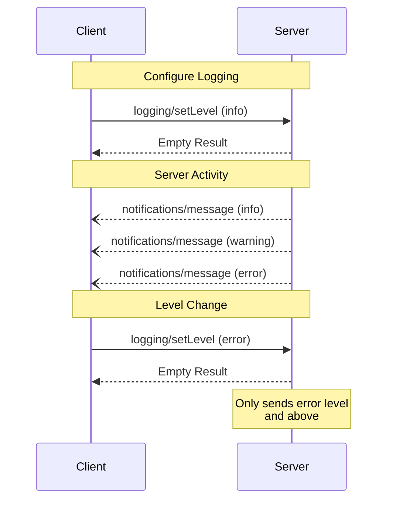


**Protocol Revision**: 2024-11-05 (Final)


The Model Context Protocol (MCP) provides a standardized way for servers to send structured log messages to clients. Clients can control logging verbosity by setting minimum log levels, with servers sending notifications containing severity levels, optional logger names, and arbitrary JSON-serializable data.

## User Interaction Model

Implementations are free to expose logging through any interface pattern that suits their needs - the protocol itself does not mandate any specific user interaction model.

## Capabilities

Servers that support logging MUST include a `logging` capability in their `ServerCapabilities` during initialization:

```json
{
  "capabilities": {
    "logging": {}
  }
}
```

## Log Levels

The protocol defines standard syslog severity levels as specified in [RFC 5424](https://datatracker.ietf.org/doc/html/rfc5424#section-6.2.1):

| Level      | Description                          | Example Use Case                        |
|------------|--------------------------------------|----------------------------------------|
| debug      | Detailed debugging information       | Function entry/exit points              |
| info       | General informational messages       | Operation progress updates              |
| notice     | Normal but significant events        | Configuration changes                   |
| warning    | Warning conditions                   | Deprecated feature usage                |
| error      | Error conditions                     | Operation failures                      |
| critical   | Critical conditions                  | System component failures               |
| alert      | Action must be taken immediately     | Data corruption detected                |
| emergency  | System is unusable                   | Complete system failure                 |

## Protocol Messages

### Setting Log Level

To configure the minimum log level, clients send a `logging/setLevel` request:

**Request:**
```json
{
  "jsonrpc": "2.0",
  "id": 1,
  "method": "logging/setLevel",
  "params": {
    "level": "info"
  }
}
```

### Log Message Notifications

Servers send log messages using `notifications/message` notifications:

```json
{
  "jsonrpc": "2.0",
  "method": "notifications/message",
  "params": {
    "level": "error",
    "logger": "database",
    "data": {
      "error": "Connection failed",
      "details": {
        "host": "localhost",
        "port": 5432
      }
    }
  }
}
```

## Message Flow



## Common Message Patterns

### Operation Progress
```json
{
  "level": "info",
  "logger": "file_processor",
  "data": {
    "operation": "scan",
    "progress": "50%",
    "filesProcessed": 150,
    "totalFiles": 300
  }
}
```

### Error Reporting
```json
{
  "level": "error",
  "logger": "git_clone",
  "data": {
    "error": "Repository unreachable",
    "details": {
      "repository": "github.com/example/repo",
      "attempt": 2,
      "maxAttempts": 3
    }
  }
}
```

## Error Handling

Servers SHOULD return standard JSON-RPC errors for common failure cases:

- Invalid log level: `-32602` (Invalid params)
- Configuration errors: `-32603` (Internal error)

## Implementation Considerations

1. Servers SHOULD:
   - Rate limit log messages
   - Include relevant context in data field
   - Use consistent logger names
   - Remove sensitive information

2. Clients SHOULD:
   - Handle out-of-order messages
   - Implement log filtering/search
   - Display severity visually
   - Support log persistence

## Security

1. Log messages MUST NOT contain:
   - Credentials or secrets
   - Personal identifying information
   - Internal system details that could aid attacks

2. Implementations SHOULD:
   - Rate limit messages
   - Validate all data fields
   - Control log access
   - Monitor for sensitive content

## See Also





