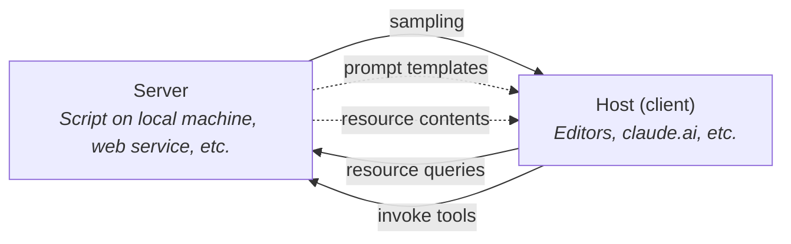
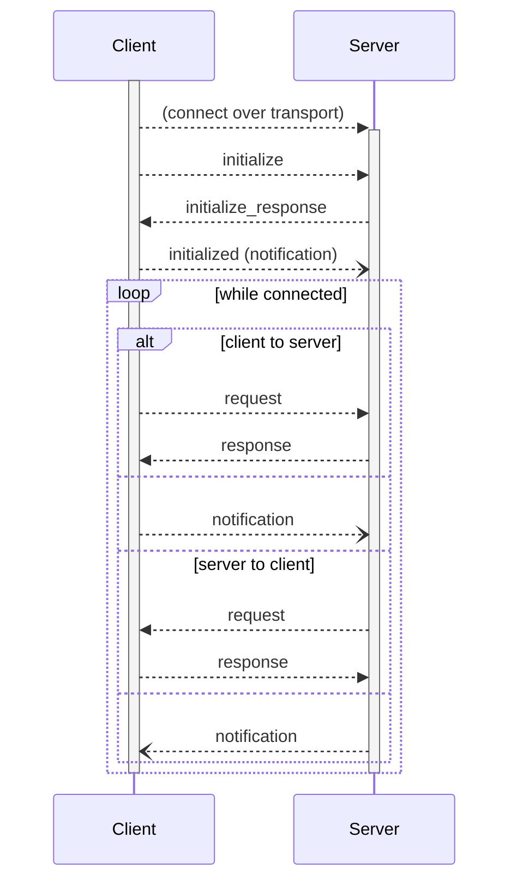
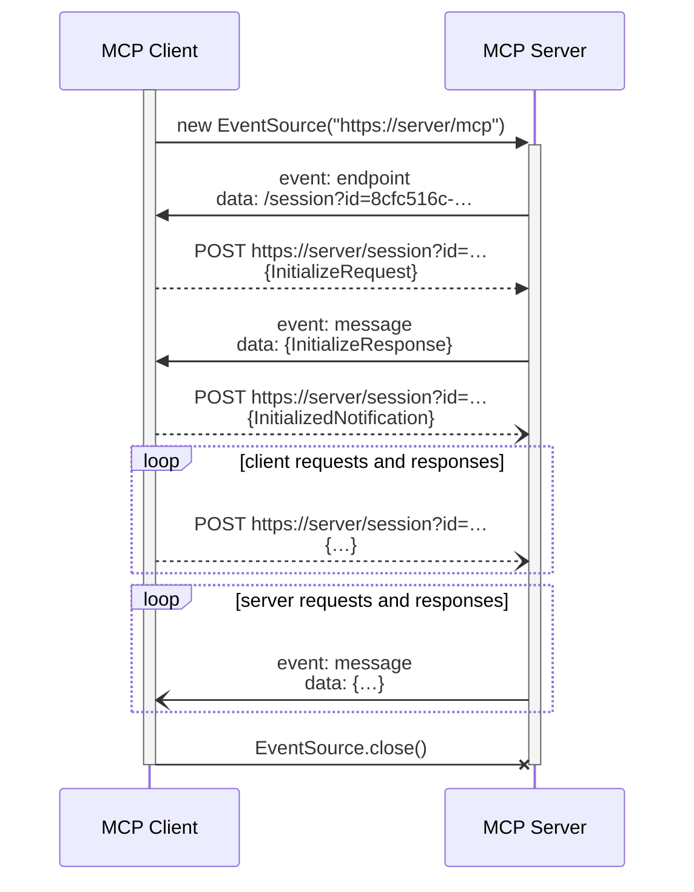

_**NOTE:** This is a very early draft. Feel free to discuss changes, requirements, etc._

# Goal
The Model Context Protocol (MCP) is an attempt to allow implementors to provide context to various LLM surfaces such as editors/IDEs, [claude.ai](https://claude.ai), etc., in a pluggable way. It separates the concerns of providing context from the LLM loop and its usage within.

This makes it **much** easier for anyone to script LLM applications for accomplishing their custom workflows, without the application needing to directly offer a large number of integrations.

# Terminology
The Model Context Protocol is inspired by Microsoft's [Language Server Protocol](https://microsoft.github.io/language-server-protocol/), with similar concepts:

* **Server**: a process or service providing context via MCP.
* **Client**: the initiator and client connection to a single MCP server. A message sent through a client is always directed to its one corresponding server.
* **Host**: a process or service which runs any number of MCP clients. [For example, your editor might be a host, claude.ai might be a host, etc.](#example-hosts)
* **Session**: a stateful session established between one client and server.
* **Message**: a message refers to one of the following types of [JSON-RPC](https://www.jsonrpc.org/) object:
  * **Request:** a request includes a `method` and `params`, and can be sent by either the server or the client, asking the other for some information or to perform some operation.
  * **Response:** a response includes a `result` or an `error`, and is sent *back* after a request, once processing has finished (successfully or unsuccessfully).
  * **Notification:** a special type of a request that does not expect a response, notifications are emitted by either the server or client to unilaterally inform the other of an event or state change.
* **Capability**: a feature that the client or server supports. When an MCP connection is initiated, the client and server negotiate the capabilities that they both support, which affects the rest of the interaction.

## Primitives
On top of the base protocol, MCP introduces these unique primitives:

* **Resources**: anything that can be loaded as context for an LLM. *Servers* expose a list of resources, identified with [URIs](https://en.wikipedia.org/wiki/Uniform_Resource_Identifier), which the *client* can choose to read or (if supported) subscribe to. Resources can be text or binary data—there are no restrictions on their content.
* **Prompts**: prompts or prompt templates that the *server* can provide to the *client*, which the client can easily surface in the UI (e.g., as some sort of slash command).
* **Tools**: functionality that the *client* can invoke on the *server*, to perform effectful operations. The client can choose to [expose these tools directly to the LLM](https://docs.anthropic.com/en/docs/build-with-claude/tool-use) too, allowing it to decide when and how to use them.
* **Sampling**: *servers* can ask the *client* to sample from the LLM, which allows servers to implement agentic behaviors without having to implement sampling themselves. This also allows the client to combine the sampling request with *all of the other context it has*, making it much more intelligent—while avoiding needlessly exfiltrating information to servers.

## Control
In addition to basic primitives, MCP offers a set of control flow messages.

* **Logging:** Anything related to how the server processes logs.
* **Completion**: Supports completion of server arguments on the client side. See

# Use cases
Most use cases are around enabling people to build their own specific workflows and integrations. MCP enables engineers and teams to **tailor AI to their needs.**

The beauty of the Model Context Protocol is that it's **extremely composable**. You can imagine mixing and matching *any number* of the example servers below with any one of the hosts. Each individual server can be quite simple and limited, but *composed together*, you can get a super-powered AI!

## Example servers
* **File watcher**: read entire local directories, exposed as resources, and subscribe to changes. The server can provide a tool to write changes back to disk too!
* **Screen watcher**: follow along with the user, taking screenshots automatically, and exposing those as resources. The host can use this to automatically attach screen captures to LLM context.
* **Git integration**: could expose context like Git commit history, but probably *most* useful as a source of tools, like: "commit these changes," "merge this and resolve conflicts," etc.
* **GitHub integration**: read and expose GitHub resources: files, commits, pull requests, issues, etc. Could also expose one or more tools to modify GitHub resources, like "create a PR."
* **Asana integration**: similarly to GitHub—read/write Asana projects, tasks, etc.
* **Slack integration**: read context from Slack channels. Could also look for specially tagged messages, or invocations of [shortcuts](https://api.slack.com/interactivity/shortcuts), as sources of context. Could expose tools to post messages to Slack.
* **Google Workspace integration**: read and write emails, docs, etc.
* **IDEs and editors**: IDEs and editors can be [servers](#example-hosts-clients) as well as hosts! As servers, they can be a rich source of context like: output/status of tests, [ASTs](https://en.wikipedia.org/wiki/Abstract_syntax_tree) and parse trees, and "which files are currently open and being edited?"

A key design principle of MCP is that it should be *as simple as possible* to implement a server. We want anyone to be able to write, e.g., a local Python script of 100 or fewer lines and get a fully functioning server, with capabilities comparable to any of the above.

## Example hosts
* **IDEs and editors**: An MCP host inside an IDE or editor could support attaching any number of servers, which can be used to populate an in-editor LLM chat interface, as well as (e.g.) contextualize refactoring. In future, we could also imagine populating editors' command palette with all of the tools that MCP servers have made available.
* **claude.ai**: [Claude.ai](https://claude.ai) can become an MCP host, allowing users to connect any number of MCP servers. Resources from those servers could be automatically made available for attaching to any Project or Chat. Claude could also make use of the tools exposed by MCP servers to implement agentic behaviors, saving artifacts to disk or to web services, etc.!
* **Slack**: [Claude in Slack](https://www.anthropic.com/claude-in-slack) on steroids! Building an MCP host into Slack would open the door to much more complex interactions with LLMs via the platform—both in being able to read context from any number of places (for example, all the servers posited above), as well as being able to *take actions*, from Slack, via the tools that MCP servers expose.

# Protocol
## Initialization
MCP [sessions](lifecycle) begin with an initialization phase, where the client and server identify each other, and exchange information about their respective [capabilities](lifecycle#capability-descriptions).

The client can only begin requesting resources and invoking tools on the server, and the server can only begin requesting LLM sampling, after the client has issued the `initialized` notification:

## Transports
An MCP server or client must implement one of the following transports. Different transports require different clients (but each can run within the same *host*).

### stdio
The client spawns the server process and manages its lifetime, and writes messages to it on the server's stdin. The server writes messages back to the client on its stdout.

Individual JSON-RPC messages are sent as newline-terminated JSON over the interface.

Anything the server writes to stderr MAY be captured as logging, but the client is also allowed to ignore it completely.

### SSE
A client can open a [Server-Sent Events](https://en.wikipedia.org/wiki/Server-sent_events) connection to a server, which the server will use to push all of its requests and responses to the client.

Upon connection, the server MUST issue a `endpoint` event (which is specific to MCP, not a default SSE event). The `data` associated with an `endpoint` event MUST be a URI for the client to use. The endpoint can be a relative or an absolute URI, but MUST always point to the same server origin. Cross-origin endpoints are not allowed, for security.

The client MUST issue individual JSON-RPC messages through the endpoint identified by the server, using HTTP POST requests—this allows the server to link these out-of-band messages with the ongoing SSE stream.

In turn, `message` events on the SSE stream will contain individual JSON-RPC messages from the server. The server MUST NOT send a `message` event until after the `endpoint` event has been issued.

This sequence diagram shows the MCP initialization flow over SSE, followed by open-ended communication between client and server, until ultimately the client disconnects:

## Security and T&S considerations
This model, while making meaningful changes to productivity and product experience, is effectively a form of arbitrary data access and arbitrary code execution.

**Every interaction between MCP host and server will need informed user consent.** For example:

* Servers must only expose user data as [resources](resources) with the user's explicit consent. Hosts must not transmit that data elsewhere without the user's explicit consent.
* Hosts must not invoke tools on servers without the user's explicit consent, and understanding of what the tool will do.
* When a server initiates [sampling](sampling) via a host, the user must have control over:
  * *Whether* sampling even occurs. (They may not want to be charged!)
  * What the prompt that will actually be sampled is.
  * *What the server sees* of the completion when sampling finishes.

This latter point is why the sampling primitives do not permit MCP servers to see the whole prompt—instead, the host remains in control, and can censor or modify it at will.
