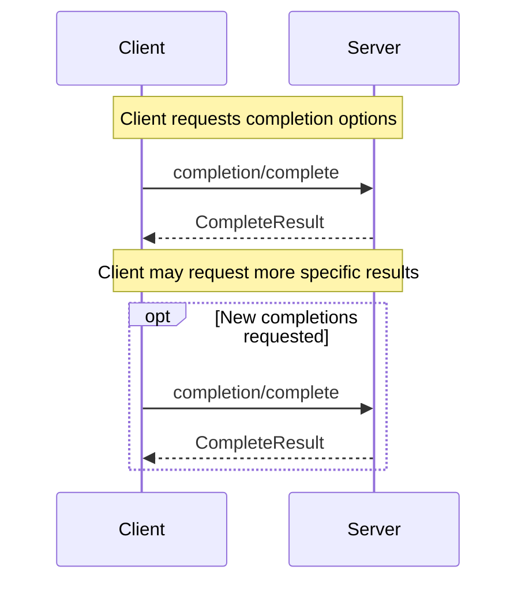

Argument Completion enables servers to provide argument completion for prompt and resource URI arguments. Clients can request completion options for specific arguments, and servers can return ranked suggestions. This allows clients to build rich user interfaces with intelligent argument completion for argument values.

> **_NOTE:_** Argument Completion in MCP is similar to traditional IDE argument completion - it provides contextual suggestions based on available options, rather than AI-powered completion. The server maintains a fixed set of valid values for each argument and returns matching suggestions based on partial input.

## Capabilities

Support for argument completion is not indicated by a dedicated capability - servers that expose prompts or resources with arguments implicitly support argument completion for those arguments. Clients may attempt argument completion requests for any prompt or resource argument.

## Concepts

### Completion References

When requesting completions, clients must specify what is being completed using a reference type:

- `ref/prompt`: References a prompt by name
- `ref/resource`: References a resource by URI

The reference identifies the context for completion suggestions.

### Completion Results

Servers return an array of completion values ranked by relevance, with a maximum of 100 items per response. If more results are available beyond the first 100, servers MUST set `hasMore: true` in the response to indicate that additional results can be retrieved with subsequent requests. The optional `total` field allows servers to specify the complete number of matches available, even if not all are returned in a single response.

> **_NOTE:_** MCP does not currently support pagination of completion results - clients that need more than the first 100 matches must issue new completion requests with more specific argument values to narrow down the results.

## Use Cases

Common use cases for argument completion include:

### Prompt Argument Completion

A client requesting completion options for a prompt argument:

```json
{
  "ref": {
    "type": "ref/prompt",
    "name": "code_review"
  },
  "argument": {
    "name": "language",
    "value": "py"
  }
}
```

The server might respond with language suggestions:

```json
{
  "completion": {
    "values": ["python", "pytorch", "pyside", "pyyaml"],
    "total": 10,
    "hasMore": true
  }
}
```

### Resource URI Completion

A client completing a path in a resource URI template:

```json
{
  "ref": {
    "type": "ref/resource",
    "uri": "file://{path}"
  },
  "argument": {
    "name": "path",
    "value": "/home/user/doc"
  }
}
```

The server could respond with matching paths:

```json
{
  "completion": {
    "values": [
      "/home/user/documents",
      "/home/user/docker",
      "/home/user/downloads"
    ],
    "hasMore": false
  }
}
```

## Diagram

The following diagram visualizes a typical argument completion interaction between client and server:



## Messages

This section defines the protocol messages for argument completion in the Model Context Protocol (MCP).

### Requesting Completions

#### Request

To get completion suggestions, the client MUST send a `completion/complete` request.

Method: `completion/complete`
Params:
  - `ref`: A `PromptReference` or `ResourceReference` indicating what is being completed
  - `argument`: Object containing:
    - `name`: The name of the argument being completed
    - `value`: The current value to get completions for

Example:
```json
{
  "jsonrpc": "2.0",
  "id": 1,
  "method": "completion/complete",
  "params": {
    "ref": {
      "type": "ref/prompt",
      "name": "code_review"
    },
    "argument": {
      "name": "language",
      "value": "py"
    }
  }
}
```

#### Response

The server MUST respond with a `CompleteResult` containing:

- `completion`: Object containing:
  - `values`: Array of completion suggestions (maximum 100)
  - `total`: Optional total number of matches available
  - `hasMore`: Optional boolean indicating if additional results exist

Example:
```json
{
  "jsonrpc": "2.0",
  "id": 1,
  "result": {
    "completion": {
      "values": ["python", "pytorch", "pyside"],
      "total": 10,
      "hasMore": true
    }
  }
}
```

## Error Handling

Servers MUST return appropriate errors if:
- The referenced prompt or resource does not exist
- The argument name is invalid
- Completion cannot be provided for other reasons

Clients SHOULD be prepared to handle cases where completion is temporarily unavailable or returns errors.

## Security Considerations

Implementations MUST carefully consider:
- Rate limiting completion requests to prevent abuse
- Access control for sensitive completion suggestions
- Validation of completion inputs to prevent injection attacks
