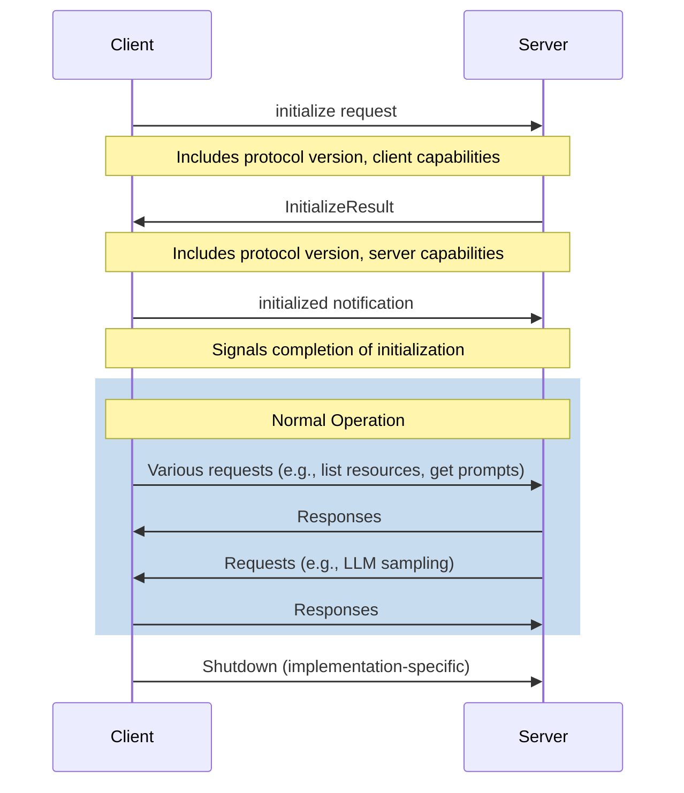

The Model Context Protocol defines a specific lifecycle for client-server interactions. This lifecycle consists of the following stages:

Initialization
: The client sends an `initialize` request to the server, initiating the connection.

Capability Exchange
: The client and server exchange information about their supported features and protocol versions.

Normal Operation
: After successful initialization, the client and server can freely communicate using the agreed-upon protocol.

Shutdown
: The connection is terminated, typically initiated by the client when it no longer needs the server's services.

The initialization sequence in the Model Context Protocol follows these steps:



This sequence ensures that both parties are aware of each other's capabilities and agree on the protocol version to be used for further communication.


# Details
## Initialization
The initialization process **MUST** begin with the client sending an `initialize` request to the server. This request **MUST** include:

- The *protocol version* supported by the client as a numeric integer
- The client's capabilities
- Information about the client implementation


    
```typescript
export interface InitializeRequest extends Request {
  method: "initialize";
  params: {
    protocolVersion: number;
    capabilities: ClientCapabilities;
    clientInfo: Implementation;
  };
}
```
    
    
```json
{
  "jsonrpc": "2.0",
  "id": 1,
  "method": "initialize",
  "params": {
    "protocolVersion": 1,
    "capabilities": {
      "experimental": {},
      "sampling": {}
    },
    "clientInfo": {
      "name": "ExampleClient",
      "version": "1.0.0"
    }
  }
}
```
    



The server **MUST** respond to the initialize request with an `InitializeResult`. This response **MUST** include:

- The *protocol version* the server will use
- The server's capabilities
- Information about the server implementation


    
    ```typescript
    export interface InitializeResult extends Result {
      protocolVersion: number;
      capabilities: ServerCapabilities;
      serverInfo: Implementation;
    }
    ```
    
    
    ```json
    {
      "jsonrpc": "2.0",
      "id": 1,
      "result": {
        "protocolVersion": 1,
        "capabilities": {
          "experimental": {},
          "logging": {},
          "prompts": {},
          "resources": {
            "subscribe": true
          },
          "tools": {}
        },
        "serverInfo": {
          "name": "ExampleServer",
          "version": "1.0.0"
        }
      }
    }
    ```
    


If the server cannot support the protocol version requested by the client, it **SHOULD** respond with an error.

## Capability Exchange

During the initialization process, both the client and server exchange their capabilities. This allows each party to understand what features and operations are supported by the other.

The client's capabilities are sent in the `initialize` request:

```typescript
export interface ClientCapabilities {
  experimental?: { [key: string]: object };
  sampling?: {};
}
```

The server's capabilities are sent in the `InitializeResult`:

```typescript
export interface ServerCapabilities {
  experimental?: { [key: string]: object };
  logging?: {};
  prompts?: {};
  resources?: {
    subscribe?: boolean;
  };
  tools?: {};
}
```

Both parties **SHOULD** respect the capabilities declared by the other and **SHOULD NOT** attempt to use features that are not supported.

### Capability Descriptions

Client Capabilities:
- `experimental`: An object containing any experimental, non-standard capabilities supported by the client.
- `sampling`: If present, indicates that the client supports sampling from an LLM.

Server Capabilities:
- `experimental`: An object containing any experimental, non-standard capabilities supported by the server.
- `logging`: If present, indicates that the server supports controlling logging from client side.
- `prompts`: If present, indicates that the server offers prompt templates.
- `resources`: If present, indicates that the server offers resources to read. The `subscribe` property within this object indicates whether the server supports subscribing to resource updates.
- `tools`: If present, indicates that the server offers tools to call.

These capabilities allow the client and server to communicate their supported features, enabling them to adapt their behavior accordingly and utilize the full range of supported functionalities during their interaction.

## Normal Operation

After successful initialization, the client **MUST** send an `initialized` notification to the server:

```typescript
export interface InitializedNotification extends Notification {
  method: "notifications/initialized";
}
```

Once the server receives this notification, both client and server can begin normal operation. During this phase:

1. The client **MAY** send requests to the server for various operations such as listing resources, getting prompts, or calling tools.
2. The server **MAY** send requests to the client for operations like sampling from an LLM.
3. Either party **MAY** send notifications to the other as needed.

Both parties **MUST** be prepared to handle requests and notifications at any time during normal operation.

## Shutdown

The Model Context Protocol does not define a specific shutdown procedure. However, implementations **SHOULD** consider the following guidelines:

1. The client **SHOULD** initiate the shutdown process when it no longer needs the server's services.
2. The server **SHOULD** gracefully terminate any ongoing operations when a shutdown is initiated.
3. Both parties **SHOULD** ensure that any resources are properly released during shutdown.

Throughout all stages of the lifecycle, both client and server **MUST** adhere to the JSON-RPC 2.0 specification for message formatting and error handling.
