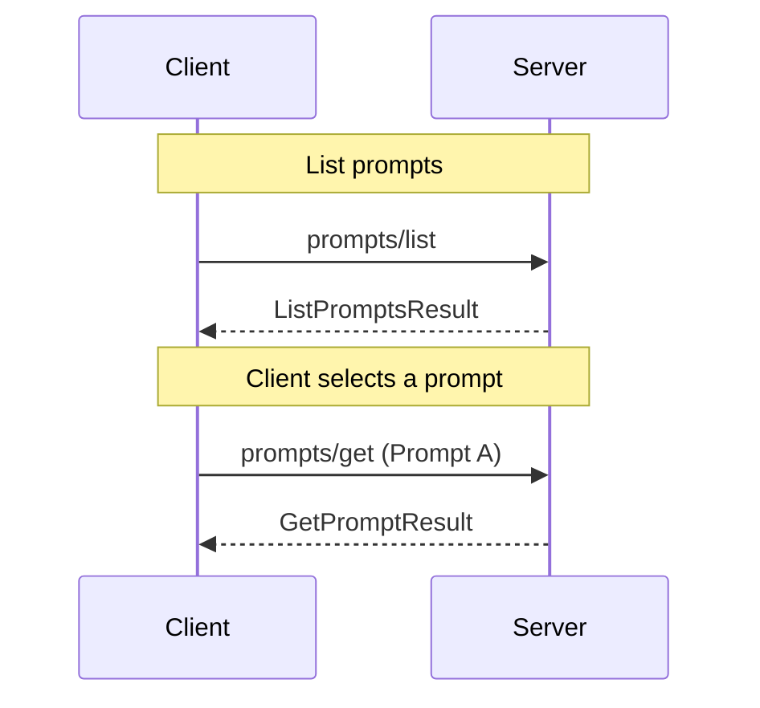

Prompts enable servers to provide templated conversations or instructions to clients in a structured way, specifically for interacting with language models. Clients can discover available prompts, retrieve their contents, and optionally provide arguments to customize them. Users may explicitly select prompts via the client UI, or clients can intelligently suggest appropriate prompts based on context. Each prompt is uniquely identified by a name.

An example of a prompt as a slash command in the Zed editor:


## Capabilities

To indicate support for the Prompts API, servers MUST include a `prompts` capability in their `ServerCapabilities` during initialization. The `prompts` capability SHOULD be an empty object:

```json
{
  "capabilities": {
    "prompts": {}
  }
}
```

Clients SHOULD check for this capability before using the Prompts API.

Servers MAY support notifications for changes to the prompt list. If a server supports this feature, it SHOULD include a `listChanged` property in its `prompts` capability:

```json
{
  "capabilities": {
    "prompts": {
      "listChanged": true
    }
  }
}
```

If a server supports this capability, it MAY send `notifications/prompts/list_changed` notifications to inform the client about changes to the available prompts.

## Concepts

### Prompt

A Prompt in the Model Context Protocol (MCP) represents a pre-defined set of messages or instructions that a server can provide to clients. Each Prompt is uniquely identified by a name and may have associated metadata such as a description and required arguments. Prompts can represent various types of interactions, including code reviews, data analysis tasks, or creative writing prompts.

### Prompt Templates

Prompt Templates are prompts that can be dynamically generated or customized based on provided arguments. They allow servers to expose a flexible set of prompts that can be tailored to specific use cases. Clients can use these templates by providing the required arguments when retrieving the prompt.

### Embedded Resource Contents

Prompts can include embedded resource contents from the MCP server. This allows servers to provide context-rich prompts that incorporate relevant data or files directly into the prompt structure.

## Use Cases

Common use cases for prompts include providing standardized instructions for code reviews, data analysis tasks, or creative writing exercises. Here are examples of kinds of prompts that an MCP server could expose:

### Code Review

A prompt template for conducting code reviews:

```json
{
  "name": "code_review",
  "description": "Analyze code quality and suggest improvements",
  "arguments": [
    {
      "name": "language",
      "description": "Programming language of the code",
      "required": true
    },
    {
      "name": "code",
      "description": "The code snippet to review",
      "required": true
    }
  ]
}
```

### Data Analysis

A prompt for guiding data analysis tasks:

```json
{
  "name": "data_analysis",
  "description": "Provide step-by-step guidance for analyzing a dataset",
  "arguments": [
    {
      "name": "dataset_description",
      "description": "Brief description of the dataset",
      "required": true
    },
    {
      "name": "analysis_goal",
      "description": "The main goal of the analysis",
      "required": true
    }
  ]
}
```

## Diagram

The following diagram visualizes a common interaction sequence between
client and server for using prompts:



## Messages

This section defines the protocol messages for prompt management in the Model Context Protocol (MCP).

### Listing Prompts

The Listing Prompts operation allows clients to discover available prompts on the server. This operation is fundamental to the prompt management process in the Model Context Protocol (MCP). When a client sends a `prompts/list` request, the server responds with a comprehensive list of prompts and prompt templates it can provide. This list enables clients to understand what prompts are available, facilitating subsequent operations such as retrieving specific prompts.

#### Request

To retrieve a list of available prompts from the server, the client MUST send a `prompts/list` request.

* Method: `prompts/list`
* Params: None

Example request from a client to a server:
```json
{
  "jsonrpc": "2.0",
  "id": 1,
  "method": "prompts/list"
}
```

#### Response

The server MUST respond with a `ListPromptsResult` containing:

- `prompts`: An array of `Prompt` objects

Example:
```json
{
  "jsonrpc": "2.0",
  "id": 1,
  "result": {
    "prompts": [
      {
        "name": "code_review",
        "description": "Analyze code quality and suggest improvements",
        "arguments": [
          {
            "name": "language",
            "description": "Programming language of the code",
            "required": true
          },
          {
            "name": "code",
            "description": "The code snippet to review",
            "required": true
          }
        ]
      },
      {
        "name": "data_analysis",
        "description": "Provide step-by-step guidance for analyzing a dataset",
        "arguments": [
          {
            "name": "dataset_description",
            "description": "Brief description of the dataset",
            "required": true
          },
          {
            "name": "analysis_goal",
            "description": "The main goal of the analysis",
            "required": true
          }
        ]
      }
    ]
  }
}
```

### Getting a Prompt

#### Request

To retrieve the contents of a specific prompt, the client MUST send a `prompts/get` request.

Method: `prompts/get`
Params:
  - `name`: The name of the prompt to retrieve (string, required)
  - `arguments`: An optional object containing argument values for prompt templates

Example:
```json
{
  "jsonrpc": "2.0",
  "id": 2,
  "method": "prompts/get",
  "params": {
    "name": "code_review",
    "arguments": {
      "language": "Python",
      "code": "def add(a, b):\n    return a + b"
    }
  }
}
```

#### Response

The server MUST respond with a `GetPromptResult` containing:

- `description`: An optional string describing the prompt
- `messages`: An array of `PromptMessage` objects representing the prompt content, which may include embedded resource contents

Example:
```json
{
  "jsonrpc": "2.0",
  "id": 2,
  "result": {
    "description": "A prompt for analyzing code quality",
    "messages": [
      {
        "role": "user",
        "content": {
          "type": "text",
          "text": "Please review the following Python code snippet and provide feedback on its quality and potential improvements:\n\ndef add(a, b):\n    return a + b"
        }
      },
      {
        "role": "assistant",
        "content": {
          "type": "text",
          "text": "Certainly! I'd be happy to review the Python code snippet and provide feedback on its quality and potential improvements. Let's analyze it:"
        }
      },
      {
        "role": "user",
        "content": {
          "type": "resource",
          "resource": {
            "uri": "file:///workspace/project/requirements.txt",
            "mimeType": "text/plain",
            "text": "flask==2.0.1\nnumpy==1.21.0\npandas==1.3.0\n"
          }
        }
      },
      {
        "role": "assistant",
        "content": {
          "type": "text",
          "text": "I see you've also provided the contents of the requirements.txt file. This gives us additional context about the project environment. Let's consider these dependencies in our code review as well."
        }
      }
    ]
  }
}
```

### Prompt List Changed Notification

If the server supports the `listChanged` capability for prompts, it MAY send a `notifications/prompts/list_changed` notification to inform the client that the list of available prompts has changed.

#### Notification

Method: `notifications/prompts/list_changed`
Params: None

Example:
```json
{
  "jsonrpc": "2.0",
  "method": "notifications/prompts/list_changed"
}
```

Upon receiving this notification, clients SHOULD request an updated prompt list using the `prompts/list` method to ensure they have the most up-to-date information about available prompts.

## Error Handling

Clients MUST be prepared to handle cases where listed prompts become unavailable between listing and retrieval attempts. Servers SHOULD provide appropriate error responses in such scenarios.

## Security Considerations

Implementations MUST carefully consider the security implications of exposing prompts, especially when dealing with sensitive data or customizable templates. Proper authentication and authorization mechanisms SHOULD be in place to prevent unauthorized access to prompts.
