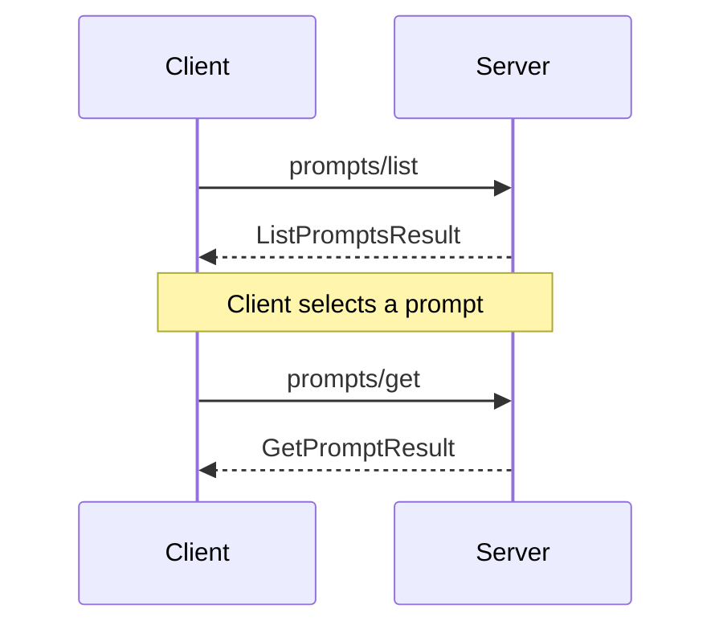

The Prompts API allows clients to retrieve information about available prompts and prompt templates from the server.

## Capabilities

To indicate support for the Prompts API, server and client **MUST** agree on the `prompts` capability in their capabilities during initialization.

## Request example



## List Prompts

The client **SHOULD** send a `prompts/list` request to retrieve a list of available prompts and prompt templates from the server.

### Request

- method: "prompts/list"
- params: none

### Response

The server **MUST** respond with a `ListPromptsResult` as defined in the TypeScript interface:

```typescript
export interface ListPromptsResult extends Result {
  prompts: Prompt[];
}
```

Each `Prompt` object in the `prompts` array **MUST** conform to the following TypeScript interface:

```typescript
export interface Prompt {
  name: string;
  description?: string;
  arguments?: {
    name: string;
    description?: string;
    required?: boolean;
  }[];
}
```

The server **MUST** include:

- prompts: An array of `Prompt` objects describing the available prompts/templates

Each `Prompt` object **MUST** contain:

- name: A string identifying the prompt/template
- description: An optional string describing the prompt (if provided)
- arguments: An optional array of argument definitions (if the prompt is a template)

Argument definitions, if present, **MUST** include:

- name: The argument name
- description: An optional description of the argument
- required: An optional boolean indicating if the argument is required

The server **SHOULD** provide descriptive names and descriptions to help clients understand the purpose and usage of each prompt or template.
## Get Prompt

To retrieve a specific prompt or instantiate a prompt template, the client **SHOULD** send a `prompts/get` request.

### Request

- method: "prompts/get"
- params:
  - name: The name of the prompt/template to retrieve
  - arguments: An optional object containing argument values for templates

### Response

The server **MUST** respond with a `GetPromptResult` containing:

- description: An optional string describing the prompt
- messages: An array of `SamplingMessage` objects representing the prompt content

Each `SamplingMessage` **MUST** have:

- role: Either "user" or "assistant"
- content: Either a text object or an image object

Text content objects **MUST** contain:

- type: "text"
- text: The text content

Image content objects **MUST** contain:

- type: "image"
- data: Base64-encoded image data
- mimeType: The MIME type of the image

Example response:

```json
{
  "description": "A prompt for analyzing code quality",
  "messages": [
    {
      "role": "user",
      "content": {
        "type": "text",
        "text": "Please review the following code snippet and provide feedback on its quality and potential improvements:"
      }
    },
    {
      "role": "assistant",
      "content": {
        "type": "text",
        "text": "Certainly! I'd be happy to review the code snippet and provide feedback on its quality and potential improvements. Please share the code you'd like me to analyze."
      }
    },
    {
      "role": "user",
      "content": {
        "type": "text",
        "text": "{{code}}"
      }
    }
  ]
}
```

In this example, `{{code}}` is a placeholder that would be replaced with the actual code snippet when the prompt is used.

## Capabilities

To indicate support for the Prompts API, servers **MUST** include a `prompts` capability in their `ServerCapabilities` during initialization.

Clients **SHOULD** check for this capability before using the Prompts API.
