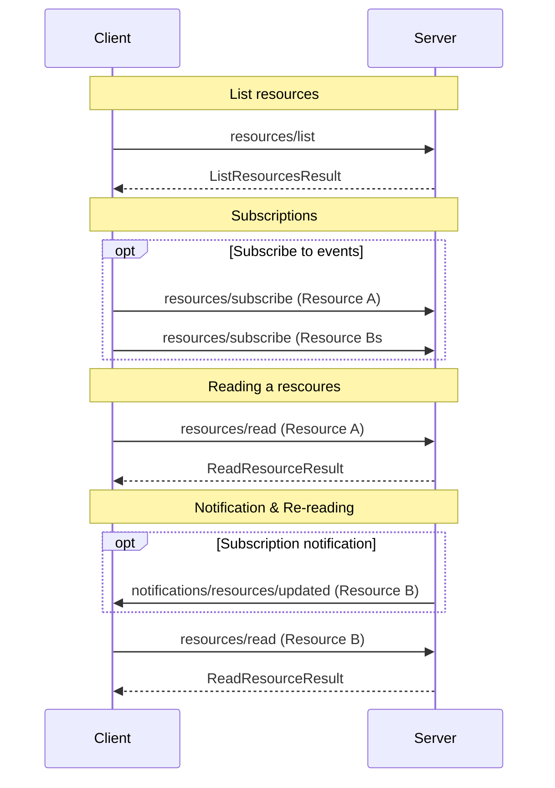

Resources enable servers to expose arbitrary data to clients in a structured way, specifically for providing context to language models. Clients can discover available resources, read their contents, and optionally subscribe to updates. Users may explicitly attach resources via the client UI, or clients can intelligently select appropriate resources to add to the context. Each resource is uniquely identified by a [URI](https://datatracker.ietf.org/doc/html/rfc3986).

## Concepts
### Resource

A Resource in the Model Context Protocol (MCP) represents a discrete unit of data that a server can provide to clients. Each Resource is uniquely identified by a URI and may have associated metadata such as a name and MIME type. Resources can represent various types of data, including files, database records, or application-specific information.

### Resource Templates

Resource Templates are URI patterns that describe a class of resources that can be dynamically generated or accessed. They use URI templates as defined in [RFC 6570](https://datatracker.ietf.org/doc/html/rfc6570) to specify how clients can construct valid resource URIs. Templates allow servers to expose a potentially large or dynamic set of resources without explicitly listing each one. Clients can use these templates to generate specific resource URIs as needed.

## Use Cases

Common usecases for resources include file and folder access to provide code context, but can extend to any other form of model-relevant data. See [list of common URI schemes](#list-of-common-uri-schemas) for more information. Here are examples of kinds of resources that an MCP server could expose:

### File Access
Resources can be used to expose file access to clients. The server should prefix any file-like resource
with the `file://` scheme, and ensure that the client is aware of how to interpret the file by providing
a correct MIME type. When the client issues a `resources/read` request, the server *MUST* ensure that it
returns the file in the correct encoding for the mime type (e.g., text if possible, or base64 for any binary data).

```json
{
  "uri": "file:///home/user/documents/example.zip",
  "name": "Example Text File",
  "mimeType": "application/octet-stream"
}
```

### Database Schema

Resources can also be used to provide specialized structured information. In the following example we are providing a database schema as a custom JSON format that the client is required to understand:

```json
{
  "uri": "postgres://localhost/some_database/some_table/schema",
  "name": "Database schema for some_database.some_table",
  "mimeType": "application/json;format=MyApplication::DatabaseSchema"
}
```

If the client requests a schema, the server would respond with the custom database schema
JSON, for example

```json
{
  "schema": "myschema",
  "table": "test",
  "owner": "a-user",
  "definition": "..."
}
```
## Diagram

The following diagram visualizes a common intercation sequence between
client and server. This is an example. Clients are free to request any
method at any time. For instance, clients are not required to list resources
before reading them.



## Messages

This section defines the protocol messages for resource management in the Model Context Protocol (MCP). Resources are identified by URIs and can represent various types of data exposed by the server. Clients can list available resources, read their contents, and optionally subscribe to updates.

### Listing Resources
The Listing Resources operation allows clients to discover available resources on the server. This operation is fundamental to the resource management process in the Model Context Protocol (MCP). When a client sends a `resources/list` request, the server responds with a comprehensive list of resources and resource templates it can provide. This list enables clients to understand what data is available, facilitating subsequent operations such as reading resources or subscribing to updates. The response may include both concrete resources (with specific URIs) and resource templates (with URI patterns), giving clients flexibility in accessing and utilizing server-provided data.

#### Request

To retrieve a list of available resources from the server, the client MUST send a `resources/list` request.

* Method: `resources/list`
* Params: None

Example request from a client to a server:
```json
{
  "jsonrpc": "2.0",
  "id": 1,
  "method": "resources/list"
}
```

### Response

The server MUST respond with a `ListResourcesResult` containing:

- `resourceTemplates`: An optional array of `ResourceTemplate` objects
- `resources`: An optional array of `Resource` objects

The response MAY be empty (i.e., both arrays may be omitted or empty).

Example:
```json
{
  "jsonrpc": "2.0",
  "id": 1,
  "result": {
    "resourceTemplates": [
      {
        "uriTemplate": "file://{path}",
        "name": "Local File",
        "description": "Access local files",
        "mimeType": "application/octet-stream"
      }
    ],
    "resources": [
      {
        "uri": "file:///home/user/document.txt",
        "name": "User Document",
        "mimeType": "text/plain"
      }
    ]
  }
}
```

### Error Handling

Clients MUST be prepared to handle cases where listed resources become unavailable between listing and access attempts. Servers SHOULD provide appropriate error responses in such scenarios.

## Reading a Resource

### Request

To retrieve the contents of a specific resource, the client MUST send a `resources/read` request.

Method: `resources/read`
Params:
  - `uri`: The URI of the resource to read (string, required)

Example:
```json
{
  "jsonrpc": "2.0",
  "id": 2,
  "method": "resources/read",
  "params": {
    "uri": "file:///home/user/document.txt"
  }
}
```

### Response

The server MUST respond with a `ReadResourceResult` containing an array of `ResourceContents` objects. Each object MUST be either a `TextResourceContents` or a `BlobResourceContents`.

Example (text content):
```json
{
  "jsonrpc": "2.0",
  "id": 2,
  "result": {
    "contents": [
      {
        "uri": "file:///home/user/document.txt",
        "mimeType": "text/plain",
        "text": "This is the content of the document."
      }
    ]
  }
}
```

Example (binary content):
```json
{
  "jsonrpc": "2.0",
  "id": 2,
  "result": {
    "contents": [
      {
        "uri": "file:///home/user/image.png",
        "mimeType": "image/png",
        "blob": "iVBORw0KGgoAAAANSUhEUgAAAAEAAAABCAYAAAAfFcSJAAAACklEQVR4nGMAAQAABQABDQottAAAAABJRU5ErkJggg=="
      }
    ]
  }
}
```

## Subscriptions

The Model Context Protocol (MCP) offers an optional subscription mechanism for resources to enable real-time updates and efficient synchronization between clients and servers. This feature allows clients to receive notifications when specific resources they're interested in change, without the need for constant polling.

Key aspects of resource subscriptions in MCP:

1. Optional Feature: Subscriptions are not mandatory. Servers MAY support this feature, and clients MAY choose to use it when available.

2. Real-time Updates: Subscriptions enable clients to receive immediate notifications when resources change, ensuring up-to-date information without delay.

3. Efficiency: By subscribing only to relevant resources, clients can reduce unnecessary network traffic and processing overhead associated with frequent polling.

Implementations should carefully consider the implications of supporting subscriptions, including potential increased complexity in server-side resource tracking and the need for robust error handling in case of connection issues or missed updates.

### Subscribing to Resources
#### Request

To subscribe to updates for a resource, the client MUST send a `resources/subscribe` request.

Method: `resources/subscribe`
Params:
  - `uri`: The URI of the resource to subscribe to (string, required)

Example:
```json
{
  "jsonrpc": "2.0",
  "id": 3,
  "method": "resources/subscribe",
  "params": {
    "uri": "file:///home/user/document.txt"
  }
}
```

### Response

The server MUST respond with an empty result if the subscription is successful, or an error if it fails.

Example (success):
```json
{
  "jsonrpc": "2.0",
  "id": 3,
  "result": {}
}
```

### Unsubscribing from Resources

#### Request

To unsubscribe from updates for a resource, the client MUST send a `resources/unsubscribe` request.

Method: `resources/unsubscribe`
Params:
  - `uri`: The URI of the resource to unsubscribe from (string, required)

Example:
```json
{
  "jsonrpc": "2.0",
  "id": 4,
  "method": "resources/unsubscribe",
  "params": {
    "uri": "file:///home/user/document.txt"
  }
}
```

#### Response

The server MUST respond with an empty result if the unsubscription is successful, or an error if it fails.

Example (success):
```json
{
  "jsonrpc": "2.0",
  "id": 4,
  "result": {}
}
```

### Resource Updated Notification

When a subscribed resource is updated, the server MUST send a `notifications/resources/updated` notification to the client.

Method: `notifications/resources/updated`
Params:
  - `uri`: The URI of the updated resource (string, required)

Example:
```json
{
  "jsonrpc": "2.0",
  "method": "notifications/resources/updated",
  "params": {
    "uri": "file:///home/user/document.txt"
  }
}
```

Servers MUST only send this notification for resources that clients have explicitly subscribed to.

### Resource List Changed Notification

When the list of available resources has changed, the server MUST send a `notifications/resources/list_changed` notification to the client.

Method: `notifications/resources/list_changed`
Params: None

Example:
```json
{
  "jsonrpc": "2.0",
  "method": "notifications/resources/list_changed"
}
```

Upon receiving this notification, clients SHOULD request an updated resource list using the `resources/list` method.

## Security Considerations

Implementations MUST carefully consider the security implications of exposing resources, especially when dealing with sensitive data or file systems. Proper authentication and authorization mechanisms SHOULD be in place to prevent unauthorized access to resources.

## Error Handling

Servers MUST provide appropriate error responses for all request types when issues occur, such as resource not found, permission denied, or internal server errors. Clients MUST be prepared to handle these error responses gracefully.

Clients MUST also be prepared for resources to change or become unavailable between listing and reading operations. A resource that was present in a `resources/list` response may no longer exist or may have different contents when a subsequent `resources/read` request is made. Servers SHOULD return appropriate error responses in such cases, and clients SHOULD handle these scenarios gracefully, potentially by refreshing their resource list or retrying the operation.

Example error response:
```json
{
  "jsonrpc": "2.0",
  "id": 5,
  "error": {
    "code": -32001,
    "message": "Resource not found",
    "data": {
      "uri": "file:///nonexistent/file.txt"
    }
  }
}
```


## List of common URI schemas
Here are some common URI schemes used in the context of MCP resources:

https://
: Used to represent a resource available on the web
: Servers SHOULD use this scheme only when the client can fetch the resource directly
: For other cases, servers SHOULD prefer a different or custom scheme

file://
: Used to identify resources that behave like a filesystem
: Does not need to map to an actual physical filesystem
: Servers MAY use XDG MIME types like inode/directory for non-regular files

s3://
: Used for Amazon S3 or S3-compatible object storage resources

gcs://
: Use for Google Cloud object storage resources

git://
: Used to identify Git repositories or specific Git objects

data:
: Used to embed small pieces of data directly in the URI
: Useful for simple, static resources

zed://
: Reserved for integration with the Zed editor.
  - zed://prompt-library
    : Prompts provided by MCP servers for the Zed prompt library

If you would like to include a commonly used URI schema in this list,
please open an issue the [MCP Specification Github](https://github.com/modelcontextprotocol/specifications).
