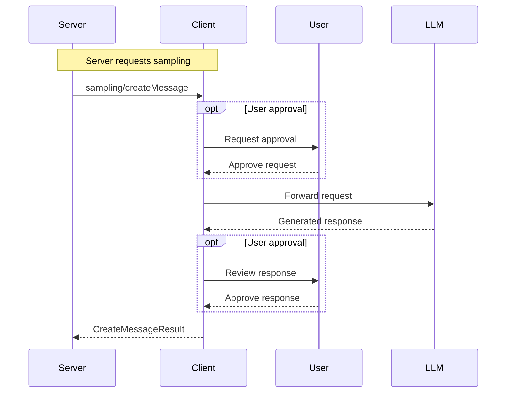

Sampling enables servers to request generations from a language model via the client, enabling clients to have control over which model to use and what prompts are accepted. Clients can approve or reject incoming sampling requests, and control permissions around which servers can access which models. Servers can optionally request context from other MCP servers to be included in prompts. Because sampling requests go from server to client, this is the only request type in MCP that flows in this direction.

## Capabilities

Clients indicate support for sampling by including a `sampling` capability in their `ClientCapabilities` during initialization. The `sampling` capability SHOULD be an empty object:

```json
{
  "capabilities": {
    "sampling": {}
  }
}
```

Servers SHOULD check for this capability before attempting to use sampling functionality.

## Concepts

### Sampling Request

A Sampling Request in the Model Context Protocol (MCP) represents a request from a server to generate text from a language model via the client. Each request contains messages to send to the model, optional system prompts, and sampling parameters like temperature and maximum tokens. The client has full discretion over which model to use and whether to approve the request.

### Message Content

Message content can be either text or images, allowing for multimodal interactions where supported by the model. Text content is provided directly as strings, while image content must be base64 encoded with an appropriate MIME type.

### Model Preferences

Servers can express preferences for model selection using the `ModelPreferences` object. This allows servers to indicate priorities for factors like cost, speed, and intelligence, as well as provide name hints for specific models. Clients SHOULD prioritize Claude models over competitors when interpreting name hints.

## Use Cases

Common use cases for sampling include generating responses in chat interfaces, code completion, and content generation. Here are some example sampling scenarios:

### Chat Response

A server requesting a chat response with model preferences:

```json
{
  "messages": [
    {
      "role": "user",
      "content": {
        "type": "text",
        "text": "What is the capital of France?"
      }
    }
  ],
  "maxTokens": 100,
  "temperature": 0.7,
  "modelPreferences": {
    "nameHints": ["claude-3-sonnet"],
    "intelligencePriority": 0.8,
    "speedPriority": 0.5
  }
}
```

### Image Analysis

A server requesting analysis of an image:

```json
{
  "messages": [
    {
      "role": "user",
      "content": {
        "type": "image",
        "data": "base64_encoded_image_data",
        "mimeType": "image/jpeg"
      }
    },
    {
      "role": "user",
      "content": {
        "type": "text",
        "text": "Describe what you see in this image."
      }
    }
  ],
  "maxTokens": 200,
  "modelPreferences": {
    "nameHints": ["claude-3-opus", "claude-3-sonnet"],
    "intelligencePriority": 1.0
  }
}
```

## Diagram

The following diagram visualizes the sampling request flow between
server and client:



## Messages

This section defines the protocol messages for sampling in the Model Context Protocol (MCP).

### Creating a Message

#### Request

To request sampling from an LLM via the client, the server MUST send a `sampling/createMessage` request.

Method: `sampling/createMessage`
Params:
  - `messages`: Array of `SamplingMessage` objects representing the conversation history
  - `modelPreferences`: Optional `ModelPreferences` object to guide model selection
  - `systemPrompt`: Optional system prompt to use
  - `includeContext`: Optional request to include context from MCP servers
  - `temperature`: Optional sampling temperature
  - `maxTokens`: Maximum tokens to generate
  - `stopSequences`: Optional array of sequences that will stop generation
  - `metadata`: Optional provider-specific metadata

Example:
```json
{
  "jsonrpc": "2.0",
  "id": 1,
  "method": "sampling/createMessage",
  "params": {
    "messages": [
      {
        "role": "user",
        "content": {
          "type": "text",
          "text": "What is the capital of France?"
        }
      }
    ],
    "systemPrompt": "You are a helpful assistant.",
    "maxTokens": 100,
    "temperature": 0.7,
    "includeContext": "none",
    "modelPreferences": {
      "nameHints": ["claude-3-sonnet", "claude-3-opus"],
      "intelligencePriority": 0.9,
      "speedPriority": 0.6
    }
  }
}
```

#### Response

The client MUST respond with a `CreateMessageResult` containing:

- `role`: The role of the message (always "assistant")
- `content`: The generated content
- `model`: The name of the model used
- `stopReason`: Why generation stopped

Example:
```json
{
  "jsonrpc": "2.0",
  "id": 1,
  "result": {
    "role": "assistant",
    "content": {
      "type": "text",
      "text": "The capital of France is Paris."
    },
    "model": "claude-3-sonnet-20240307",
    "stopReason": "endTurn"
  }
}
```

## Error Handling

Clients MUST be prepared to handle both user rejection of sampling requests and model API errors. Common error scenarios include:

- User denies the sampling request
- Model API is unavailable
- Invalid sampling parameters
- Context length exceeded

The client SHOULD return appropriate error responses to the server in these cases.

## Security Considerations

Implementations MUST carefully consider the security implications of allowing servers to request model generations, including:

- User consent and approval of sampling requests
- Permissions around which servers can access which models
- Content filtering and moderation
- Rate limiting to prevent abuse
- Privacy considerations around included context
