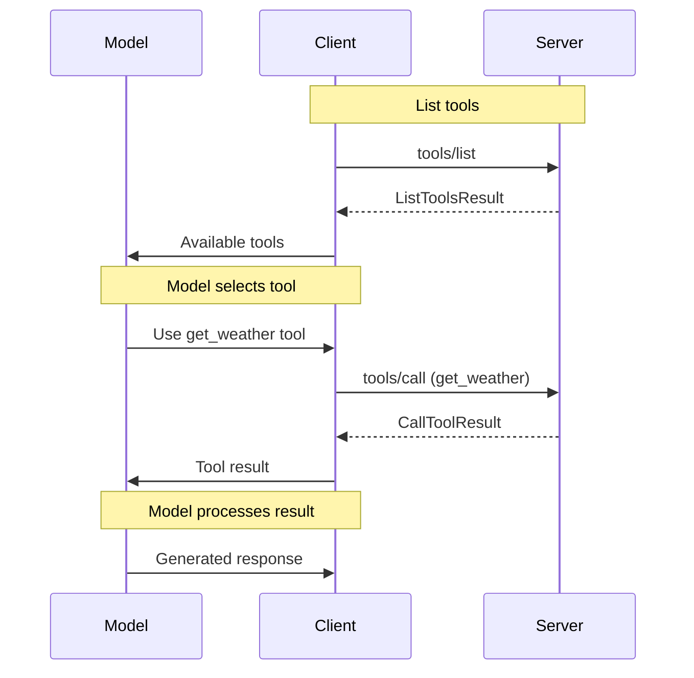

Tool use enables servers to expose tools (also sometimes called functions) that can be invoked by language models through the client. This allows models to perform actions or retrieve information beyond their training data. Clients can discover available tools, retrieve their specifications, and invoke them on behalf of the model. Each tool is uniquely identified by a name.

## Capabilities

To indicate support for the Tools API, servers MUST include a `tools` capability in their `ServerCapabilities` during initialization. The `tools` capability MAY be an empty object:

```json
{
  "capabilities": {
    "tools": {}
  }
}
```

Clients SHOULD check for this capability before attempting to use any Tools API methods. If the capability is not present, clients SHOULD assume that the server does not support tool functionality.

Servers MAY support notifications for changes to the tool list. If a server supports this feature, it SHOULD include a `listChanged` property in its `tools` capability:

```json
{
  "capabilities": {
    "tools": {
      "listChanged": true
    }
  }
}
```

If a server supports this capability, it MAY send [`notifications/tools/list_changed`](#tool-list-changed-notification) notifications to inform the client about changes to the available tools.
## Concepts

### Tool

A Tool in the Model Context Protocol (MCP) represents a function or action that can be invoked by a language model through the client. Each Tool is uniquely identified by a name and has associated metadata such as a description and input schema. Tools can represent various types of actions, including data retrieval, calculations, or external API calls.

### Tool Specifications

Tool Specifications describe the structure and expected inputs for each tool. They use JSON Schema to define the input parameters, allowing clients and models to understand how to properly invoke the tools.

## Use Cases

Common use cases for tools include data retrieval, performing calculations, or interacting with external services. Here are examples of kinds of tools that an MCP server could expose:

### Weather Information

A tool for retrieving current weather information:

```json
{
  "name": "get_weather",
  "description": "Get current weather information for a specific location",
  "inputSchema": {
    "type": "object",
    "properties": {
      "location": {
        "type": "string",
        "description": "City name or zip code"
      },
      "units": {
        "type": "string",
        "enum": ["metric", "imperial"],
        "default": "metric"
      }
    },
    "required": ["location"]
  }
}
```

### Database Query

A tool for querying a database:

```json
{
  "name": "query_database",
  "description": "Execute a SQL query on the database",
  "inputSchema": {
    "type": "object",
    "properties": {
      "query": {
        "type": "string",
        "description": "SQL query to execute"
      },
      "database": {
        "type": "string",
        "enum": ["users", "products", "orders"],
        "default": "users"
      }
    },
    "required": ["query"]
  }
}
```

## Diagram

The following diagram visualizes a common interaction sequence between
client, server, and language model for using tools:



## Messages

This section defines the protocol messages for tool management in the Model Context Protocol (MCP).

### Listing Tools
The Listing Tools operation allows clients to discover available tools on the server. When a client sends a `tools/list` request, the server responds with a comprehensive list of tools it can provide. This list enables clients to understand what tools are available, facilitating subsequent operations such as tool invocation.

> **_NOTE:_** Tools can change over time. In such cases, the server may send a [Tool List Changed Notification](#tool-list-changed-notification) to inform the client about updates to the available tools.

#### Request

To retrieve a list of available tools from the server, the client MUST send a `tools/list` request.

* Method: `tools/list`
* Params: None

Example request from a client to a server:
```json
{
  "jsonrpc": "2.0",
  "id": 1,
  "method": "tools/list"
}
```

#### Response

The server MUST respond with a `ListToolsResult` containing:

- `tools`: An array of `Tool` objects

Example:
```json
{
  "jsonrpc": "2.0",
  "id": 1,
  "result": {
    "tools": [
      {
        "name": "get_weather",
        "description": "Get current weather information for a specific location",
        "inputSchema": {
          "type": "object",
          "properties": {
            "location": {
              "type": "string",
              "description": "City name or zip code"
            },
            "units": {
              "type": "string",
              "enum": ["metric", "imperial"],
              "default": "metric"
            }
          },
          "required": ["location"]
        }
      },
      {
        "name": "query_database",
        "description": "Execute a SQL query on the database",
        "inputSchema": {
          "type": "object",
          "properties": {
            "query": {
              "type": "string",
              "description": "SQL query to execute"
            },
            "database": {
              "type": "string",
              "enum": ["users", "products", "orders"],
              "default": "users"
            }
          },
          "required": ["query"]
        }
      }
    ]
  }
}
```

### Calling a Tool

#### Request

To invoke a specific tool, the client MUST send a `tools/call` request.

Method: `tools/call`
Params:
  - `name`: The name of the tool to call (string, required)
  - `arguments`: An object containing the tool's input parameters (object, optional)

Example:
```json
{
  "jsonrpc": "2.0",
  "id": 2,
  "method": "tools/call",
  "params": {
    "name": "get_weather",
    "arguments": {
      "location": "New York",
      "units": "imperial"
    }
  }
}
```

#### Response

The server MUST respond with a `CallToolResult` containing:

- `toolResult`: The result of the tool invocation (any JSON-serializable value)

Example:
```json
{
  "jsonrpc": "2.0",
  "id": 2,
  "result": {
    "toolResult": {
      "temperature": 72,
      "humidity": 65,
      "description": "Partly cloudy"
    }
  }
}
```

### Tool List Changed Notification

If the server supports the `listChanged` capability for tools, it MAY send a `notifications/tools/list_changed` notification to inform the client that the list of available tools has changed.

#### Notification

Method: `notifications/tools/list_changed`
Params: None

Example:
```json
{
  "jsonrpc": "2.0",
  "method": "notifications/tools/list_changed"
}
```

Upon receiving this notification, clients SHOULD request an updated tool list using the `tools/list` method to ensure they have the most up-to-date information about available tools.

## Error Handling

Error handling for tools follows two distinct paths depending on the type of error:

1. Protocol-level errors (like unknown tools or invalid parameters) MUST be reported as JSON-RPC error responses
2. Tool execution errors SHOULD be reported inside successful CallToolResult responses

For protocol-level errors, servers MUST return error responses when:
- An unknown tool is requested
- Invalid arguments are provided
- The server does not support tool calls

Example protocol error response for invalid parameters:
```json
{
  "jsonrpc": "2.0",
  "id": 3,
  "error": {
    "code": -32602,
    "message": "Invalid params",
    "data": {
      "reason": "Missing required argument: location"
    }
  }
}
```

Example protocol error response for an unknown tool:
```json
{
  "jsonrpc": "2.0",
  "id": 4,
  "error": {
    "code": -32602,
    "message": "Invalid params",
    "data": {
      "reason": "Unknown tool: invalid_tool_name"
    }
  }
}
```

For errors that occur during tool execution (like API failures or invalid data), servers SHOULD return these as part of a successful `CallToolResult`. This allows the LLM to see and potentially handle the error condition:

```json
{
  "jsonrpc": "2.0",
  "id": 5,
  "result": {
    "toolResult": {
      "error": "No search results found for query: 'widgets manufactured in 1972'",
      "status": "empty_results"
    }
  }
}
```

## Security Considerations

Implementations MUST carefully consider the security implications of exposing tools, especially when dealing with sensitive data or external services. Proper authentication and authorization mechanisms SHOULD be in place to prevent unauthorized access to tools.

Clients SHOULD implement user permission prompts before executing tools, especially for tools that may have side effects or access sensitive information. This allows users to maintain control over the actions performed by the language model.

Servers SHOULD implement rate limiting and input validation to prevent abuse of tool invocations.
