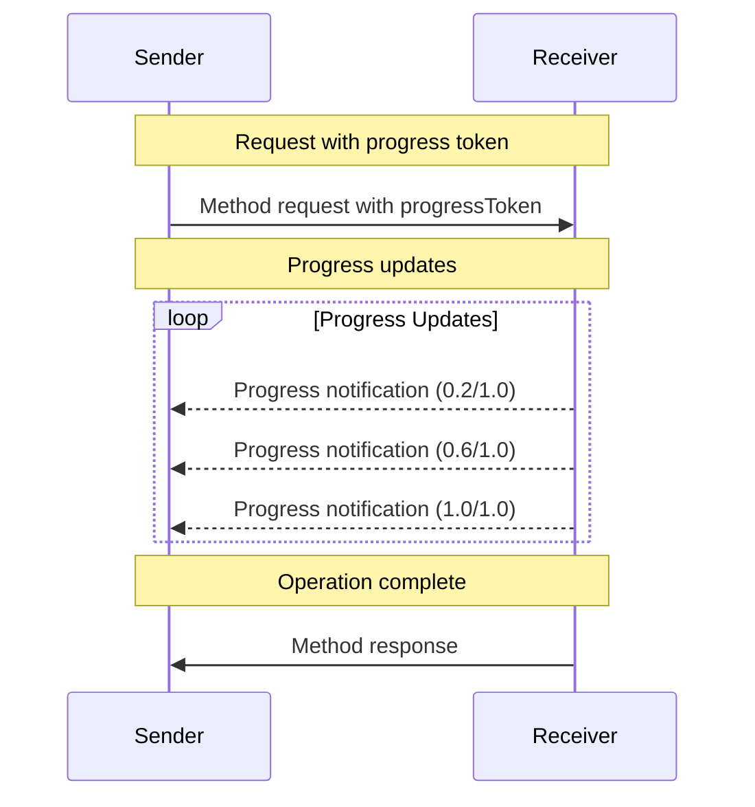


**Protocol Revision**: 


The Model Context Protocol (MCP) supports optional progress tracking for long-running operations through notification messages. Either side can send progress notifications to provide updates about operation status.

## Progress Flow

When a party wants to _receive_ progress updates for a request, it includes a `progressToken` in the request metadata.

* Progress tokens **MUST** be a string or integer value
* Progress tokens can be chosen by the sender using any means, but **MUST** be unique across all active requests.

```json
{
  "jsonrpc": "2.0",
  "id": 1,
  "method": "some_method",
  "params": {
    "_meta": {
      "progressToken": "abc123"
    }
  }
}
```

The receiver **MAY** then send progress notifications containing:

- The original progress token
- The current progress value so far
- An optional "total" value

```json
{
  "jsonrpc": "2.0",
  "method": "notifications/progress",
  "params": {
    "progressToken": "abc123",
    "progress": 50,
    "total": 100
  }
}
```

* The `progress` value **MUST** increase with each notification, even if the total is unknown.
* The `progress` and the `total` values **MAY** be floating point.

## Behavior Requirements

1. Progress notifications **MUST** only reference tokens that:
   - Were provided in an active request
   - Are associated with an in-progress operation

2. Receivers of progress requests **MAY**:
   - Choose not to send any progress notifications
   - Send notifications at whatever frequency they deem appropriate
   - Omit the total value if unknown



## Implementation Notes

- Senders and receivers **SHOULD** track active progress tokens
- Both parties **SHOULD** implement rate limiting to prevent flooding
- Progress notifications **MUST** stop after completion
