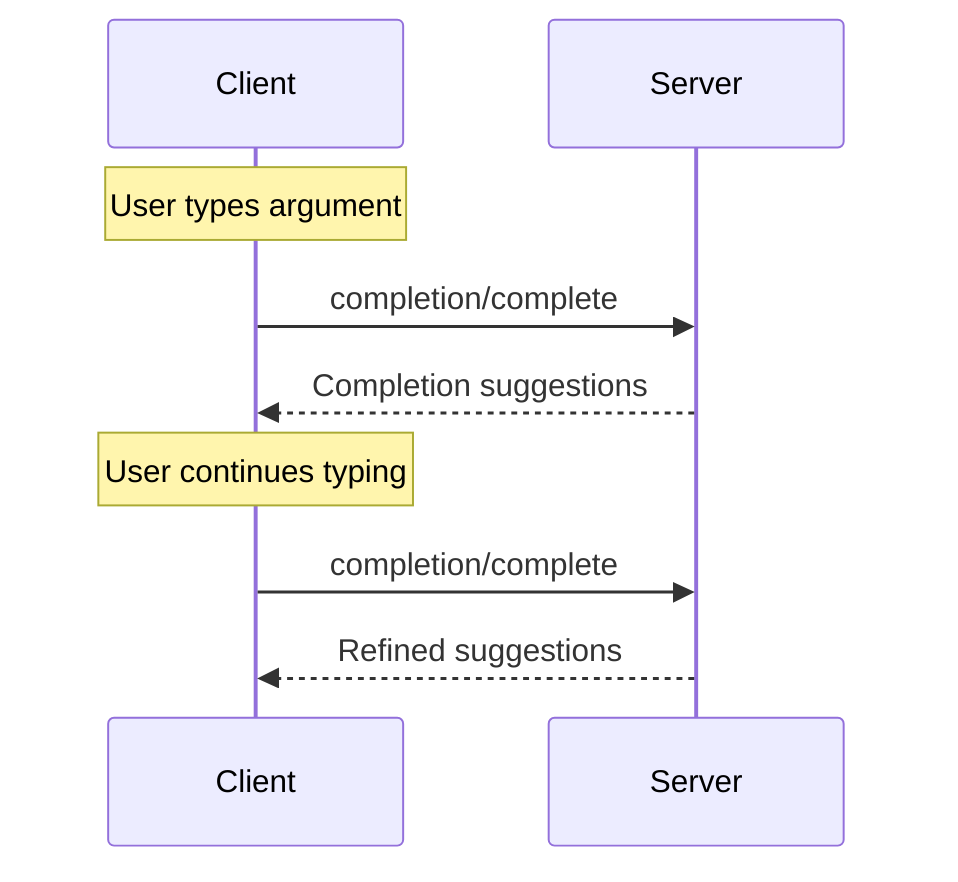


**Protocol Revision**: 


The Model Context Protocol (MCP) provides a standardized way for servers to offer argument autocompletion suggestions for prompts and resource URIs. This enables rich, IDE-like experiences where users receive contextual suggestions while entering argument values.

## User Interaction Model

Completion in MCP is designed to support interactive user experiences similar to IDE code completion.

For example, applications may show completion suggestions in a dropdown or popup menu as users type, with the ability to filter and select from available options.

However, implementations are free to expose completion through any interface pattern that suits their needs&mdash;the protocol itself does not mandate any specific user interaction model.

## Protocol Messages

### Requesting Completions

To get completion suggestions, clients send a `completion/complete` request specifying what is being completed through a reference type:

**Request:**
```json
{
  "jsonrpc": "2.0",
  "id": 1,
  "method": "completion/complete",
  "params": {
    "ref": {
      "type": "ref/prompt",
      "name": "code_review"
    },
    "argument": {
      "name": "language",
      "value": "py"
    }
  }
}
```

**Response:**
```json
{
  "jsonrpc": "2.0",
  "id": 1,
  "result": {
    "completion": {
      "values": ["python", "pytorch", "pyside"],
      "total": 10,
      "hasMore": true
    }
  }
}
```

### Reference Types

The protocol supports two types of completion references:

| Type | Description | Example |
|------|-------------|---------|
| `ref/prompt` | References a prompt by name | `{"type": "ref/prompt", "name": "code_review"}` |
| `ref/resource` | References a resource URI | `{"type": "ref/resource", "uri": "file:///{path}"}` |

### Completion Results

Servers return an array of completion values ranked by relevance, with:

- Maximum 100 items per response
- Optional total number of available matches
- Boolean indicating if additional results exist

## Message Flow



## Data Types

### CompleteRequest
- `ref`: A `PromptReference` or `ResourceReference`
- `argument`: Object containing:
  - `name`: Argument name
  - `value`: Current value

### CompleteResult
- `completion`: Object containing:
  - `values`: Array of suggestions (max 100)
  - `total`: Optional total matches
  - `hasMore`: Additional results flag

## Implementation Considerations

1. Servers **SHOULD**:
   - Return suggestions sorted by relevance
   - Implement fuzzy matching where appropriate
   - Rate limit completion requests
   - Validate all inputs

2. Clients **SHOULD**:
   - Debounce rapid completion requests
   - Cache completion results where appropriate
   - Handle missing or partial results gracefully

## Security

Implementations **MUST**:
- Validate all completion inputs
- Implement appropriate rate limiting
- Control access to sensitive suggestions
- Prevent completion-based information disclosure
