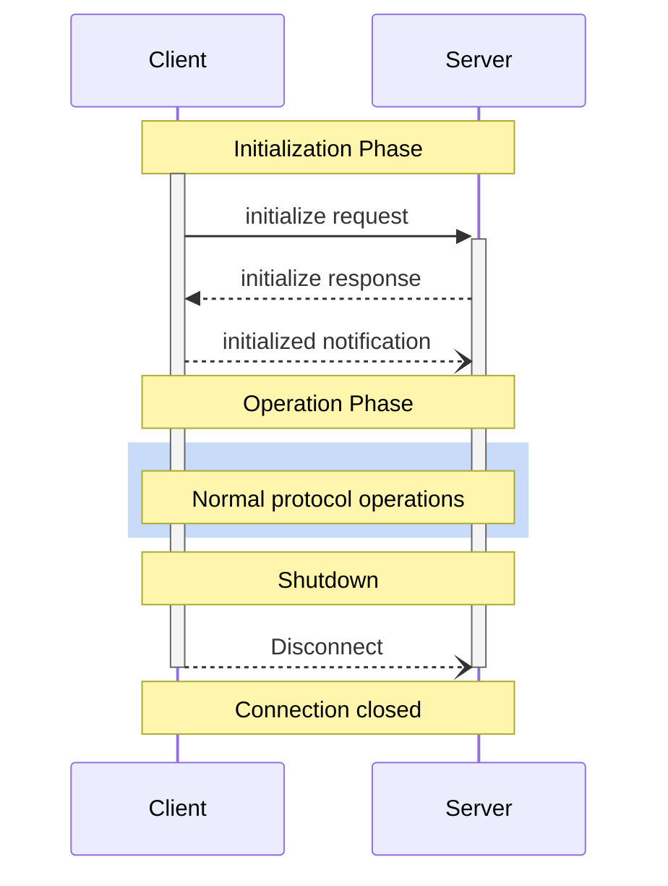


**Protocol Revision**: 


The Model Context Protocol (MCP) defines a rigorous lifecycle for client-server connections that ensures proper capability negotiation and state management.

1. **Initialization**: Capability negotiation and protocol version agreement
2. **Operation**: Normal protocol communication
3. **Shutdown**: Graceful termination of the connection



## Lifecycle Phases

### Initialization

The initialization phase **MUST** be the first interaction between client and server. During this phase, the client and server:

- Establish protocol version compatibility
- Exchange and negotiate capabilities
- Share implementation details

The client **MUST** initiate this phase by sending an `initialize` request containing:

- Protocol version supported
- Client capabilities
- Client implementation information

```json
{
  "jsonrpc": "2.0",
  "id": 1,
  "method": "initialize",
  "params": {
    "protocolVersion": "2024-11-05",
    "capabilities": {
      "roots": {
        "listChanged": true
      },
      "sampling": {}
    },
    "clientInfo": {
      "name": "ExampleClient",
      "version": "1.0.0"
    }
  }
}
```

The server **MUST** respond with its own capabilities and information:

```json
{
  "jsonrpc": "2.0",
  "id": 1,
  "result": {
    "protocolVersion": "2024-11-05",
    "capabilities": {
      "logging": {},
      "prompts": {
        "listChanged": true
      },
      "resources": {
        "subscribe": true,
        "listChanged": true
      },
      "tools": {
        "listChanged": true
      }
    },
    "serverInfo": {
      "name": "ExampleServer",
      "version": "1.0.0"
    }
  }
}
```

After successful initialization, the client **MUST** send an `initialized` notification to indicate it is ready to begin normal operations:

```json
{
  "jsonrpc": "2.0",
  "method": "initialized"
}
```

* The client **SHOULD NOT** send requests other than [pings]() before the server has responded to the `initialize` request.
* The server **SHOULD NOT** send requests other than [pings]() and [logging]() before receiving the `initialized` notification.

#### Version Negotiation

In the `initialize` request, the client **MUST** send a protocol version it supports. This **SHOULD** be the _latest_ version supported by the client.

If the server supports the requested protocol version, it **MUST** respond with the same version. Otherwise, the server **MUST** respond with another protocol version it supports. This **SHOULD** be the _latest_ version supported by the server.

If the client does not support the version in the server's response, it **SHOULD** disconnect.

#### Capability Negotiation

Client and server capabilities establish which optional protocol features will be available during the session.

Key capabilities include:

| Category | Capability     | Description |
|----------|--------------- |-------------|
| Client   | `roots`        | Ability to provide filesystem [roots]() |
| Client   | `sampling`     | Support for LLM [sampling]() requests |
| Client   | `experimental` | Describes support for non-standard experimental features |
| Server   | `prompts`      | Offers [prompt templates]() |
| Server   | `resources`    | Provides readable [resources]() |
| Server   | `tools`        | Exposes callable [tools]() |
| Server   | `logging`      | Emits structured [log messages]() |
| Server   | `experimental` | Describes support for non-standard experimental features |

Capability objects can describe sub-capabilities like:
- `listChanged`: Support for list change notifications (for prompts, resources, and tools)
- `subscribe`: Support for subscribing to individual items' changes (resources only)

### Operation

During the operation phase, the client and server exchange messages according to the negotiated capabilities.

Both parties **SHOULD**:

- Respect the negotiated protocol version
- Only use capabilities that were successfully negotiated

### Shutdown

During the shutdown phase, one side (usually the client) cleanly terminates the protocol connection. No specific shutdown messages are defined—instead, the underlying transport mechanism should be used to signal connection termination:

#### stdio

For the stdio [transport](), the client **SHOULD** initiate shutdown by:

1. First, closing the input stream to the child process (the server)
2. Waiting for the server to exit, or sending `SIGTERM` if the server does not exit within a reasonable time
3. Sending `SIGKILL` if the server does not exit within a reasonable time after `SIGTERM`

The server **MAY** initiate shutdown by closing its output stream to the client and exiting.

#### HTTP

For HTTP [transports](), shutdown is indicated by closing the associated HTTP connection(s).

## Error Handling

Implementations **SHOULD** be prepared to handle these error cases:

- Protocol version mismatch
- Failure to negotiate required capabilities
- Initialize request timeout
- Shutdown timeout

Implementations **SHOULD** implement appropriate timeouts for all requests, to prevent hung connections and resource exhaustion.

Example initialization error:
```json
{
  "jsonrpc": "2.0",
  "id": 1,
  "error": {
    "code": -32602,
    "message": "Unsupported protocol version",
    "data": {
      "supported": ["2024-11-05"],
      "requested": "1.0.0"
    }
  }
}
```
