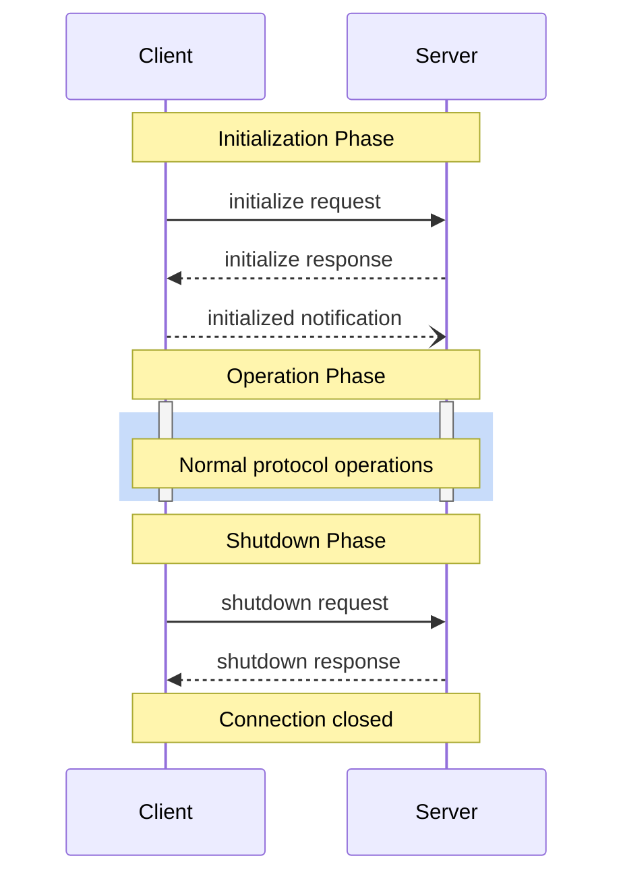


**Protocol Revision**: 2024-11-05


The Model Context Protocol (MCP) defines a rigorous lifecycle for client-server connections that ensures proper capability negotiation and state management. This lifecycle consists of four distinct phases:

1. **Initialization**: Capability negotiation and protocol version agreement
2. **Ready**: Final confirmation before beginning operations
3. **Operation**: Normal protocol communication
4. **Shutdown**: Graceful termination of the connection



## Lifecycle Phases

### 1. Initialization Phase

The initialization phase MUST be the first interaction between client and server. During this phase, the client and server:

- Establish protocol version compatibility
- Exchange and negotiate capabilities
- Share implementation details

The client MUST initiate this phase by sending an `initialize` request containing:

- Protocol version supported
- Client capabilities
- Client implementation information

```json
{
  "jsonrpc": "2.0",
  "id": 1,
  "method": "initialize",
  "params": {
    "protocolVersion": "2024-11-05",
    "capabilities": {
      "roots": {
        "listChanged": true
      },
      "sampling": {}
    },
    "clientInfo": {
      "name": "ExampleClient",
      "version": "1.0.0"
    }
  }
}
```

The server MUST respond with its own capabilities and information:

```json
{
  "jsonrpc": "2.0",
  "id": 1,
  "result": {
    "protocolVersion": "2024-11-05",
    "capabilities": {
      "prompts": {
        "listChanged": true
      },
      "resources": {
        "subscribe": true,
        "listChanged": true
      },
      "tools": {
        "listChanged": true
      }
    },
    "serverInfo": {
      "name": "ExampleServer",
      "version": "1.0.0"
    }
  }
}
```

#### Capability Negotiation

The initialization phase establishes which optional protocol features will be available during the session. Key capabilities include:

| Category      | Capability     | Description                                  |
|---------------|---------------|-----------------------------------------------|
| Client        | `roots`       | Ability to provide filesystem roots           |
| Client        | `sampling`    | Support for LLM sampling requests             |
| Client        | `experimental`| Support for non-standard experimental features|
| Server        | `prompts`     | Offers prompt templates                       |
| Server        | `resources`   | Provides readable resources                   |
| Server        | `tools`       | Exposes callable tools                        |
| Server        | `logging`     | Support for structured log messages           |
| Server        | `experimental`| Support for non-standard experimental features|

Capabilities can include sub-capabilities like:
- `listChanged`: Support for list change notifications (for prompts, resources, and tools)
- `subscribe`: Support for subscriptions (resources only)

### 2. Ready Phase

After successful initialization, the client MUST send an `initialized` notification to indicate it is ready to begin normal operations:

```json
{
  "jsonrpc": "2.0",
  "method": "initialized"
}
```

The server MUST NOT send any protocol messages besides the initialization response until it receives this notification.

### 3. Operation Phase

During the operation phase, the client and server exchange messages according to the negotiated capabilities. Both parties MUST:

- Respect the negotiated protocol version
- Only use capabilities that were successfully negotiated
- Handle messages according to the JSON-RPC 2.0 specification

### 4. Shutdown Phase
The shutdown phase cleanly terminates the protocol connection. No specific shutdown messages are defined - instead, the underlying transport mechanism should be used to signal connection termination:

- For STDIO-based transport, the MCP server process should be terminated
- For HTTP-based transport, the HTTP connection should be closed

## Error Handling

Implementations MUST handle these error cases:

- Protocol version mismatch
- Required capability negotiation failure
- Initialize request timeout
- Shutdown request timeout

Server implementations are SHOULD implement appropriate timeouts for all lifecycle phases to prevent hung connections and resource exhaustion.

When errors occur during initialization, the server MUST respond with an appropriate error code and SHOULD close the connection.

Example initialization error:
```json
{
  "jsonrpc": "2.0",
  "id": 1,
  "error": {
    "code": -32600,
    "message": "Unsupported protocol version",
    "data": {
      "supported": ["2024-11-05"],
      "requested": "1.0.0"
    }
  }
}
```
