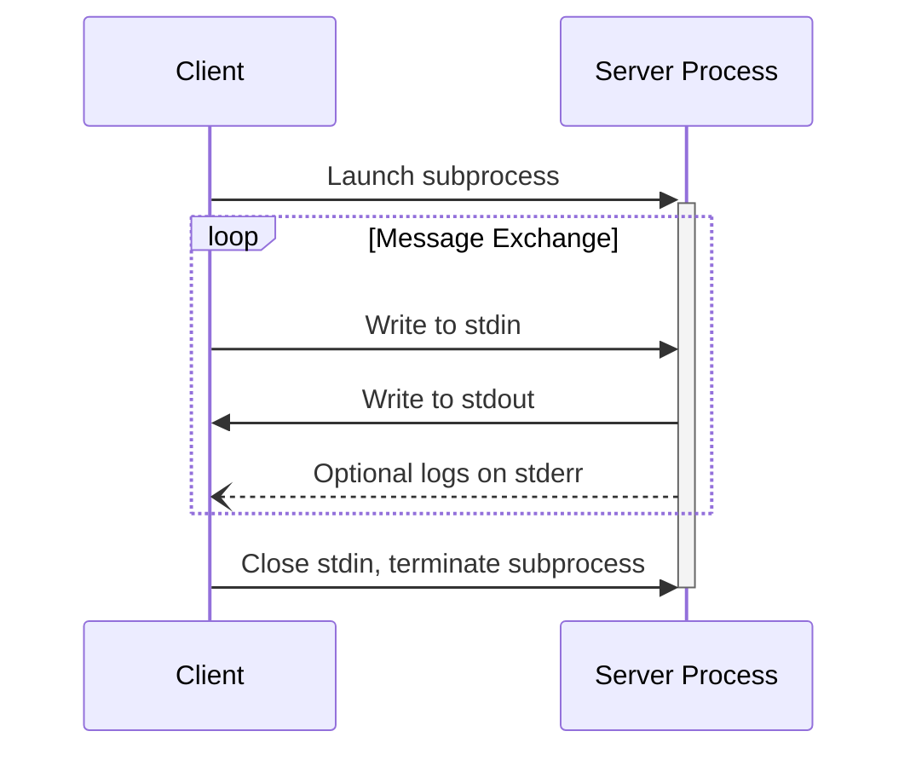
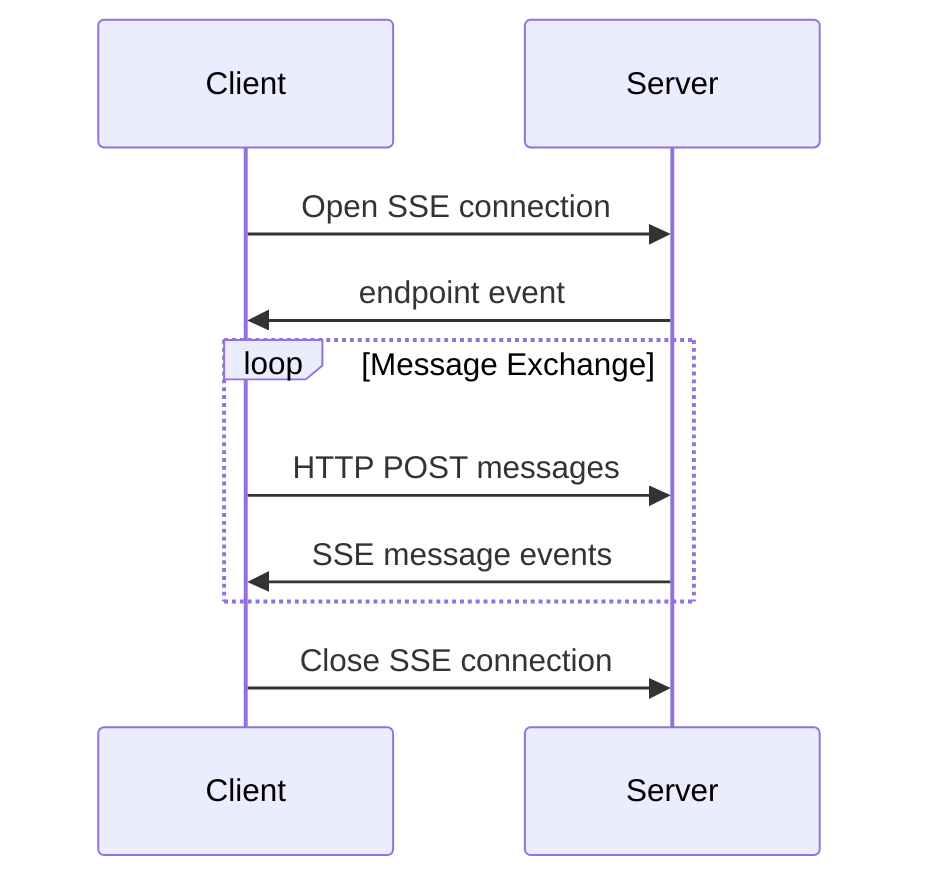


**Protocol Revision**: 


MCP currently defines two standard transport mechanisms for client-server communication:
1. [stdio](#stdio), communication over standard in and standard out
2. [HTTP with Server-Sent Events](#http-with-sse) (SSE)

Clients **SHOULD** support stdio whenever possible.

It is also possible for clients and servers to implement [custom transports](#custom-transports) in a pluggable fashion.

## stdio
In the **stdio** transport:
* The client launches the MCP server as a subprocess.
* The server receives JSON-RPC messages on its standard input (`stdin`) and writes responses to its standard output (`stdout`).
* Messages are delimited by newlines, and **MUST NOT** contain embedded newlines.
* The server **MAY** write UTF-8 strings to its standard error (`stderr`) for logging purposes. Clients **MAY** capture, forward, or ignore this logging.
* The server **MUST NOT** write anything to its `stdout` that is not a valid MCP message.
* The client **MUST NOT** write anything to the server's `stdin` that is not a valid MCP message.

## HTTP with SSE
In the **SSE** transport, the server operates as an independent process that can handle multiple client connections.

The server **MUST** provide two endpoints:

1. An SSE endpoint, for clients to establish a connection and receive messages from the server
2. A regular HTTP POST endpoint for clients to send messages to the server

When a client connects, the server **MUST** send an `endpoint` event containing a URI for the client to use for sending messages. All subsequent client messages **MUST** be sent as HTTP POST requests to this endpoint.

Server messages are sent as SSE `message` events, with the message content encoded as JSON in the event data.

## Custom Transports

Clients and servers **MAY** implement additional custom transport mechanisms to suit their specific needs. The protocol is transport-agnostic and can be implemented over any communication channel that supports bidirectional message exchange.

Implementers who choose to support custom transports **MUST** ensure they preserve the JSON-RPC message format and lifecycle requirements defined by MCP. Custom transports **SHOULD** document their specific connection establishment and message exchange patterns to aid interoperability.
