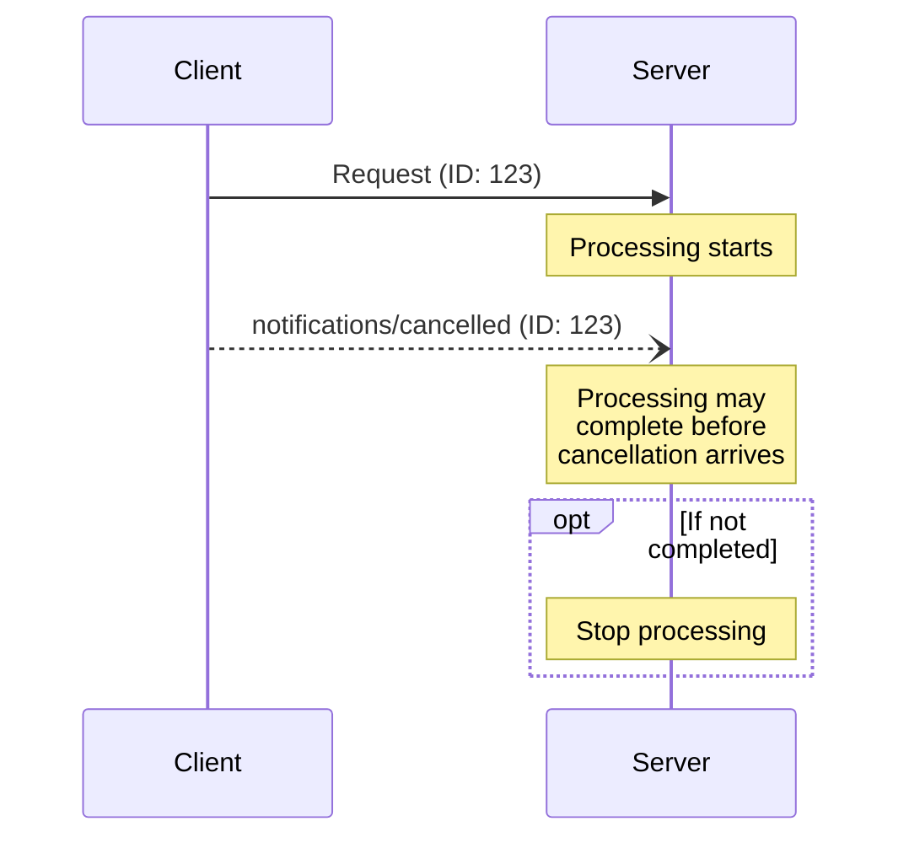


**Protocol Revision**: 


The Model Context Protocol (MCP) supports optional cancellation of in-progress requests through notification messages. Either side can send a cancellation notification to indicate that a previously-issued request should be terminated.

## Cancellation Flow

When a party wants to cancel an in-progress request, it sends a `notifications/cancelled` notification containing:

- The ID of the request to cancel
- An optional reason string that can be logged or displayed

```json
{
  "jsonrpc": "2.0",
  "method": "notifications/cancelled",
  "params": {
    "requestId": "123",
    "reason": "User requested cancellation"
  }
}
```

## Behavior Requirements

Both clients and servers MUST follow these requirements when handling cancellation:

1. Cancellation notifications MUST only reference requests that:
   - Were previously issued in the same direction
   - Are believed to still be in-progress

2. The `initialize` request MUST NOT be cancelled by clients

3. Receivers of cancellation notifications SHOULD:
   - Stop processing the cancelled request
   - Free associated resources
   - Not send a response for the cancelled request

4. Receivers MAY ignore cancellation notifications if:
   - The referenced request is unknown
   - Processing has already completed
   - The request cannot be cancelled

## Timing Considerations

Due to network latency, cancellation notifications may arrive after request processing has completed. Both parties MUST handle these race conditions gracefully:



## Implementation Notes

- Servers SHOULD implement timeouts for long-running operations
- Clients SHOULD track pending requests that can be cancelled
- Both parties SHOULD log cancellation reasons for debugging
- UIs SHOULD provide feedback when cancellation is requested

## Error Handling

Invalid cancellation notifications SHOULD be ignored without error responses:

- Unknown request IDs
- Already completed requests
- Malformed notifications

This maintains the "fire and forget" nature of notifications while allowing for race conditions in asynchronous communication.
