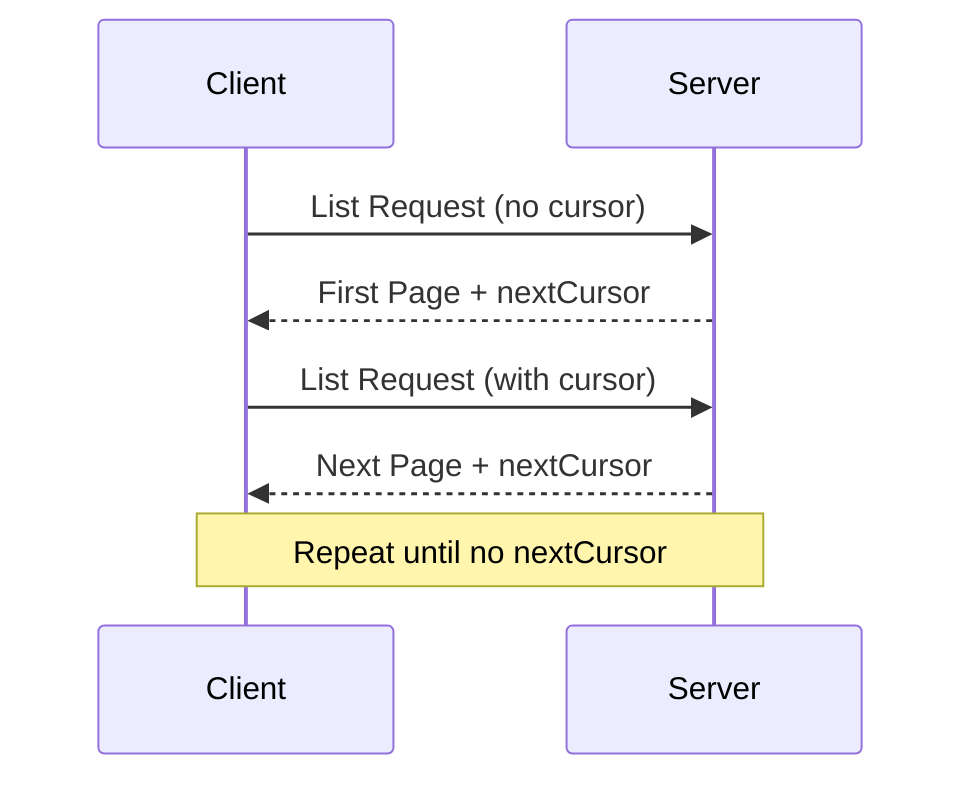


**Protocol Revision**: 2024-11-05


The Model Context Protocol (MCP) supports pagination for list operations that may return large result sets. Pagination allows clients to retrieve results in smaller chunks rather than all at once.

## Pagination Model

Pagination in MCP uses an opaque cursor-based approach. The key components are:

1. **Cursor**: An opaque string token representing a position in the result set
2. **Page Size**: Controlled by the server implementation
3. **Next Cursor**: Indicates if more results are available

## Request Format

Paginated requests can include an optional cursor parameter:

```json
{
  "jsonrpc": "2.0",
  "method": "resources/list",
  "params": {
    "cursor": "eyJwYWdlIjogMn0="
  }
}
```

## Response Format

Paginated responses include:
- The current page of results
- An optional `nextCursor` field if more results exist

```json
{
  "jsonrpc": "2.0",
  "id": "123",
  "result": {
    "resources": [...],
    "nextCursor": "eyJwYWdlIjogM30="
  }
}
```

## Pagination Flow



## Protocol Operations Supporting Pagination

The following MCP operations support pagination:

- `resources/list` - List available resources
- `resources/templates/list` - List resource templates
- `prompts/list` - List available prompts
- `tools/list` - List available tools

## Implementation Guidelines

1. Servers SHOULD:
   - Use consistent page sizes
   - Provide stable cursors
   - Handle invalid cursors gracefully

2. Clients SHOULD:
   - Store cursors for active pagination
   - Handle missing nextCursor as end of results
   - Support both paginated and non-paginated flows

3. Both parties MUST treat cursors as opaque tokens:
   - Don't make assumptions about cursor format
   - Don't attempt to parse or modify cursors
   - Don't persist cursors across sessions

## Error Handling

Invalid cursor errors SHOULD be reported as standard JSON-RPC errors with code -32602 (Invalid params).
