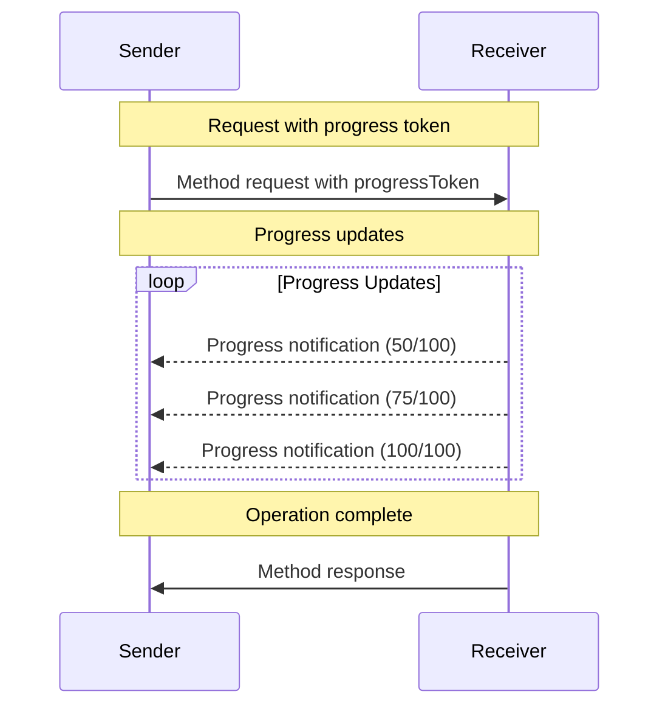


**Protocol Revision**: 2024-11-05 (Final)


The Model Context Protocol (MCP) supports optional progress tracking for long-running operations through notification messages. Either side can send progress notifications to provide updates about operation status.

## Progress Flow

When a party wants to receive progress updates for a request, it includes a `progressToken` in the request metadata. Progress tokens can be any string or number value chosen by the sender, but MUST be unique across all active requests. The receiver can then send progress notifications containing:

- The original progress token
- Current progress value
- Optional total value

```json
{
  "jsonrpc": "2.0",
  "id": 1,
  "method": "some_method",
  "params": {
    "_meta": {
      "progressToken": "abc123"
    }
  }
}
```

The receiver MAY then send progress notifications:

```json
{
  "jsonrpc": "2.0",
  "method": "notifications/progress",
  "params": {
    "progressToken": "abc123",
    "progress": 50,
    "total": 100
  }
}
```

## Behavior Requirements

Both clients and servers MUST follow these requirements when handling progress:

1. Progress notifications MUST only reference tokens that:
   - Were provided in an active request
   - Are associated with an in-progress operation

2. Receivers of progress requests MAY:
   - Choose not to send any progress notifications
   - Send notifications at whatever frequency they deem appropriate
   - Omit the total value if unknown

3. Senders SHOULD be prepared to:
   - Handle missing progress notifications
   - Receive notifications out of order
   - Handle notifications after completion



## Implementation Notes

- Receivers SHOULD use meaningful progress increments
- Senders SHOULD track active progress tokens
- Both parties SHOULD implement rate limiting
- Progress tracking SHOULD stop on completion

## Error Handling

Invalid progress notifications SHOULD be ignored without error responses:

- Unknown progress tokens
- Out of order notifications
- Malformed notifications

This maintains the "fire and forget" nature of notifications while allowing for race conditions in asynchronous communication.
