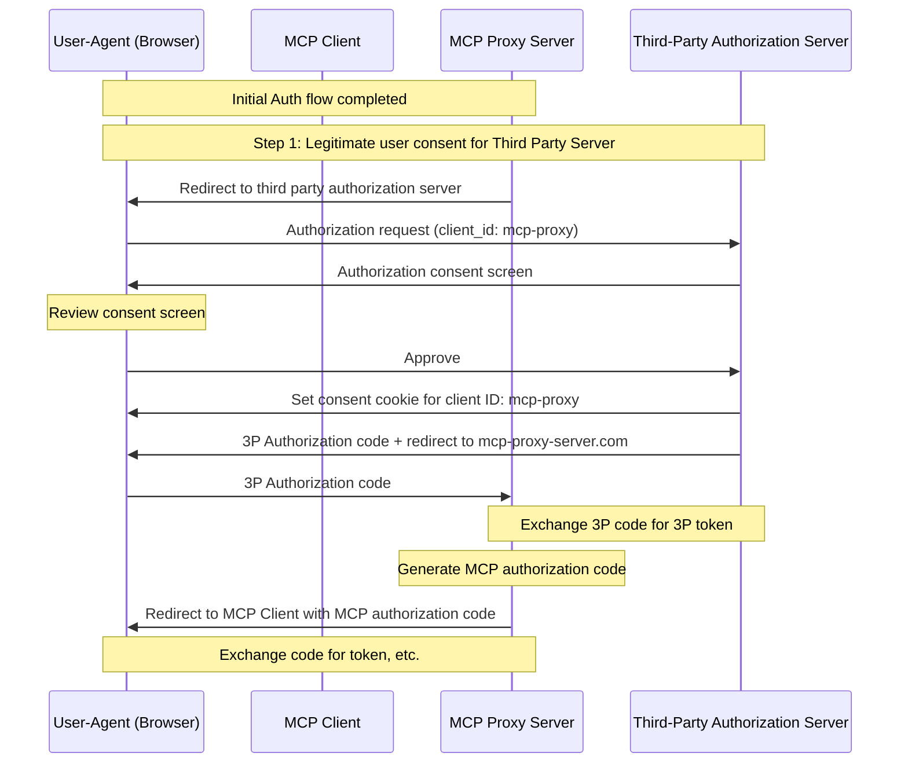
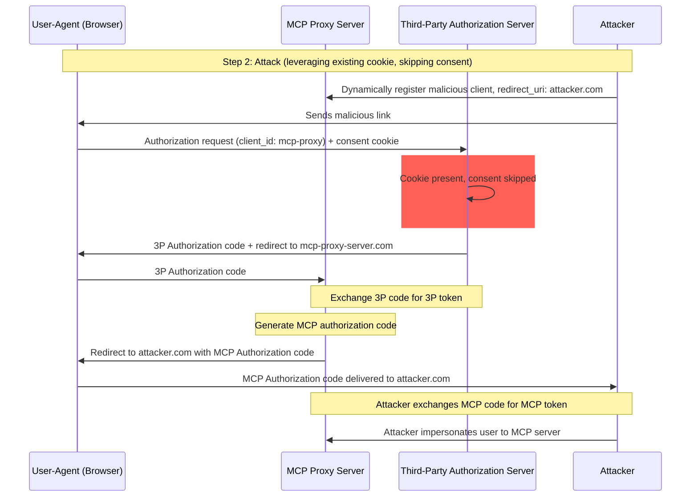

## 1. Introduction

### 1.1 Purpose and Scope

This document provides security considerations for the Model Context Protocol (MCP), complementing the MCP Authorization specification. This document identifies security risks, attack vectors, and best practices specific to MCP implementations.

The primary audience for this document includes developers implementing MCP authorization flows, MCP server operators, and security professionals evaluating MCP-based systems. This document should be read alongside the MCP Authorization specification and [OAuth 2.0 security best practices](https://datatracker.ietf.org/doc/html/rfc9700).

## 2. Attacks and Mitigations

This section gives a detailed description of attacks on MCP implementations, along with potential countermeasures.

### 2.1 Confused Deputy Problem

Attackers can exploit MCP servers proxying other resource servers, creating "[confused deputy](https://en.wikipedia.org/wiki/Confused_deputy_problem)" vulnerabilities.

#### 2.1.1 Terminology

**MCP Proxy Server**
: An MCP server that connects MCP clients to third-party APIs, offering MCP features while delegating operations and acting as a single OAuth client to the third-party API server.

**Third-Party Authorization Server**
: Authorization server that protects the third-party API. It may lack dynamic client registration support, requiring MCP proxy to use a static client ID for all requests.

**Third-Party API**
: The protected resource server that provides the actual API functionality. Access to this 
  API requires tokens issued by the third-party authorization server.

**Static Client ID**
: A fixed OAuth 2.0 client identifier used by the MCP proxy server when communicating with
  the third-party authorization server. This Client ID refers to the MCP server acting as a client
  to the Third-Party API. It is the same value for all MCP server to Third-Party API interactions regardless of
  which MCP client initiated the request.

#### 2.1.2 Architecture and Attack Flows

##### 2.1.2.1 Normal OAuth proxy usage (preserves user consent)

##### 2.1.2.3 Malicious OAuth proxy usage (skips user consent)

#### 2.1.3 Attack Description

When an MCP proxy server uses a static client ID to authenticate with a third-party 
authorization server that does not support dynamic client registration, the following 
attack becomes possible:

1. A user authenticates normally through the MCP proxy server to access the third-party API
2. During this flow, the third-party authorization server sets a cookie on the user agent
   indicating consent for the static client ID
3. An attacker later sends the user a malicious link containing a crafted authorization request which contains a malicious redirect URI along with a new dynamically registered client ID
4. When the user clicks the link, their browser still has the consent cookie from the previous legitimate request
5. The third-party authorization server detects the cookie and skips the consent screen
6. The MCP authorization code is redirected to the attacker's server (specified in the crafted redirect_uri during dynamic client registration)
7. The attacker exchanges the stolen authorization code for access tokens for the MCP server without the user's explicit approval
8. Attacker now has access to the third-party API as the compromised user

#### 2.1.4 Mitigation

MCP proxy servers using static client IDs **MUST** obtain user consent for each dynamically
registered client before forwarding to third-party authorization servers (which may require additional consent).
