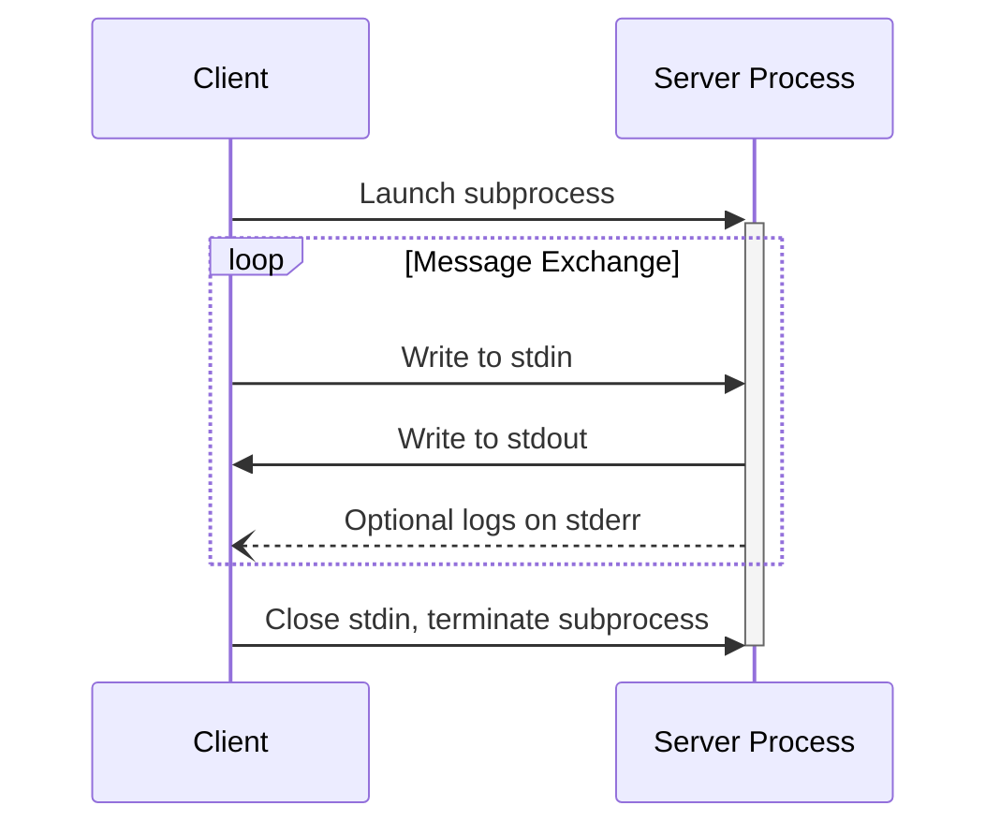
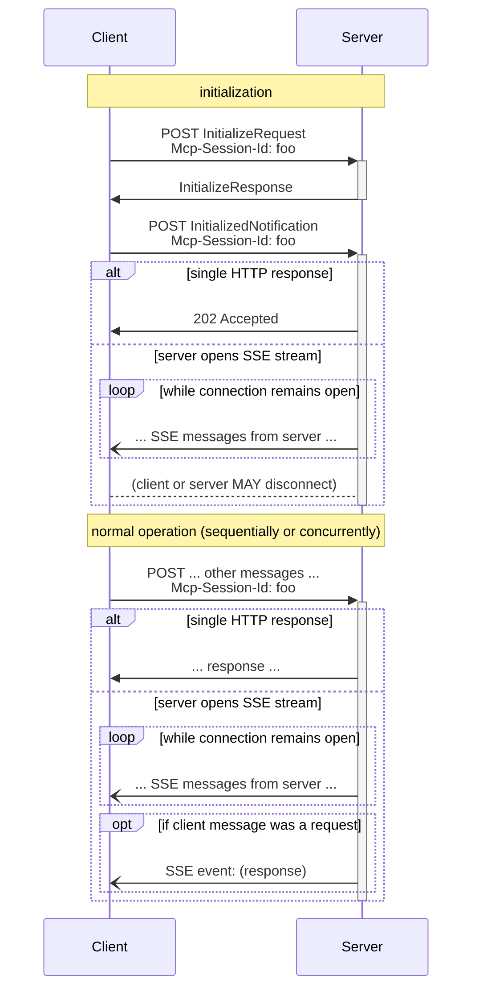

 **Protocol Revision**: draft 

MCP uses JSON-RPC to encode messages. JSON-RPC messages **MUST** be UTF-8 encoded.

The protocol currently defines two standard transport mechanisms for client-server
communication:

1. [stdio](#stdio), communication over standard in and standard out
2. [Streamable HTTP](#streamable-http)

Clients **SHOULD** support stdio whenever possible.

It is also possible for clients and servers to implement
[custom transports](#custom-transports) in a pluggable fashion.

## stdio

In the **stdio** transport:

- The client launches the MCP server as a subprocess.
- The server receives JSON-RPC messages on its standard input (`stdin`) and writes
  responses to its standard output (`stdout`).
- Messages are delimited by newlines, and **MUST NOT** contain embedded newlines.
- The server **MAY** write UTF-8 strings to its standard error (`stderr`) for logging
  purposes. Clients **MAY** capture, forward, or ignore this logging.
- The server **MUST NOT** write anything to its `stdout` that is not a valid MCP message.
- The client **MUST NOT** write anything to the server's `stdin` that is not a valid MCP
  message.

## Streamable HTTP

 This replaces the [HTTP+SSE
transport]() from
protocol version 2024-11-05. See the [backwards compatibility](#backwards-compatibility)
guide below. 

In the **Streamable HTTP** transport, the server operates as an independent process that
can handle multiple client connections. This transport uses standard HTTP with optional
[Server-Sent Events](https://en.wikipedia.org/wiki/Server-sent_events) (SSE) for
streaming multiple server messages. This permits "plain HTTP" MCP servers, as well as
more feature-rich servers supporting streaming and bidirectional communication.

The server **MUST** provide a single HTTP endpoint (hereafter referred to as the **MCP
endpoint**) that supports both POST and GET methods. For example, this could be a URL
like `https://example.com/mcp`.

### Message Exchange

1. Every JSON-RPC message sent from the client **MUST** be a new HTTP POST request to the
   MCP endpoint.

2. When the client sends a JSON-RPC _request_ message to the MCP endpoint via POST:

   - The client **MUST** include an `Accept` header, listing both `application/json` and
     `text/event-stream` as supported content types.
   - The server **MUST** either return `Content-Type: text/event-stream`, to initiate an
     SSE stream, or `Content-Type: application/json`, to return a single JSON-RPC
     _response_. The client **MUST** support both these cases.
   - If the server initiates an SSE stream:
     - The SSE stream **SHOULD** eventually include a JSON-RPC _response_ message.
     - The server **MAY** send JSON-RPC _requests_ and JSON-RPC _notifications_ before
       sending a JSON-RPC _response_.
     - The server **SHOULD NOT** close the SSE stream before sending the JSON-RPC
       _response_.
     - After the JSON-RPC _response_ has been sent, the server **MAY** close the SSE
       stream at any time.
     - The client **MAY** close the SSE stream at any time. The server **SHOULD**
       interpret this as the client cancelling the request, if it is still in-flight.

3. When the client sends a JSON-RPC _notification_ or _response_ to the MCP endpoint via
   POST:

   - The client **MUST** include an `Accept` header, listing `text/event-stream` as a
     supported content type.
   - The server **MUST** either return `Content-Type: text/event-stream`, to initiate an
     SSE stream, or else HTTP status code 202 Accepted with no body. The client **MUST**
     support both these cases.
   - If the server initiates an SSE stream:
     - The receipt of the message is acknowledged as soon as the HTTP status code is
       received (before the SSE stream begins).
     - The server **MAY** close the SSE stream at any time.
     - The client **MAY** close the SSE stream at any time.

4. The client **MAY** also issue an HTTP GET to the MCP endpoint. This can be used to
   open an SSE stream (allowing the server to communicate to the client) without having
   first sent a _request_, _notification_, or _response_.
   - The client **MUST** include an `Accept` header, listing `text/event-stream` as a
     supported content type.
   - The server **MUST** either return `Content-Type: text/event-stream` in response to
     this HTTP GET, or else HTTP status code 204 No Content with no body. The client
     **MUST** support both these cases.
   - If the server initiates an SSE stream:
     - The server **MAY** close the SSE stream at any time.
     - The client **MAY** close the SSE stream at any time.

### Session Management

Where a client desires to share a single logical session across multiple requests, it
**MAY** attach an `Mcp-Session-Id` HTTP header to its requests. This permits maintenance
of session state across separate POSTs.

1. It is the client's responsibility to generate or select the session ID.
2. This session ID **SHOULD** be globally unique and cryptographically secure (e.g., a
   UUID or a JWT), unless it is specifically desired to share a session ID across users
   or clients.
3. The server **MAY** use this header to associate state with the logical session.
   - If the server agrees to re-establish an existing session, it **MUST** include a
     `Mcp-Session-Status: resumed` HTTP header in its response.
   - If the server begins a new session associated with the session ID, it **MUST**
     include a `Mcp-Session-Status: created` HTTP header in its response.
   - The server **MAY** delete session state at any time; however, it **MUST NOT**
     prevent the same session ID from creating a new session again in future.
4. If [authorization]() is used _and_ the server makes use of
   the `Mcp-Session-Id` header:
   - The server **SHOULD** bind the session ID to the authorization context, and return
     an error if the session ID is reused in a different authorization context.

### Multiple Connections

1. The client **MAY** remain connected to multiple SSE streams simultaneously.
2. The server **MUST** send each of its JSON-RPC messages on only one of the connected
   streams; that is, it **MUST NOT** broadcast the same message across multiple streams.
   The server **MAY** use different streams for _different_ messages.
   - The server can mitigate the risk of message loss by supporting
     [resumability and redelivery](#resumability-and-redelivery).

### Resumability and Redelivery

To support resuming broken connections, and redelivering messages that might otherwise be
lost:

1. Servers **MAY** attach an `id` field to their SSE events, as described in the
   [SSE standard](https://html.spec.whatwg.org/multipage/server-sent-events.html#event-stream-interpretation).
   - If present, the ID **MUST** be globally unique across all streams within that
     [session](#session-management)—or all streams with that specific client, if session
     management is not in use.
2. After a broken connection, clients **MAY** include a
   [`Last-Event-ID`](https://html.spec.whatwg.org/multipage/server-sent-events.html#the-last-event-id-header)
   header when opening a new SSE stream, to indicate the last event ID they received.
   - The server **MAY** use this header to replay messages that were sent after the last
     event ID, and to resume the stream from that point.
3. Clients **MUST NOT** include a `Last-Event-ID` header when connecting _additional_ SSE
   streams within the session, while at least one remains connected.
   - The server **SHOULD** interpret the presence of this header as indicating that any
     other streams which _nominally_ remain open are in fact dead, and should be
     terminated.

### Sequence Diagram

### Backwards Compatibility

Clients and servers can maintain backwards compatibility with the deprecated [HTTP+SSE
transport]() (from
protocol version 2024-11-05) as follows:

**Servers** wanting to support older clients should:

- Continue to host both the SSE and POST endpoints of the old transport, alongside the
  new "MCP endpoint" defined for the Streamable HTTP transport.
  - It is also possible to combine the old POST endpoint and the new MCP endpoint, but
    this may introduce unneeded complexity.

**Clients** wanting to support older servers should:

1. Accept an MCP server URL from the user, which may point to either a server using the
   old transport or the new transport.
2. Attempt to POST an `InitializeRequest` to the server URL, with an `Accept` header as
   defined above:
   - If it succeeds or opens an SSE stream in response, the client can assume this is a
     server supporting the new Streamable HTTP transport.
   - If it fails with an HTTP 4xx status code (e.g., 405 Method Not Allowed or 404 Not
     Found):
     - Issue a GET request to the server URL, expecting that this will open an SSE stream
       and return an `endpoint` event as the first event.
     - When the `endpoint` event arrives, the client can assume this is a server running
       the old HTTP+SSE transport, and should use that transport for all subsequent
       communication.

## Custom Transports

Clients and servers **MAY** implement additional custom transport mechanisms to suit
their specific needs. The protocol is transport-agnostic and can be implemented over any
communication channel that supports bidirectional message exchange.

Implementers who choose to support custom transports **MUST** ensure they preserve the
JSON-RPC message format and lifecycle requirements defined by MCP. Custom transports
**SHOULD** document their specific connection establishment and message exchange patterns
to aid interoperability.
