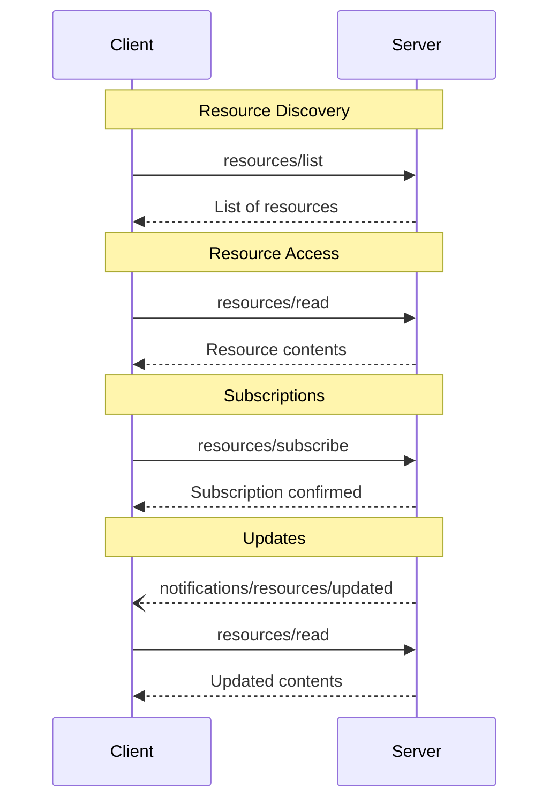


**Protocol Revision**: 2024-11-05 (Final)


The Model Context Protocol (MCP) provides a standardized way for servers to expose resources to clients. Resources allow servers to share data that provides context to language models, such as files, database schemas, or application-specific information. Each resource is uniquely identified by a [URI](https://datatracker.ietf.org/doc/html/rfc3986).

## User Interaction Model

Resources in MCP are designed to be application-driven, with clients determining how to incorporate context based on their needs. Applications can expose resources through UI elements for explicit selection, while implementing intelligent features for automatic context inclusion, searching and filtering. A recommended pattern is a context picker showing resources in a tree/list view that combines manual selection with automated context handling.


However, implementations are free to expose resources through any interface pattern that suits their needs - the protocol itself does not mandate any specific user interaction model.

## Capabilities

Servers that support resources MUST include a `resources` capability in their `ServerCapabilities` during initialization. The capability object can specify optional features:

```json
{
  "capabilities": {
    "resources": {
      "subscribe": true,
      "listChanged": true
    }
  }
}
```

Both `subscribe` and `listChanged` are optional - servers can support neither, either, or both:

```json
{
  "capabilities": {
    "resources": {}  // Neither feature supported
  }
}
```

```json
{
  "capabilities": {
    "resources": {
      "subscribe": true  // Only subscriptions supported
    }
  }
}
```

```json
{
  "capabilities": {
    "resources": {
      "listChanged": true  // Only list change notifications supported
    }
  }
}
```

The capability supports two optional features:
- `subscribe`: Server supports subscribing to resource updates
- `listChanged`: Server supports notifications about changes to the resource list

## Protocol Messages

### Listing Resources

To discover available resources, clients send a `resources/list` request. This operation supports pagination through the standard cursor mechanism.

**Request:**
```json
{
  "jsonrpc": "2.0",
  "id": 1,
  "method": "resources/list",
  "params": {
    "cursor": "optional-cursor-value"
  }
}
```

**Response:**
```json
{
  "jsonrpc": "2.0",
  "id": 1,
  "result": {
    "resources": [
      {
        "uri": "file:///project/src/main.rs",
        "name": "Main source file",
        "description": "Primary application entry point",
        "mimeType": "text/x-rust"
      }
    ],
    "nextCursor": "next-page-cursor"
  }
}
```

### Reading Resources

To retrieve resource contents, clients send a `resources/read` request:

**Request:**
```json
{
  "jsonrpc": "2.0",
  "id": 2,
  "method": "resources/read",
  "params": {
    "uri": "file:///project/src/main.rs"
  }
}
```

**Response:**
```json
{
  "jsonrpc": "2.0",
  "id": 2,
  "result": {
    "contents": [
      {
        "uri": "file:///project/src/main.rs",
        "mimeType": "text/x-rust",
        "text": "fn main() {\n    println!(\"Hello world!\");\n}"
      }
    ]
  }
}
```

### Resource Templates

Resource templates allow servers to expose parameterized resources using URI templates ([RFC 6570](https://datatracker.ietf.org/doc/html/rfc6570)):

**Request:**
```json
{
  "jsonrpc": "2.0",
  "id": 3,
  "method": "resources/templates/list"
}
```

**Response:**
```json
{
  "jsonrpc": "2.0",
  "id": 3,
  "result": {
    "resourceTemplates": [
      {
        "uriTemplate": "file:///{path}",
        "name": "Project Files",
        "description": "Access files in the project directory",
        "mimeType": "application/octet-stream"
      }
    ]
  }
}
```

### Subscriptions

The protocol supports optional subscriptions to resource changes. Clients can subscribe to specific resources and receive notifications when they change:

**Subscribe Request:**
```json
{
  "jsonrpc": "2.0",
  "id": 4,
  "method": "resources/subscribe",
  "params": {
    "uri": "file:///project/src/main.rs"
  }
}
```

**Update Notification:**
```json
{
  "jsonrpc": "2.0",
  "method": "notifications/resources/updated",
  "params": {
    "uri": "file:///project/src/main.rs"
  }
}
```

## Message Flow



## Data Types

### Resource

A resource definition includes:

- `uri`: Unique identifier for the resource
- `name`: Human-readable name
- `description`: Optional description
- `mimeType`: Optional MIME type

### Resource Contents

Resources can contain either text or binary data:

#### Text Content
```json
{
  "uri": "file:///example.txt",
  "mimeType": "text/plain",
  "text": "Resource content"
}
```

#### Binary Content
```json
{
  "uri": "file:///example.png",
  "mimeType": "image/png",
  "blob": "base64-encoded-data"
}
```

## Common URI Schemes

The protocol defines several standard URI schemes:

| Scheme    | Description                           | Notes                                    |
|-----------|---------------------------------------|------------------------------------------|
| file://   | Filesystem-like resources             | Primary scheme for code and text files   |
| https://  | Web resources                         | For directly fetchable web content       |
| s3://     | S3-compatible storage                 | For cloud storage access                 |
| git://    | Git repositories                      | For version control integration          |
| data:     | Inline data                          | For small embedded resources             |

## Error Handling

Servers SHOULD return standard JSON-RPC errors for common failure cases:

- Resource not found: `-32001`
- Permission denied: `-32002`
- Internal errors: `-32603`

Example error:
```json
{
  "jsonrpc": "2.0",
  "id": 5,
  "error": {
    "code": -32001,
    "message": "Resource not found",
    "data": {
      "uri": "file:///nonexistent.txt"
    }
  }
}
```

## Security Considerations

1. Servers MUST validate all resource URIs
2. Access controls SHOULD be implemented for sensitive resources
3. Binary data MUST be properly encoded
4. Resource permissions SHOULD be checked before operations

## See Also





