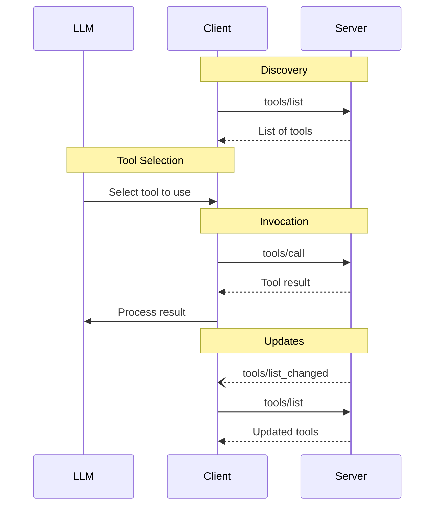


**Protocol Revision**: 2024-11-05 (Final)


The Model Context Protocol (MCP) allows servers to expose tools that can be invoked by language models through clients. Tools enable models to perform actions or retrieve information beyond their training data, such as querying databases, calling external APIs, or executing commands. Each tool is uniquely identified by a name and includes metadata describing its capabilities and requirements.

## User Interaction Model

Tools in MCP are commonly surfaced through AI assistant or chatbot interfaces, where the language model can discover and invoke tools based on the conversation context. A recommended pattern is displaying available tools in the chat interface with visual indicators when they are invoked, along with confirmation prompts for sensitive operations.

However, implementations are free to expose tools through any interface pattern that suits their needs - the protocol itself does not mandate any specific user interaction model.

## Capabilities

Servers that support tools MUST include a `tools` capability in their `ServerCapabilities` during initialization. The basic tools capability can be specified with an empty object:

```json
{
  "capabilities": {
    "tools": {}
  }
}
```

For servers that support notifications about tool list changes, the optional `listChanged` property should be set to true:

```json
{
  "capabilities": {
    "tools": {
      "listChanged": true
    }
  }
}
```

The `listChanged` property indicates that the server supports notifications about changes to the tool list. When omitted or set to false, clients should not expect to receive tool list change notifications.

## Protocol Messages

### Listing Tools

To discover available tools, clients send a `tools/list` request. This operation supports pagination through the standard cursor mechanism.

**Request:**
```json
{
  "jsonrpc": "2.0",
  "id": 1,
  "method": "tools/list",
  "params": {
    "cursor": "optional-cursor-value"
  }
}
```

**Response:**
```json
{
  "jsonrpc": "2.0",
  "id": 1,
  "result": {
    "tools": [
      {
        "name": "get_weather",
        "description": "Get current weather information for a location",
        "inputSchema": {
          "type": "object",
          "properties": {
            "location": {
              "type": "string",
              "description": "City name or zip code"
            }
          },
          "required": ["location"]
        }
      }
    ],
    "nextCursor": "next-page-cursor"
  }
}
```

### Calling Tools

To invoke a tool, clients send a `tools/call` request:

**Request:**
```json
{
  "jsonrpc": "2.0",
  "id": 2,
  "method": "tools/call",
  "params": {
    "name": "get_weather",
    "arguments": {
      "location": "New York"
    }
  }
}
```

**Response:**
```json
{
  "jsonrpc": "2.0",
  "id": 2,
  "result": {
    "content": [{
      "type": "text",
      "text": "Current weather in New York:\nTemperature: 72°F\nConditions: Partly cloudy"
    }],
    "isError": false
  }
}
```

### List Changed Notification

When tools change, servers that support `listChanged` MAY send a notification:

```json
{
  "jsonrpc": "2.0",
  "method": "notifications/tools/list_changed"
}
```

## Message Flow



## Data Types

### Tool

A tool definition includes:

- `name`: Unique identifier for the tool
- `description`: Human-readable description of functionality
- `inputSchema`: JSON Schema defining expected parameters

### Tool Result

Tool results can contain multiple content items of different types:

#### Text Content
```json
{
  "type": "text",
  "text": "Tool result text"
}
```

#### Image Content
```json
{
  "type": "image",
  "data": "base64-encoded-data",
  "mimeType": "image/png"
}
```

#### Embedded Resources
```json
{
  "type": "resource",
  "resource": {
    "uri": "resource://example",
    "mimeType": "text/plain",
    "text": "Resource content"
  }
}
```

## Error Handling

Tools use two error reporting mechanisms:

1. Protocol Errors: Standard JSON-RPC errors for issues like:
   - Unknown tools
   - Invalid arguments
   - Server errors

2. Tool Execution Errors: Reported in successful responses with `isError: true`:
   - API failures
   - Invalid input data
   - Business logic errors

Example protocol error:
```json
{
  "jsonrpc": "2.0",
  "id": 3,
  "error": {
    "code": -32602,
    "message": "Unknown tool: invalid_tool_name"
  }
}
```

Example tool execution error:
```json
{
  "jsonrpc": "2.0",
  "id": 4,
  "result": {
    "content": [{
      "type": "text",
      "text": "Failed to fetch weather data: API rate limit exceeded"
    }],
    "isError": true
  }
}
```

## Security Considerations

1. Servers MUST:
   - Validate all tool inputs
   - Implement proper access controls
   - Rate limit tool invocations
   - Sanitize tool outputs

2. Clients SHOULD:
   - Prompt for user confirmation on sensitive operations
   - Validate tool results before passing to LLM
   - Implement timeouts for tool calls
   - Log tool usage for audit purposes

## See Also





