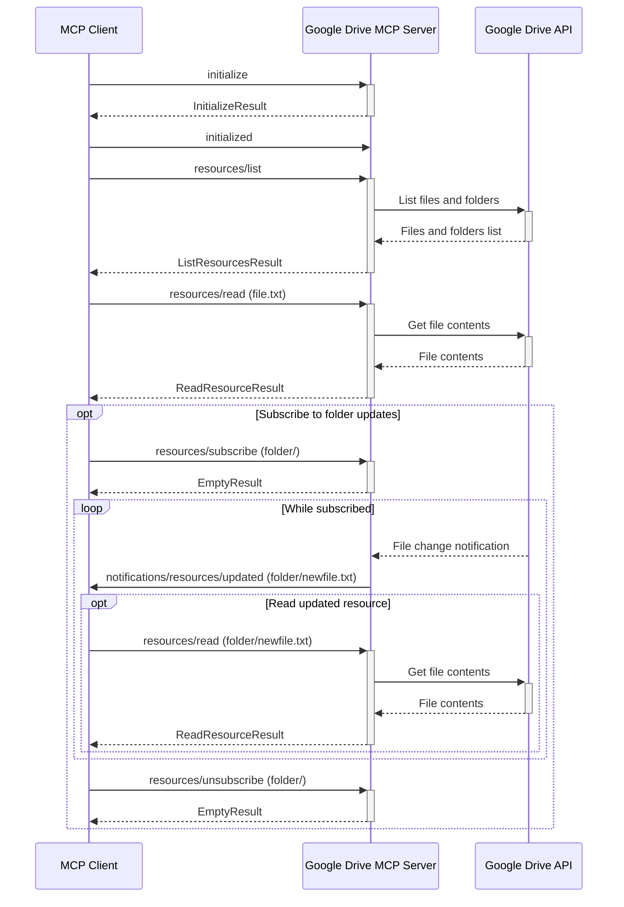
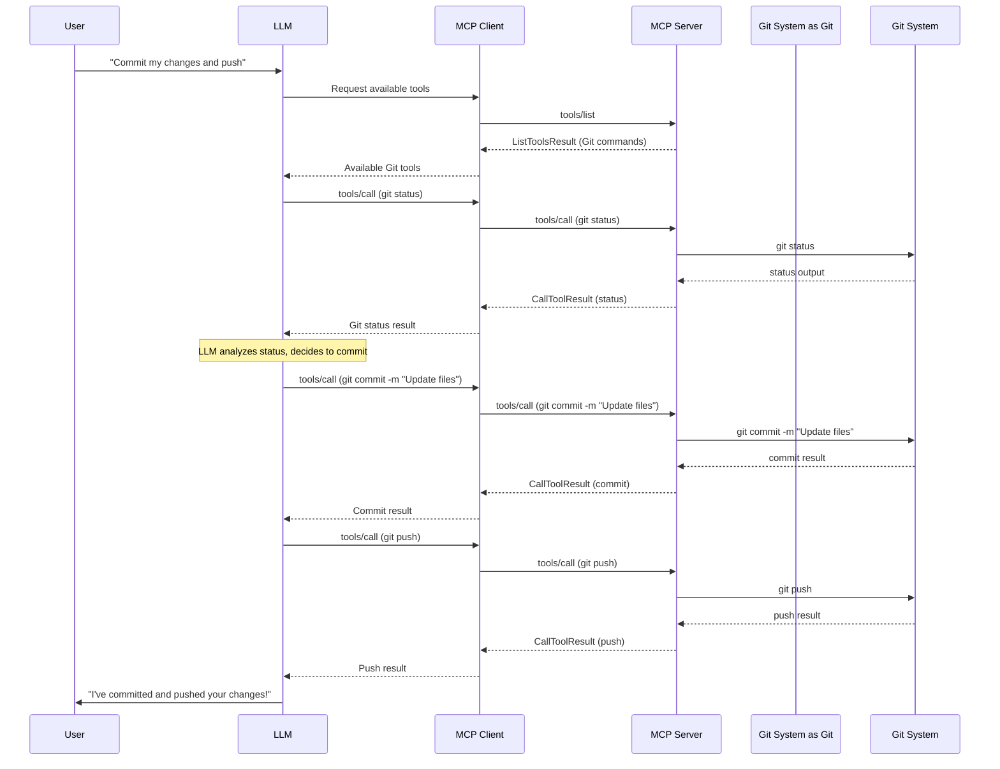
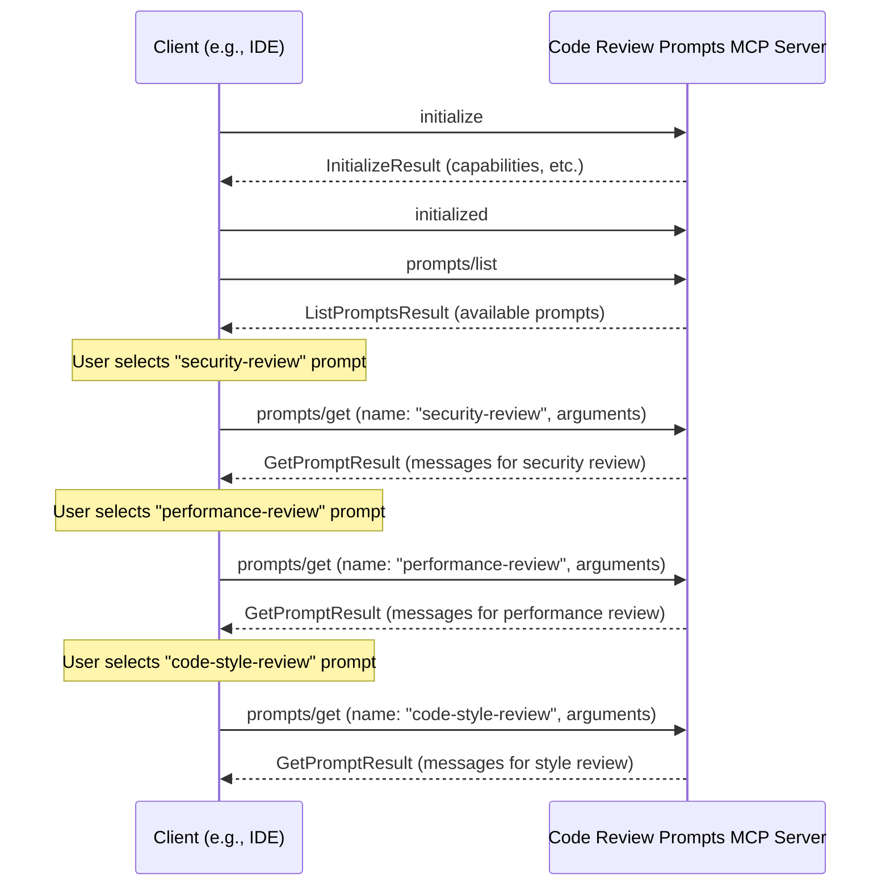
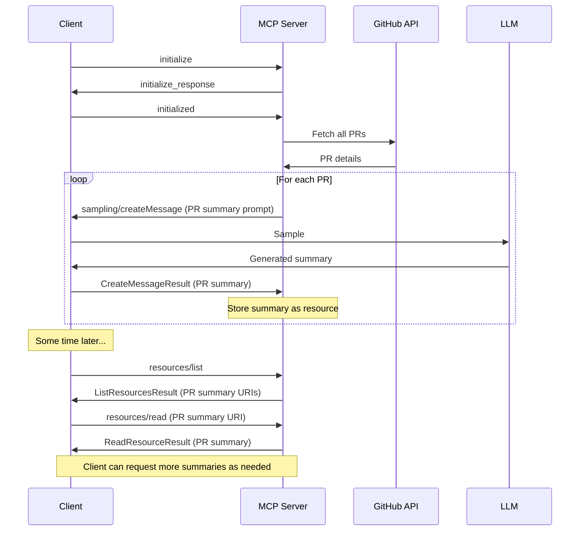

# Example MCP workflow diagrams

Some illustrative sequence diagrams of various concepts that could be built as MCP servers.

**NOTE:** These are _examples_, not necessarily planned integrations!

### Google Drive Resource Requests

> a sequence diagram showing how resources would be requested from a Google Drive MCP server

### Git MCP Server Tool Use

> an example of a Git MCP server, exposing a few Git commands as tool use for the LLM

### Code Review Prompts

> … a code review assistant … could offer a set of specialized prompts to help developers conduct more thorough and efficient code reviews.

### GitHub PR Summaries Server

> an MCP server that summarizes GitHub pull requests
>
> …
>
>
> 1. MCP server loads all the PRs on a GitHub repo
> 2. MCP server requests LLM sampling to summarize each one
> 3. The summaries are vended as MCP resources

