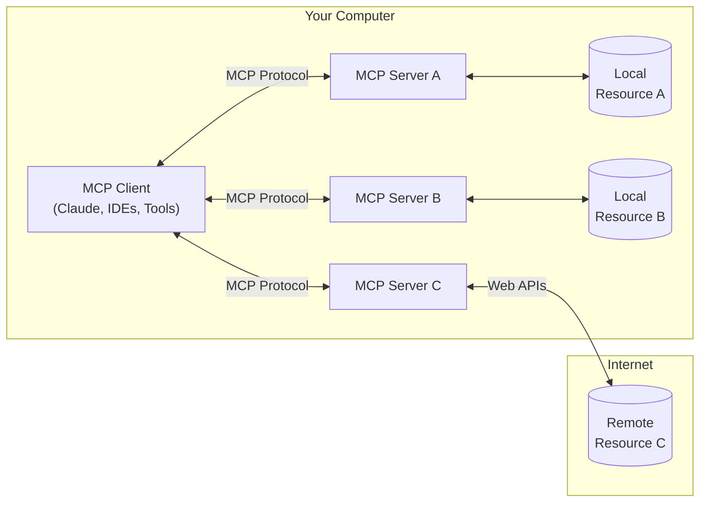

Model Context Protocol (MCP) is an open protocol that enables seamless integration between LLM applications and external data sources and tools.

## Why MCP

MCP is a great choice for anyone building agents or complex integrations on top of LLMs. LLMs frequently need to integrate with data and tools, and MCP provides:
- A growing list of pre-built integrations that your LLM can directly plug into.
  - Check out our official [servers repo](https://github.com/modelcontextprotocol/servers) for a focused list and [MCP Get](https://mcp-get.com/) for a more complete directory
- The flexibility to switch between LLM providers and vendors
- Best practices for securing your data within your infrastructure

### General architecture

At its core, MCP follows a client-server architecture where a client application can connect to multiple servers:

- **MCP Client**: Programs like Claude Desktop, IDEs, or AI tools that want to access resources through MCP
- **MCP Servers**: Lightweight programs that each expose specific capabilities through the standardized Model Context Protocol
- **Local Resources**: Your computer's resources (databases, files, services) that MCP servers can securely access
- **Remote Resources**: Resources available over the internet (e.g., through APIs) that MCP servers can connect to

## Get started with MCP 

Choose the path that best fits your needs:

<CardGroup cols={1}>
  <Card
    title="Quickstart"
    icon="bolt"
    href="/quickstart"
  >
    Build your first MCP client and server in less than 5 minutes
  </Card>
  <Card
    title="Take MCP servers for a test run in Claude Desktop"
    icon="desktop"
    href="/tutorials/claude-desktop"
  >
    Give Claude Desktop the ability to query SQLite data using MCP
  </Card>
  <Card
    title="MCP clients"
    icon="plug"
    href="/clients"
  >
    See a detailed list of MCP clients
  </Card>
  <Card
    title="MCP servers"
    icon="outlet"
    href="/servers"
  >
    See a detailed list of MCP servers
  </Card>
</CardGroup>

## Explore MCP

Dive deeper into MCP's core concepts and capabilities:

<CardGroup cols={2}>
  <Card
    title="Core Architecture"
    icon="sitemap"
    href="/docs/concepts/architecture"
  >
    Understand how MCP connects clients, servers, and LLMs
  </Card>
  <Card
    title="Resources"
    icon="database"
    href="/docs/concepts/resources"
  >
    Expose data and content from your servers to LLMs
  </Card>
  <Card
    title="Prompts"
    icon="message"
    href="/docs/concepts/prompts"
  >
    Create reusable prompt templates and workflows
  </Card>
  <Card
    title="Tools"
    icon="wrench"
    href="/docs/concepts/tools"
  >
    Enable LLMs to perform actions through your server
  </Card>
  <Card
    title="Sampling"
    icon="robot"
    href="/docs/concepts/sampling"
  >
    Let your servers request completions from LLMs
  </Card>
  <Card
    title="Transports"
    icon="network-wired"
    href="/docs/concepts/transports"
  >
    Learn about MCP's communication mechanism
  </Card>
</CardGroup>

## Development tools

Essential tools for building and debugging MCP servers:

<CardGroup cols={2}>
  <Card
  title="Debugging Guide"
  icon="bug"
  href="/docs/tools/debugging">
    Learn how to effectively debug MCP servers and integrations
  </Card>
  <Card
    title="MCP Inspector"
    icon="magnifying-glass"
    href="/docs/tools/inspector"
  >
    Test and inspect your MCP servers with our interactive debugging tool
  </Card>
</CardGroup>

## Contributing

Want to contribute? Check out [@modelcontextprotocol](https://github.com/modelcontextprotocol) on GitHub to join our growing community of developers building with MCP.