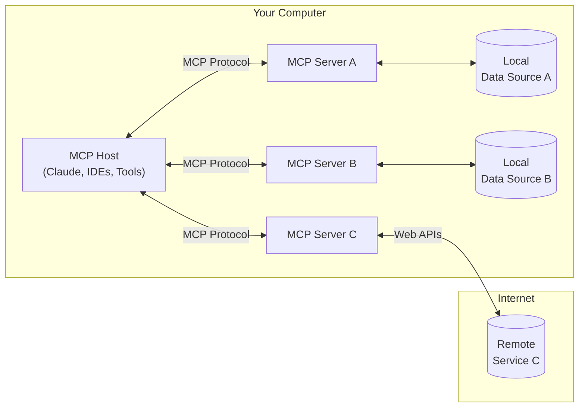

MCP is an open protocol that standardizes how applications provide context to LLMs. Think of it as the "Language Server Protocol for AI" - it separates the concerns of providing context from the LLM interaction itself. This separation enables:

- **Modularity**: Each MCP server focuses on one specific integration or capability
- **Reusability**: The same server can be used with any MCP-compatible client
- **Composability**: Multiple servers can be combined to create powerful workflows
- **Standardization**: A common protocol for all integrations reduces complexity

## Why MCP?

MCP helps you build agents and complex workflows on top of LLMs. LLMs frequently need to integrate with data and tools, and MCP provides:
- A growing list of pre-built integrations that your LLM can directly plug into
- The flexibility to switch between LLM providers and vendors
- Best practices for securing your data within your infrastructure

### General architecture

At its core, MCP follows a client-server architecture where a host application can connect to multiple servers:

- **MCP Hosts**: Programs like Claude Desktop, IDEs, or AI tools that want to access data through MCP
- **MCP Clients**: Protocol clients that maintain 1:1 connections with servers
- **MCP Servers**: Lightweight programs that each expose specific capabilities through the standardized Model Context Protocol
- **Local Data Sources**: Your computer's files, databases, and services that MCP servers can securely access
- **Remote Services**: External systems available over the internet (e.g., through APIs) that MCP servers can connect to

## Get started

Choose the path that best fits your needs:

<CardGroup cols={1}>
  <Card
    title="Quickstart"
    icon="bolt"
    href="/quickstart"
  >
    Build and connect to your first MCP server
  </Card>
</CardGroup>

## Tutorials

<CardGroup cols={2}>
  <Card
    title="Building a MCP client"
    icon="outlet"
    href="/building-a-client"
  >
    Learn how to build your first MCP client
  </Card>
</CardGroup>

## Explore MCP

Dive deeper into MCP's core concepts and capabilities:

<CardGroup cols={2}>
  <Card
    title="Core architecture"
    icon="sitemap"
    href="/docs/concepts/architecture"
  >
    Understand how MCP connects clients, servers, and LLMs
  </Card>
  <Card
    title="Resources"
    icon="database"
    href="/docs/concepts/resources"
  >
    Expose data and content from your servers to LLMs
  </Card>
  <Card
    title="Prompts"
    icon="message"
    href="/docs/concepts/prompts"
  >
    Create reusable prompt templates and workflows
  </Card>
  <Card
    title="Tools"
    icon="wrench"
    href="/docs/concepts/tools"
  >
    Enable LLMs to perform actions through your server
  </Card>
  <Card
    title="Sampling"
    icon="robot"
    href="/docs/concepts/sampling"
  >
    Let your servers request completions from LLMs
  </Card>
  <Card
    title="Transports"
    icon="network-wired"
    href="/docs/concepts/transports"
  >
    Learn about MCP's communication mechanism
  </Card>
</CardGroup>

## Development tools

Essential tools for building and debugging MCP servers:

<CardGroup cols={2}>
  <Card
  title="Debugging Guide"
  icon="bug"
  href="/docs/tools/debugging">
    Learn how to effectively debug MCP servers and integrations
  </Card>
  <Card
    title="MCP Inspector"
    icon="magnifying-glass"
    href="/docs/tools/inspector"
  >
    Test and inspect your MCP servers with our interactive debugging tool
  </Card>
</CardGroup>

## Contributing

Want to contribute? Check out [@modelcontextprotocol](https://github.com/modelcontextprotocol) on GitHub to join our growing community of developers building with MCP.