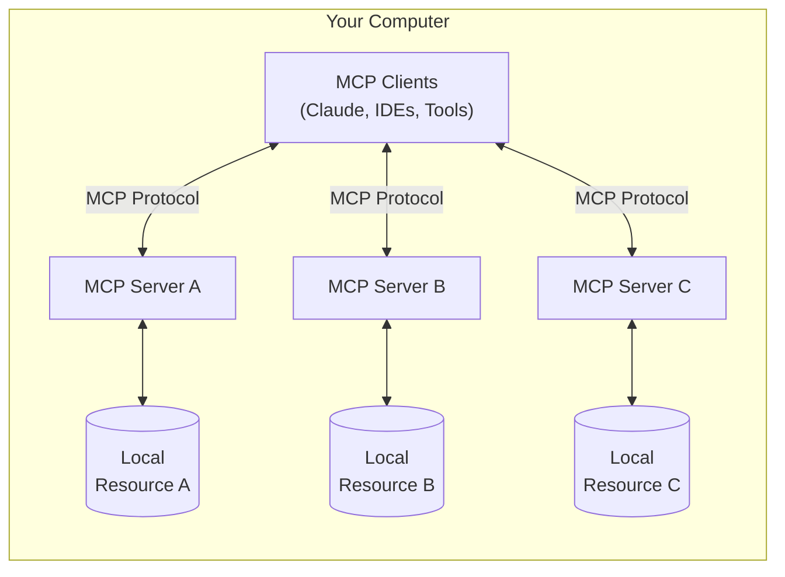
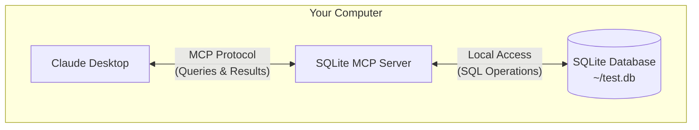

MCP is a protocol that enables secure connections between clients, such as the Claude Desktop app, and local services. In this quickstart guide, you'll learn how to:

- Set up a local SQLite database
- Connect Claude Desktop to it through MCP
- Query and analyze your data securely

<Note>
While this guide focuses on using Claude Desktop as an example MCP client, the protocol is open and can be implemented by any application. IDEs, AI tools, and other software can all act as MCP clients to access local services in a standardized way.
</Note>

<Warning>
Claude Desktop's MCP support is currently in developer preview and only supports connecting to local servers running on your machine. Remote connections are not yet supported. MCP integration is only available in the Claude Desktop app, not the Claude web interface (claude.ai).
</Warning>

## How MCP works

MCP (Model Context Protocol) is an open protocol that enables secure, controlled interactions between AI applications and local resources on your computer. Let's break down how it works, then look at how we'll use it in this guide.

### General Architecture
At its core, MCP follows a client-server architecture where multiple services can connect to any compatible client:



- **MCP Clients**: Applications like Claude Desktop, IDEs, or AI tools that want to access local resources
- **MCP Servers**: Lightweight programs that each expose specific capabilities through the standardized MCP protocol
- **Local Resources**: Your computer's resources (databases, files, services) that MCP servers can securely access

### In This Guide

For this quickstart, we'll implement a focused example using SQLite:



1. Claude Desktop acts as our MCP client
2. A SQLite MCP Server provides secure database access
3. Your local SQLite database stores the actual data

All communication happens entirely on your machine - no data leaves your computer. The MCP protocol ensures that Claude Desktop can only perform approved database operations through well-defined interfaces.
This gives you a secure way to let Claude analyze and interact with your local data while maintaining complete control over what it can access.

## Prerequisites

- macOS (Windows/Linux guides coming soon)
- Node.js v18 or higher (`node --version` to check)
- Git (`git --version` to check)
- [Claude Desktop app](https://claude.ai/download) installed
- SQLite (`sqlite3 --version` to check)

<Accordion title="Need to install the prerequisites?">
```bash
# Using Homebrew
brew install node git sqlite3

# Or download directly:
# Node.js: https://nodejs.org
# Git: https://git-scm.com
# SQLite: https://www.sqlite.org/download.html
```
</Accordion>

## Installation

<Steps>
  <Step title="Install example servers">
    Let's start by getting the pre-built MCP servers:

    ```bash
    # Clone the example servers
    git clone https://github.com/modelcontextprotocol/servers
    cd servers
    
    # Install dependencies and build
    npm install
    npm run build
    
    # Make servers available globally
    npm install -g
    ```

    This makes the MCP servers available as command-line tools that Claude Desktop can launch.
  </Step>

  <Step title="Create a sample database">
    Let's create a simple SQLite database for testing:

    ```bash
    # Create a new SQLite database
    sqlite3 ~/test.db <<EOF
    CREATE TABLE products (
      id INTEGER PRIMARY KEY,
      name TEXT,
      price REAL
    );
    
    INSERT INTO products (name, price) VALUES
      ('Widget', 19.99),
      ('Gadget', 29.99),
      ('Gizmo', 39.99);
    EOF
    ```
  </Step>

  <Step title="Configure Claude Desktop">
    Open your Claude Desktop App configuration:

    ```bash
    code ~/Library/Application\ Support/Claude/claude_desktop_config.json
    ```

    Add this configuration (replace YOUR_USERNAME with your actual username):

    ```json
    {
      "mcpServers": {
        "sqlite": {
          "command": "mcp-server-sqlite",
          "args": ["/Users/YOUR_USERNAME/test.db"]
        }
      }
    }
    ```

    This tells Claude Desktop:
    1. There's an MCP server named "sqlite"
    2. Launch it using the `mcp-server-sqlite` command
    3. Connect it to your test database
    4. Provide necessary environment variables

    Save and **restart Claude Desktop App**.
  </Step>
</Steps>

## Test it out

Let's verify everything is working. Try sending this prompt to Claude Desktop:

```
Can you connect to my SQLite database and tell me what products are available and their prices?
```

Claude Desktop will:
1. Connect to the SQLite MCP server
2. Query your local database
3. Format and present the results

<Frame>
  
</Frame>

## What's happening under the hood?

When you interact with Claude Desktop using MCP:

1. **Server Discovery**: Claude Desktop loads your configured MCP servers on startup
2. **Protocol Handshake**: When you ask about data, Claude Desktop:
   - Identifies which MCP server can help (sqlite in this case)
   - Negotiates capabilities through the MCP protocol
   - Establishes a secure local connection

3. **Interaction Flow**:
   ```mermaid
   sequenceDiagram
       participant C as Claude Desktop
       participant M as MCP Server
       participant D as SQLite DB
       
       C->>M: Initialize connection
       M-->>C: Available capabilities
       
       C->>M: Query request
       M->>D: SQL query
       D-->>M: Results
       M-->>C: Formatted results
   ```

4. **Security**: 
   - MCP servers only expose specific, controlled capabilities
   - All communication is local to your machine
   - Claude Desktop requires user confirmation for sensitive operations

## Try these examples

Now that MCP is working, try these increasingly powerful examples:

<AccordionGroup>
  <Accordion title="Basic Queries" active>
    ```
    What's the average price of all products in the database?
    ```
  </Accordion>
  <Accordion title="Data Analysis">
    ```
    Can you analyze the price distribution and suggest any pricing optimizations?
    ```
  </Accordion>
  <Accordion title="Complex Operations">
    ```
    Could you help me design and create a new table for storing customer orders?
    ```
  </Accordion>
</AccordionGroup>

## Add more capabilities

Want to give Claude Desktop more local integration capabilities? Add these servers to your configuration:

<AccordionGroup>
  <Accordion title="File System Access" icon="folder-open">
    Add this to your config to let Claude Desktop read and analyze files:
    ```json
    "tee": {
      "command": "mcp-server-tee",
      "args": ["tail", "-f", "/var/log/system.log"],
      "env": {
        "HOME": "/Users/YOUR_USERNAME"
      }
    }
    ```
  </Accordion>
  
  <Accordion title="PostgreSQL Connection" icon="database">
    Connect Claude Desktop to your PostgreSQL database:
    ```json
    "postgres": {
      "command": "mcp-server-postgres",
      "args": ["postgresql://localhost/mydb"],
      "env": {
        "HOME": "/Users/YOUR_USERNAME"
      }
    }
    ```
  </Accordion>
</AccordionGroup>

## MCP clients

While this guide demonstrates MCP using Claude Desktop, several other applications support MCP integration:

<CardGroup cols={2}>
  <Card 
    title="Zed Editor" 
    icon="pen-to-square" 
    href="https://zed.dev">
    A high-performance, multiplayer code editor with built-in MCP support for AI-powered coding assistance
  </Card>
  
  <Card 
    title="Sourcegraph" 
    icon="magnifying-glass"
    href="https://sourcegraph.com">
    Code intelligence platform featuring MCP integration for enhanced code search and analysis capabilities
  </Card>
</CardGroup>

Each client may implement MCP features differently or support different capabilities. Check their respective documentation for specific setup instructions and supported features.

## Troubleshooting

<AccordionGroup>
  <Accordion title="Nothing showing up in Claude Desktop?">
    1. Check if MCP is enabled:
       - Click the 🔌 icon in Claude Desktop
       - You should see your configured servers
    
    2. Verify your config:
       ```bash
       cat ~/Library/Application\ Support/Claude/claude_desktop_config.json
       ```
    
    3. Restart Claude Desktop completely:
       - Quit the app (not just close the window)
       - Start it again
  </Accordion>

  <Accordion title="Database connection errors?">
    1. Check Claude Desktop's logs:
       ```bash
       tail -f ~/Claude.log
       ```
    
    2. Verify database access:
       ```bash
       # Test database connection
       sqlite3 ~/test.db ".tables"
       ```
       
    3. Common fixes:
       - Check file paths in your config
       - Verify database file permissions
       - Ensure SQLite is installed properly
  </Accordion>
</AccordionGroup>

## Next steps

<CardGroup cols={2}>
  <Card title="Build your first MCP server" icon="code" href="/docs/first-server/python">
    Create your own MCP servers to give your LLM clients new capabilities.
  </Card>
  
  <Card title="Explore examples" icon="github" href="https://github.com/modelcontextprotocol/servers">
    Browse our collection of example servers to see what's possible.
  </Card>
</CardGroup>