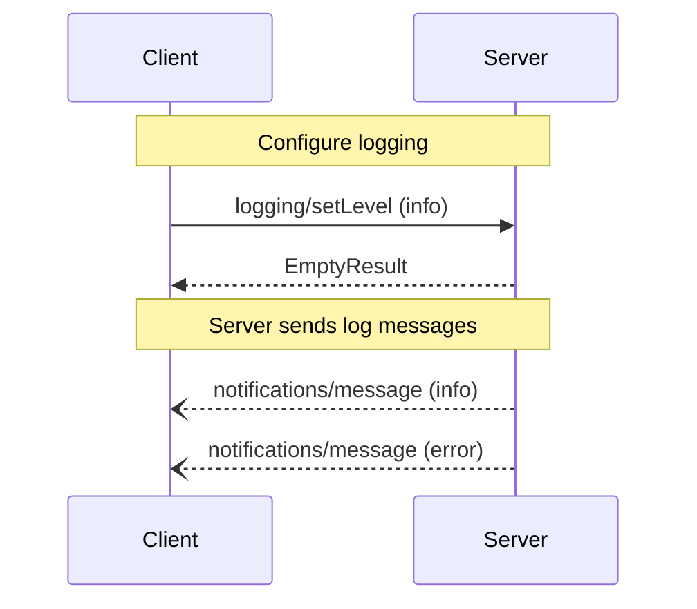

Logging enables servers to send log messages to clients in a structured way. Clients can control the verbosity of logging by setting the minimum log level they want to receive. Each log message includes a level indicating its severity, an optional logger name for organization, and arbitrary data that can be any JSON-serializable value.

## Capabilities

To indicate support for the Logging API, servers MUST include a `logging` capability in their `ServerCapabilities` during initialization. The `logging` capability SHOULD be an empty object:

```json
{
  "capabilities": {
    "logging": {}
  }
}
```

Clients SHOULD check for this capability before attempting to set the log level.

## Concepts

### Log Levels

MCP defines the following log levels in order of increasing severity:

- `debug`: Detailed information for debugging
- `info`: General informational messages
- `notice`: Normal but significant events
- `warning`: Warning conditions
- `error`: Error conditions
- `critical`: Critical conditions
- `alert`: Action must be taken immediately
- `emergency`: System is unusable

These levels correspond to syslog severity levels as defined in [RFC 5424](https://datatracker.ietf.org/doc/html/rfc5424#section-6.2.1).

### Log Messages

Each log message contains:
- A severity level
- Optional logger name for categorization
- Arbitrary data payload (any JSON-serializable value)

## Use Cases

Common use cases for logging include:

### Informational Updates

```json
{
  "level": "info",
  "logger": "file_processor",
  "data": "Processing file: example.txt"
}
```

### Transient errors

```json
{
  "level": "error",
  "logger": "git_clone",
  "data": {
    "error": "Remote repository temporarily unreachable",
    "details": {
      "repository": "github.com/example/repo",
      "attempt": 2,
      "maxAttempts": 3,
      "willRetry": true,
      "retryIn": "5s"
    }
  }
}
```

## Diagram

The following diagram visualizes the logging interaction between client and server:



## Messages

This section defines the protocol messages for logging in the Model Context Protocol (MCP).

### Setting Log Level

#### Request

To configure the minimum log level to receive, the client MUST send a `logging/setLevel` request.

Method: `logging/setLevel`
Params:
  - `level`: The minimum severity level of logs to receive (string, required)

Example:
```json
{
  "jsonrpc": "2.0",
  "id": 1,
  "method": "logging/setLevel",
  "params": {
    "level": "info"
  }
}
```

#### Response

The server MUST respond with an empty result if successful:

```json
{
  "jsonrpc": "2.0",
  "id": 1,
  "result": {}
}
```

### Log Message Notification

The server sends log messages to the client using the `notifications/message` notification.

Method: `notifications/message`
Params:
  - `level`: The severity level of the message (string, required)
  - `logger`: Optional name of the logger (string)
  - `data`: The log message data (any JSON-serializable value, required)

Example:
```json
{
  "jsonrpc": "2.0",
  "method": "notifications/message",
  "params": {
    "level": "error",
    "logger": "database",
    "data": {
      "error": "Connection failed",
      "details": {
        "host": "localhost",
        "port": 5432
      }
    }
  }
}
```

## Error Handling

Clients MUST be prepared to handle:
- Invalid log levels in setLevel requests
- Missing or malformed log message parameters
- Unexpected data types in log messages

## Security Considerations

Implementations MUST carefully consider:
- Sanitizing sensitive information from log messages
- Rate limiting log messages to prevent flooding
- Access control for log configuration
- Validation of log data to prevent injection attacks