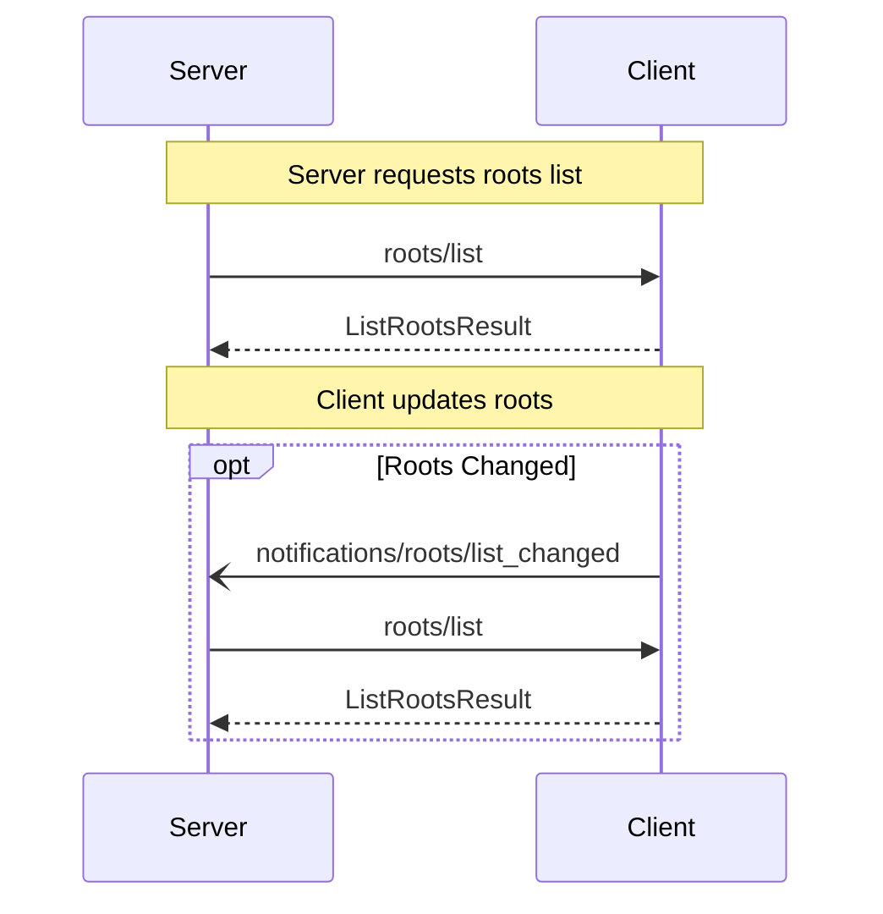

Roots enable clients to provide a list of root directories or files that servers can operate on. This allows servers to understand which parts of the filesystem they have access to and should work with. Servers can request the list of roots from clients that support this capability, and clients can notify servers when the list of available roots changes.

## Capabilities

To indicate support for roots, clients MUST include a `roots` capability in their `ClientCapabilities` during initialization:

<CodeGroup>

```json
{
  "capabilities": {
   "roots": { }
  }
}
```

```json
{
  "capabilities": {
    "roots": {
      "listChanged": true
    }
  }
}
```
</CodeGroup>

The optional `listChanged` property indicates whether the client will send notifications when the root list changes.

Servers SHOULD check for this capability before attempting to use any roots functionality.

## Concepts

### Root

A Root in the Model Context Protocol (MCP) represents a directory or file that a server is allowed to operate on. Each Root is uniquely identified by a URI (currently restricted to file:// URIs) and may have an optional human-readable name. Roots define the boundaries of where servers can work within the filesystem.

<Info>
Only URI's starting with **file://** are accepted.
</Info>

## Use Cases

Common use cases for roots include defining workspace directories, project repositories, or specific files that a server should analyze or modify. Here are some examples:

### Project Directory

A root representing a project workspace:

```json
{
  "uri": "file:///home/user/projects/myproject",
  "name": "My Project"
}
```

### Multiple Repositories

Multiple roots for different Git repositories:

```json
[
  {
    "uri": "file:///home/user/repos/frontend",
    "name": "Frontend Repository"
  },
  {
    "uri": "file:///home/user/repos/backend",
    "name": "Backend Repository"
  }
]
```

## Diagram

The following diagram visualizes the interaction between client and server for roots:



## Messages

This section defines the protocol messages for root management in the Model Context Protocol (MCP).

### Listing Roots

#### Request

To retrieve a list of available roots from the client, the server MUST send a `roots/list` request.

Method: `roots/list`
Params: None

Example:
```json
{
  "jsonrpc": "2.0",
  "id": 1,
  "method": "roots/list"
}
```

#### Response

The client MUST respond with a `ListRootsResult` containing:

- `roots`: An array of `Root` objects

A `Root` object consists of:
- `uri`: A URI string identifying the root location. Currently only `file://` URIs are supported. This field is required.
- `name`: An optional string providing a human-readable name for the root.

Example:
```json
{
  "jsonrpc": "2.0",
  "id": 1,
  "result": {
    "roots": [
      {
        "uri": "file:///home/user/projects/myproject",
        "name": "My Project"
      },
      {
        "uri": "file:///home/user/repos/backend",
        "name": "Backend Repository"
      }
    ]
  }
}
```

### Root List Changed Notification

If the client supports the `listChanged` capability for roots, it MUST send a `notifications/roots/list_changed` notification when the list of available roots changes.

#### Notification

Method: `notifications/roots/list_changed`
Params: None

Example:
```json
{
  "jsonrpc": "2.0",
  "method": "notifications/roots/list_changed"
}
```

Upon receiving this notification, servers SHOULD request an updated root list using the `roots/list` method to ensure they have the most up-to-date information.

## Error Handling

Servers MUST be prepared to handle cases where:
- The client does not support roots
- Listed roots become unavailable
- Access to roots is denied

The client SHOULD return appropriate error responses in these cases.

Example error response:
```json
{
  "jsonrpc": "2.0",
  "id": 1,
  "error": {
    "code": -32601,
    "message": "Roots not supported",
    "data": {
      "reason": "Client does not have roots capability"
    }
  }
}
```

## Security Considerations

Implementations MUST carefully consider:

- Access control for root directories and files
- Validation of root URIs to prevent path traversal attacks
- Scope limitations to prevent unauthorized access
- Permission checks before exposing roots
- Regular validation that roots remain accessible

Clients SHOULD:
- Only expose roots that the server has permission to access
- Validate all root URIs before returning them
- Implement proper filesystem permission checks
- Monitor for changes in root accessibility