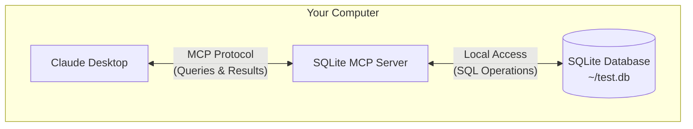

MCP is a protocol that enables secure connections between host applications, such as [Claude Desktop](https://claude.ai/download), and local services. In this short tutorial, you'll learn how to:

<Note>
While this tutorial focuses on using Claude Desktop as an example MCP client, the protocol is open and can be integrated by any application. IDEs, AI tools, and other software can all use MCP to connect to local integrations in a standardized way.
</Note>

<Warning>
Claude Desktop's MCP support is currently in developer preview and only supports connecting to local MCP servers running on your machine. Remote MCP connections are not yet supported. This integration is only available in the Claude Desktop app, not the Claude web interface (claude.ai).
</Warning>

### In This Guide

For this tutorial, we'll implement a focused example using SQLite:



1. Claude Desktop acts as our MCP client
2. A SQLite MCP Server provides secure database access
3. Your local SQLite database stores the actual data

The communication between the SQLite MCP server and your local SQLite database happens entirely on your machine&mdash;your SQLite database is not exposed to the internet. The Model Context Protocol ensures that Claude Desktop can only perform approved database operations through well-defined interfaces. This gives you a secure way to let Claude analyze and interact with your local data while maintaining complete control over what it can access.

## Prerequisites

- macOS or Windows
- The latest version of [Claude Desktop](https://claude.ai/download) installed
- [uv](https://docs.astral.sh/uv/) 0.4.18 or higher (`uv --version` to check)
- Git (`git --version` to check)
- SQLite (`sqlite3 --version` to check)

<AccordionGroup>
  <Accordion title="Installing prerequisites (macOS)">
  ```bash
  # Using Homebrew
  brew install uv git sqlite3

  # Or download directly:
  # uv: https://docs.astral.sh/uv/
  # Git: https://git-scm.com
  # SQLite: https://www.sqlite.org/download.html
  ```
  </Accordion>
  <Accordion title="Installing prerequisites (Windows)">
  ```powershell
  # Using winget
  winget install --id=astral-sh.uv -e
  winget install git.git sqlite.sqlite

  # Or download directly:
  # uv: https://docs.astral.sh/uv/
  # Git: https://git-scm.com
  # SQLite: https://www.sqlite.org/download.html
  ```
  </Accordion>
</AccordionGroup>

## Installation

<Tabs>
  <Tab title="macOS">
    <Steps>
      <Step title="Create a sample database">
        Let's create a simple SQLite database for testing:

        ```bash
        # Create a new SQLite database
        sqlite3 ~/test.db <<EOF
        CREATE TABLE products (
          id INTEGER PRIMARY KEY,
          name TEXT,
          price REAL
        );

        INSERT INTO products (name, price) VALUES
          ('Widget', 19.99),
          ('Gadget', 29.99),
          ('Gizmo', 39.99),
          ('Smart Watch', 199.99),
          ('Wireless Earbuds', 89.99),
          ('Portable Charger', 24.99),
          ('Bluetooth Speaker', 79.99),
          ('Phone Stand', 15.99),
          ('Laptop Sleeve', 34.99),
          ('Mini Drone', 299.99),
          ('LED Desk Lamp', 45.99),
          ('Keyboard', 129.99),
          ('Mouse Pad', 12.99),
          ('USB Hub', 49.99),
          ('Webcam', 69.99),
          ('Screen Protector', 9.99),
          ('Travel Adapter', 27.99),
          ('Gaming Headset', 159.99),
          ('Fitness Tracker', 119.99),
          ('Portable SSD', 179.99);
        EOF
        ```
      </Step>

      <Step title="Configure Claude Desktop">
        Open your Claude Desktop App configuration at `~/Library/Application Support/Claude/claude_desktop_config.json` in a text editor.

        For example, if you have [VS Code](https://code.visualstudio.com/) installed:

        ```bash
        code ~/Library/Application\ Support/Claude/claude_desktop_config.json
        ```

        Add this configuration (replace YOUR_USERNAME with your actual username):

        ```json
        {
          "mcpServers": {
            "sqlite": {
              "command": "uvx",
              "args": ["mcp-server-sqlite", "--db-path", "/Users/YOUR_USERNAME/test.db"]
            }
          }
        }
        ```

        This tells Claude Desktop:
        1. There's an MCP server named "sqlite"
        2. Launch it by running `uvx mcp-server-sqlite`
        3. Connect it to your test database

        Save the file, and restart **Claude Desktop**.
      </Step>
    </Steps>
  </Tab>
  <Tab title="Windows">
    <Steps>
      <Step title="Create a sample database">
        Let's create a simple SQLite database for testing:

        ```powershell
        # Create a new SQLite database
        $sql = @'
        CREATE TABLE products (
          id INTEGER PRIMARY KEY,
          name TEXT,
          price REAL
        );

        INSERT INTO products (name, price) VALUES
          ('Widget', 19.99),
          ('Gadget', 29.99),
          ('Gizmo', 39.99),
          ('Smart Watch', 199.99),
          ('Wireless Earbuds', 89.99),
          ('Portable Charger', 24.99),
          ('Bluetooth Speaker', 79.99),
          ('Phone Stand', 15.99),
          ('Laptop Sleeve', 34.99),
          ('Mini Drone', 299.99),
          ('LED Desk Lamp', 45.99),
          ('Keyboard', 129.99),
          ('Mouse Pad', 12.99),
          ('USB Hub', 49.99),
          ('Webcam', 69.99),
          ('Screen Protector', 9.99),
          ('Travel Adapter', 27.99),
          ('Gaming Headset', 159.99),
          ('Fitness Tracker', 119.99),
          ('Portable SSD', 179.99);
        '@

        cd ~
        & sqlite3 test.db $sql
        ```
      </Step>

      <Step title="Configure Claude Desktop">
        Open your Claude Desktop App configuration at `%APPDATA%\Claude\claude_desktop_config.json` in a text editor.

        For example, if you have [VS Code](https://code.visualstudio.com/) installed:

        ```powershell
        code $env:AppData\Claude\claude_desktop_config.json
        ```

        Add this configuration (replace YOUR_USERNAME with your actual username):

        ```json
        {
          "mcpServers": {
            "sqlite": {
              "command": "uvx",
              "args": [
                "mcp-server-sqlite",
                "--db-path",
                "C:\\Users\\YOUR_USERNAME\\test.db"
              ]
            }
          }
        }
        ```

        This tells Claude Desktop:
        1. There's an MCP server named "sqlite"
        2. Launch it by running `uvx mcp-server-sqlite`
        3. Connect it to your test database

        Save the file, and restart **Claude Desktop**.
      </Step>
    </Steps>
  </Tab>
</Tabs>

## Test it out

Let's verify everything is working. Try sending this prompt to Claude Desktop:

```
Can you connect to my SQLite database and tell me what products are available, and their prices?
```

Claude Desktop will:
1. Connect to the SQLite MCP server
2. Query your local database
3. Format and present the results

<Frame caption="Claude Desktop successfully queries our SQLite database 🎉">
  
</Frame>

## What's happening under the hood?

When you interact with Claude Desktop using MCP:

1. **Server Discovery**: Claude Desktop connects to your configured MCP servers on startup
2. **Protocol Handshake**: When you ask about data, Claude Desktop:
   - Identifies which MCP server can help (sqlite in this case)
   - Negotiates capabilities through the protocol
   - Requests data or actions from the MCP server

3. **Interaction Flow**:
   ```mermaid
   sequenceDiagram
       participant C as Claude Desktop
       participant M as MCP Server
       participant D as SQLite DB

       C->>M: Initialize connection
       M-->>C: Available capabilities

       C->>M: Query request
       M->>D: SQL query
       D-->>M: Results
       M-->>C: Formatted results
   ```

4. **Security**:
   - MCP servers only expose specific, controlled capabilities
   - MCP servers run locally on your machine, and the resources they access are not exposed to the internet
   - Claude Desktop requires user confirmation for sensitive operations

## Try these examples

Now that MCP is working, try these increasingly powerful examples:

<AccordionGroup>
  <Accordion title="Basic Queries" active>
    ```
    What's the average price of all products in the database?
    ```
  </Accordion>
  <Accordion title="Data Analysis">
    ```
    Can you analyze the price distribution and suggest any pricing optimizations?
    ```
  </Accordion>
  <Accordion title="Complex Operations">
    ```
    Could you help me design and create a new table for storing customer orders?
    ```
  </Accordion>
</AccordionGroup>

## Add more capabilities

Want to give Claude Desktop more local integration capabilities? Add these servers to your configuration:

<Note>
  Note that these MCP servers will require [Node.js](https://nodejs.org/en) to be installed on your machine.
</Note>

<AccordionGroup>
  <Accordion title="File System Access" icon="folder-open">
    Add this to your config to let Claude Desktop read and analyze files:
    ```json
    "filesystem": {
      "command": "npx",
      "args": ["-y", "@modelcontextprotocol/server-filesystem", "/Users/YOUR_USERNAME/Desktop"]
    }
    ```
  </Accordion>

  <Accordion title="PostgreSQL Connection" icon="database">
    Connect Claude Desktop to your PostgreSQL database:
    ```json
    "postgres": {
      "command": "npx",
      "args": ["-y", "@modelcontextprotocol/server-postgres", "postgresql://localhost/mydb"]
    }
    ```
  </Accordion>
</AccordionGroup>

## More MCP Clients

While this guide demonstrates MCP using Claude Desktop as a client, several other applications support MCP integration:

<CardGroup cols={2}>
  <Card
    title="Zed Editor"
    icon="pen-to-square"
    href="https://zed.dev">
    A high-performance, multiplayer code editor with built-in MCP support for AI-powered coding assistance
  </Card>

  <Card
    title="Cody"
    icon="magnifying-glass"
    href="https://sourcegraph.com/cody">
    Code intelligence platform featuring MCP integration for enhanced code search and analysis capabilities
  </Card>
</CardGroup>

Each host application may implement MCP features differently or support different capabilities. Check out our [clients](/clients) documentation for more information.

## Troubleshooting

<AccordionGroup>
  <Accordion title="Nothing showing up in Claude Desktop?">
    1. Check if MCP is enabled:
       - Click the 🔌 icon in Claude Desktop, next to the chat box
       - Expand "Installed MCP Servers"
       - You should see your configured servers

    2. Verify your config:
       - From Claude Desktop, go to Claude > Settings…
       - Open the "Developer" tab to see your configuration

    3. Restart Claude Desktop completely:
       - Quit the app (not just close the window)
       - Start it again
  </Accordion>

  <Accordion title="MCP or database errors?">
    1. Check Claude Desktop's logs:
       ```bash
       tail -n 20 -f ~/Library/Logs/Claude/mcp*.log
       ```

    2. Verify database access:
       ```bash
       # Test database connection
       sqlite3 ~/test.db ".tables"
       ```

    3. Common fixes:
       - Check file paths in your config
       - Verify database file permissions
       - Ensure SQLite is installed properly
  </Accordion>
</AccordionGroup>

## Next steps

<CardGroup cols={2}>
  <Card title="Build your first MCP client and server" icon="code" href="/quickstart">
    Build your first MCP client and server from scratch in less than 5 minutes.
  </Card>

  <Card title="Explore examples" icon="github" href="https://github.com/modelcontextprotocol/servers">
    Browse our collection of example servers to see what's possible.
  </Card>
</CardGroup>